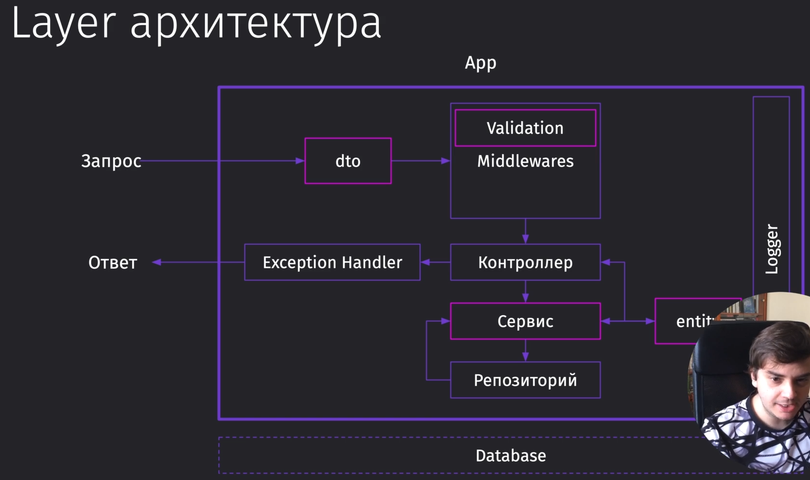
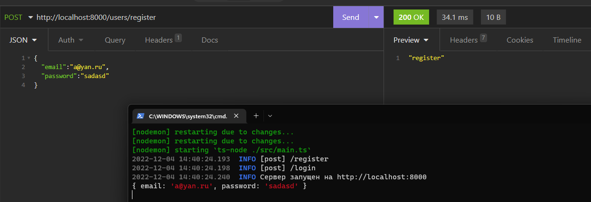
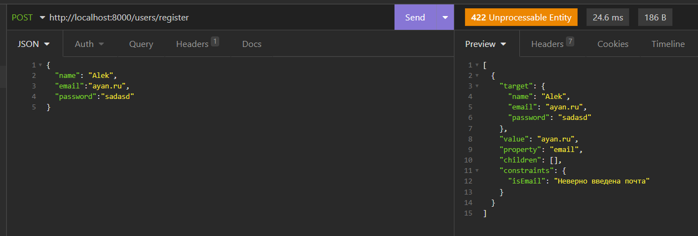

## 078 Улучшение архитектуры

Далее мы идём улучшать нашу архитектуру. 
Первым делом, запрос должен идти не напрямую в `middleware`, а через `data transfer object`, который хранит в себе данные в виде определённой структуры.
Внутри `middleware` будет находиться валидатор, который будет проверять `dto` на корректность переданных данных.
Так же мы введём такое понятие, как `entity` - это объект нашей бизнес-единицы, который сфокусирован на работе с самим объектом: создание объекта, преобразование и реализация внутренних методов (например, у пользователя есть метод хеширования его пароля).
Всё, что связано с бизнес-логикой, будет инкапсулировано в `services` и `entity` 



## 079 Data transfer object

`dto` будет представлять из себя класс, который описывает, что мы получаем извне и передаём в контроллер

Сразу нужно сказать, что если наши классы очень похожи по принимаемым данным, то в данном случае мы могли бы сделать класс `UserCredentional` и от него экстендить эти два представленных класса. Однако объединять два `dto` - не нужно!

`users > dto > user-register.dto.ts`
```TS
export class UserRegisterDto {
	email: string;
	password: string;
	name: string;
}
```

`users > dto > user-login.dto.ts`
```TS
export class UserLoginDto {
	email: string;
	password: string;
}
```

Ну и далее нужно упомянуть, что тип `Request` из `express` принимает в себя дженерик из трёх параметров, где третий представляет из себя `body` принимаемых данных
И теперь в методе `login` мы видим, что в запросе `req.body` сам `body` будет иметь тип данных `UserLoginDto` - *то есть третий дженерик определяет тип `body` полученного запроса*

`users.controller.ts`
```TS
import { UserLoginDto } from './dto/user-login.dto';
import { UserRegisterDto } from './dto/user-register.dto';

// code ...

login(req: Request<{}, {}, UserLoginDto>, res: Response, next: NextFunction): void {
	console.log(req.body);
	next(new HTTPError(401, 'ошибка авторизации', 'login'));
}

register(req: Request<{}, {}, UserRegisterDto>, res: Response, next: NextFunction): void {
	console.log(req.body);
	this.ok(res, 'register');
}

// code ...
```

И далее, чтобы увидеть ответ от сервера, нужно установить модуль, который будет серилиазовать полученный `body` в `JSON` 

```bash
npm i body-parser
```

Ну и уже тут мы реализуем `middleware`, который будет принимать в себя все входящие запросы и парсить их в `JSON`

```TS
import { json } from 'body-parser';

@injectable()
export class App {
	// code ...

	// тут мы подключаем использование прослойки в виде сериализатора принимаемых ответов - теперь экспресс сможет нормально принимать данные
	useMiddleware(): void {
		this.app.use(json());
	}
	
	// code ...
	
	public async init(): Promise<void> {
		this.useMiddleware();
		this.useRoutes();
		this.useExeptionFilters();
		this.server = this.app.listen(this.port);
		this.logger.log(`Сервер запущен на http://localhost:${this.port}`);
	}
	
	// code ...
}
```



## 080 User entity

Entity - это бизнес единица, которая описывает какой-то бизнес объект в качестве какого-то класса, у которого могут быть свои методы и свойства и внутри него зашито описание и бизнес-логика. 

Так же эта единица должна быть отделена от всей системы и не должна зависеть от остальных компонентов этой системы. 

```bash
npm i bcryptjs
npm i -D @types/bcryptjs
```

И вот представление реализации нашей отдельной сущности пользователя. Он максимально абстрагирован от остальных компонентов и не зависит от них.

`users > user.entity.ts`
```TS
import { hash } from 'bcryptjs';

// класс сущности
export class User {
	// пароль, который присвоен пользователю
	private _password: string;

	constructor(private readonly _email: string, private readonly _name: string) {}

	// получаем почту пользователя
	get email(): string {
		return this._email;
	}

	// получаем имя пользователя
	get name(): string {
		return this._email;
	}

	// получаем пароль
	get password(): string {
		return this._password;
	}

	// устанавливаем пароль на сущность
	public async setPassword(pass: string): Promise<void> {
		// паролем будет зашифрованный переданный пароль от пользователя
		this._password = await hash(pass, 10);
	}
}
```

Преобразуем функцию регистрации, где сразу проводим деструктуризацию параметра `req`, чтобы получить сразу `body`. Далее тут создаём нашего нового пользователя и передаём в него все нужные параметры, включая пароль.

`users > users.controller.ts`
```TS
async register(
	// сразу деструктурируем ответ и достём одно тело запроса
	{ body }: Request<{}, {}, UserRegisterDto>,
	res: Response,
	next: NextFunction,
): Promise<void> {
	// создаём инстанс юзера из данных ответа
	const newUser = new User(body.email, body.name);
	// задаём пользователю пароль
	await newUser.setPassword(body.password);

	this.ok(res, newUser);
}
```

И теперь по роуту регистрации мы можем получить нужные нам данные


## 081 Сервис users

Теперь нужно отделить роутинг (контроллер) и бизнес-логику (сервисы)

##### Работаем с сущностью
В сервисе у нас хранится только бизнес-логика: создаём `entity`, выставляем пароль, работаем с репозиторием

Создаём интерфейс нашей сущности

`users.service.interface.ts`
```TS
export interface IUserService {
	createUser: (dto: UserRegisterDto) => Promise<User | null>;
	validateUser: (dto: UserLoginDto) => Promise<boolean>;
}
```

И тут представлена логика работы самой сущности. Она непосредственно имеет логику создания пользователя и так же работает с репозиторием (базой данных)

`users.service.ts`
```TS
@injectable()
export class UserService implements IUserService {
	async createUser({ name, email, password }: UserRegisterDto): Promise<User | null> {
		// создание пользователя и занесение данных
		const newUser = new User(email, name);
		await newUser.setPassword(password);

		// проверка, что пользователь существует
		// если есть - возвращаем null
		// если нет - создаём нового пользователя

		// возврат значения
		return null;
	}

	async validateUser(dto: UserLoginDto): Promise<boolean> {
		return false;
	}
}
```

##### Настраиваем DI

Чтобы связать нашу сущность, нужно добавить её в типы

`types.ts`
```TS
export const TYPES = {
	Application: Symbol.for('Application'),
	ILogger: Symbol.for('ILogger'),
	UserController: Symbol.for('UserController'),
	// добавляем символ нашего сервиса
	UserService: Symbol.for('UserService'),
	ExeptionFilter: Symbol.for('ExeptionFilter'),
};
```

И забиндить в модуле контейнера, чтобы эта сущность хранилась в нём

`main.ts`
```TS
export const appBindings = new ContainerModule((bind: interfaces.Bind) => {
	bind<ILogger>(TYPES.ILogger).to(LoggerService);
	bind<IExeptionFilter>(TYPES.ExeptionFilter).to(ExeptionFilter);
	bind<IUserController>(TYPES.UserController).to(UserController);
	// связываем сервис пользователя
	bind<IUserService>(TYPES.UserService).to(UserService);
	bind<App>(TYPES.Application).to(App);
});
```

##### Взаимодейтсвуем с контроллером

Контроллер же у нас будет реализовывать роунтинг и контролировать входных и выходных данных.

Конкретно тут был внедрён `UserService` в конструктор. Так же реализована регистрация пользователя (контроль входных и выходных данных) 

```TS
export class UserController extends BaseController implements IUserController {
	constructor(
		@inject(TYPES.ILogger) private loggerService: ILogger,
		@inject(TYPES.UserService) private userService: IUserService,
	) {
		super(loggerService);
		this.bindRoutes([
			{ path: '/register', method: 'post', func: this.register },
			{ path: '/login', method: 'post', func: this.login },
		]);
	}

	login(req: Request<{}, {}, UserLoginDto>, res: Response, next: NextFunction): void {
		console.log(req.body);
		next(new HTTPError(401, 'ошибка авторизации', 'login'));
	}

	async register(
		// сразу деструктурируем ответ и достём одно тело запроса
		{ body }: Request<{}, {}, UserRegisterDto>,
		res: Response,
		next: NextFunction,
	): Promise<void> {
		// создаём пользователя по данным полученного body
		const result = await this.userService.createUser(body);

		// проверяем, существует ли такой пользователь
		if (!result) return next(new HTTPError(422, 'Такой пользователь уже есть'));

		// выводим почту пользователя
		this.ok(res, { result: result.email });
	}
}
```

##### Результат
Как выглядит в действии:


## 082 Middleware для роутов

Создадим интерфейс самого посредника. Он будет выполнять ровно один метод, который ему предписан. 

`middleware.interface.ts`
```TS
import { Request, Response, NextFunction } from 'express';

export interface IMiddleware {
	// этот интерфейс будет определять логику работы миддлвэйра, который выполняет ровно одну функцию
	execute: (req: Request, res: Response, next: NextFunction) => void;
}
```

Наш контроллер роута будет принимать в себя (необязательно) массив посредников, которые будут выполняться до основной функции-хэндлера.

`common > route.interface.ts`
```TS
export interface IControllerRoute {
	path: string;
	func: (req: Request, res: Response, next: NextFunction) => void;
	method: keyof Pick<Router, 'get' | 'post' | 'delete' | 'patch' | 'put'>;
	// это массив посредников, которые должны отработать перед тем, как мы попадём в сам контроллер
	middlewares?: IMiddleware[];
}
```

И далее в основном контроллере получаем массив посреднических функций, которому меняем контекст вызова на себя самого. В функции `pipeline` мы проверяем, если у нас имеются в принципе `middlewares`, то передаём в наш роут сначала эти функции-посредники, а уже тлько потом основную функцию 

`base.controller.ts`
```TS
protected bindRoutes(routes: IControllerRoute[]): void {
	for (const route of routes) {
		this.logger.log(`[${route.method}] ${route.path}`);

		// получаем массив обработчиков контроллера и перебинживаем им контекст, чтобы он оставался внутри этих функций
		const middleware = route.middlewares?.map((mw) => mw.execute.bind(mw));
		const handler = route.func.bind(this);
		// если у нас имеются middlewares, то выполняем сначала их, а потом функцию, если нет, то выполняем только функцию
		const pipeline = middleware ? [...middleware, handler] : handler;

		this.router[route.method](route.path, pipeline);
	}
}
```

## 083 Валидация данных

Далее нужно реализовать `middleware` валидации данных, которые передаются в контроллер

##### Модуль для валидации данных
Модуль `class-validator` позволяет нам производить валидацию поступающих данных, декорируя их и производя валидацию внутри метода `validate`. 
Тут ниже приведён пример валидации данных:

```TS
import { validate, validateOrReject, Contains, IsInt, Length, IsEmail, IsFQDN, IsDate, Min, Max, } from 'class-validator';

export class Post {
  @Length(10, 20)
  title: string;

  @Contains('hello')
  text: string;

  @IsInt()
  @Min(0)
  @Max(10)
  rating: number;

  @IsEmail()
  email: string;

  @IsFQDN()
  site: string;

  @IsDate()
  createDate: Date;
}

let post = new Post();
post.title = 'Hello'; // should not pass
post.text = 'this is a great post about hell world'; // should not pass
post.rating = 11; // should not pass
post.email = 'google.com'; // should not pass
post.site = 'googlecom'; // should not pass

validate(post).then(errors => {
  // errors is an array of validation errors
  if (errors.length > 0) {
    console.log('validation failed. errors: ', errors);
  } else {
    console.log('validation succeed');
  }
});

validateOrReject(post).catch(errors => {
  console.log('Promise rejected (validation failed). Errors: ', errors);
});
// or
async function validateOrRejectExample(input) {
  try {
    await validateOrReject(input);
  } catch (errors) {
    console.log('Caught promise rejection (validation failed). Errors: ', errors);
  }
}
```

Модуль `class-transformer` позволяет нам перевести `JSON` данные в класс, чтобы заменить конструкцию присвоения на конструкцию трансформации

И теперь вместо такого ввода данных
```TS
let post = new Post();
post.title = 'Hello'; // should not pass
post.text = 'this is a great post about hell world'; // should not pass
post.rating = 11; // should not pass
post.email = 'google.com'; // should not pass
post.site = 'googlecom'; // should not pass
```

Мы можем использовать уже заранее определённый класс:
```TS
// users.json
[
  {
    "id": 1,
    "firstName": "Johny",
    "lastName": "Cage",
    "age": 27
  },
  {
    "id": 2,
    "firstName": "Ismoil",
    "lastName": "Somoni",
    "age": 50
  },
  {
    "id": 3,
    "firstName": "Luke",
    "lastName": "Dacascos",
    "age": 12
  }
]

// main.ts
export class User {
  id: number;
  firstName: string;
  lastName: string;
  age: number;

  getName() {
    return this.firstName + ' ' + this.lastName;
  }

  isAdult() {
    return this.age > 36 && this.age < 60;
  }
}

fetch('users.json').then((users: Object[]) => {
	// переводим пользователей в инстансы класса 
	const realUsers = plainToClass(User, users);
});
```

##### Реализация валидации данных
Первым делом, нужно реализовать `middleware`, который будет осуществлять саму валидацию данных. Он будет в себя принимать класс для валидации данных. Затем в `execute` будет производён перевод полученного `JSON` в класс модулем `class-transformer`, который будет валидироваться методом `validate` из модуля `class-validator`

`validate.middleware.ts`
```TS
import { Request, Response, NextFunction } from 'express';  
import { IMiddleware } from './middleware.interface';  
import { ClassConstructor, plainToClass, plainToInstance } from 'class-transformer';  
import { validate } from 'class-validator';  
  
export class ValidateMiddleware implements IMiddleware {  
   constructor(private classToValidate: ClassConstructor<object>) {}  
  
   execute({ body }: Request, res: Response, next: NextFunction): void {  
      // и тут уже мы инстанциируем класс, переданный сюда, из данных body  
      const instance = plainToClass(this.classToValidate, body);  
  
      // И тут уже происходит сама валидация данных  
      validate(instance).then((errors) => {  
         // если длинна ошибок с массивом больше 0  
         if (errors.length > 0) {  
            res.status(422).send(errors);  
         } else {  
            //  если всё хорошо, то переходим к следующему обработчику  
            next();  
         }  
      });  
   }  
}
```

Затем в контроллере пользователя добавляем под запросы промежуточные обработчики 

`users.controller.ts`
```TS
constructor(
	@inject(TYPES.ILogger) private loggerService: ILogger,
	@inject(TYPES.UserService) private userService: IUserService,
) {
	super(loggerService);
	this.bindRoutes([
		{
			path: '/register',
			method: 'post',
			func: this.register,
			middlewares: [new ValidateMiddleware(UserRegisterDto)],
		},
		{
			path: '/login',
			method: 'post',
			func: this.login,
			middlewares: [new ValidateMiddleware(UserLoginDto)],
		},
	]);
}
```

А производить проверку полученных данных будем в самом `dto`, где все полученные переменные будут валидироваться

`user-login.dto.ts`
```TS
import { IsEmail, IsString } from 'class-validator';

export class UserRegisterDto {
	// это валидация почты + кастомный ответ
	@IsEmail({}, { message: 'Неверно введена почта' })
	email: string;

	// Это валидация почты
	@IsString({ message: 'Не указан пароль' })
	password: string;

	@IsString({ message: 'Не указано имя' })
	name: string;
}
```

##### Результат
При правильно отправленном запросе у нас будет успешное сообщение без ошибок


Ошибка при ввода пароля (или его не передаём)


Ошибка в вводе почты 

