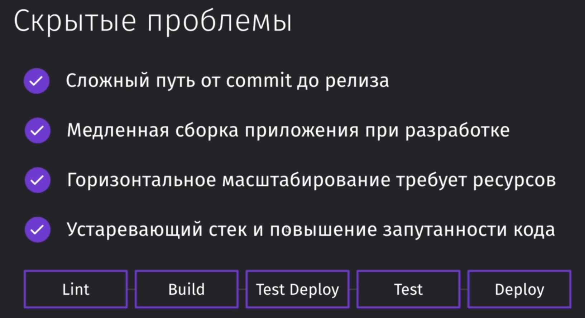
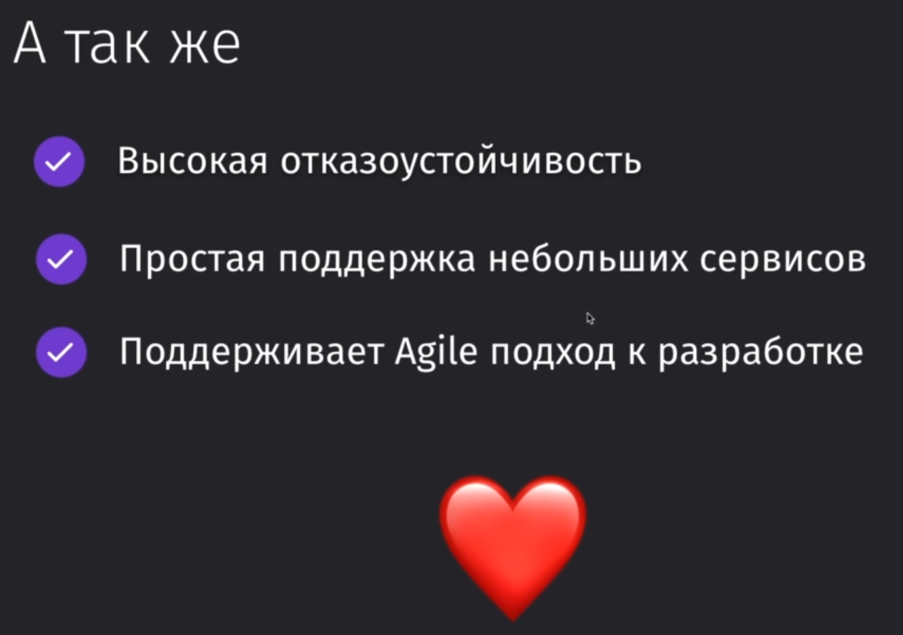
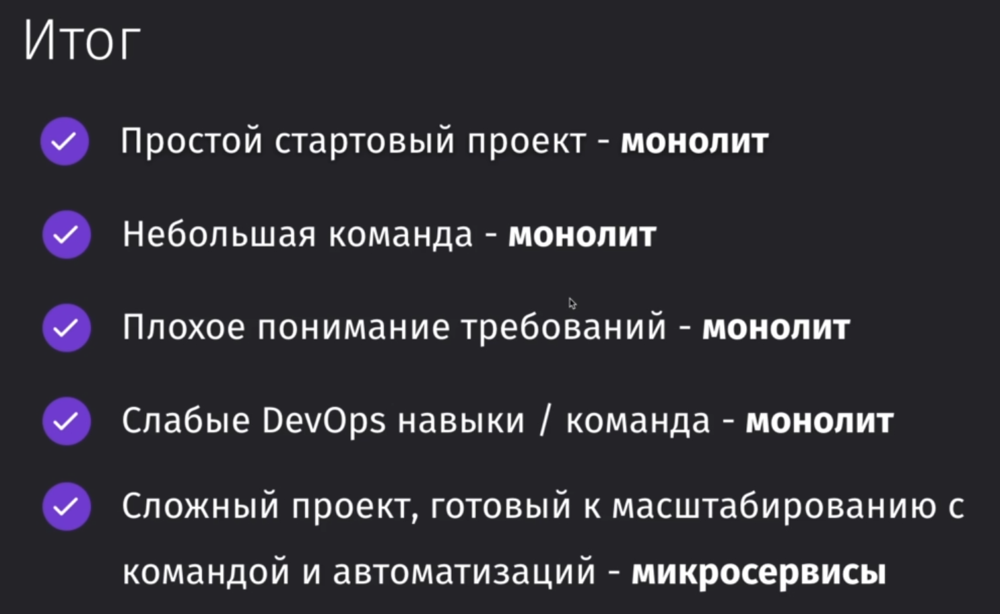
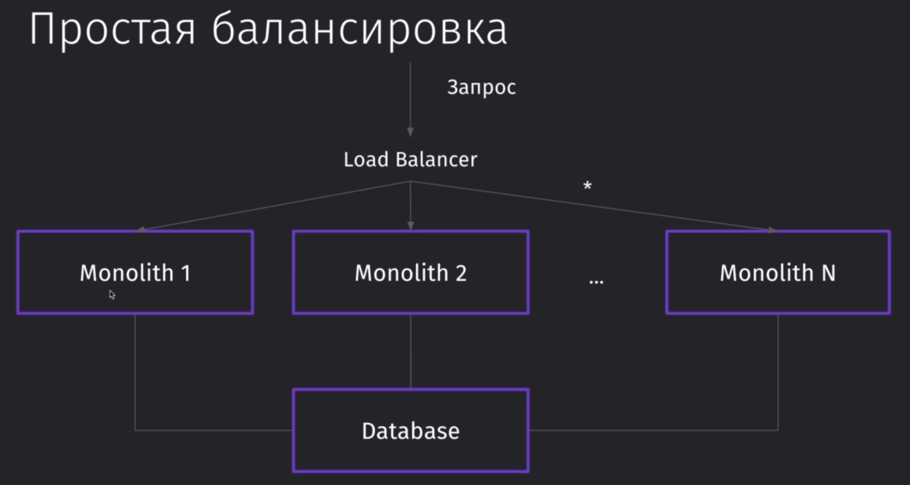
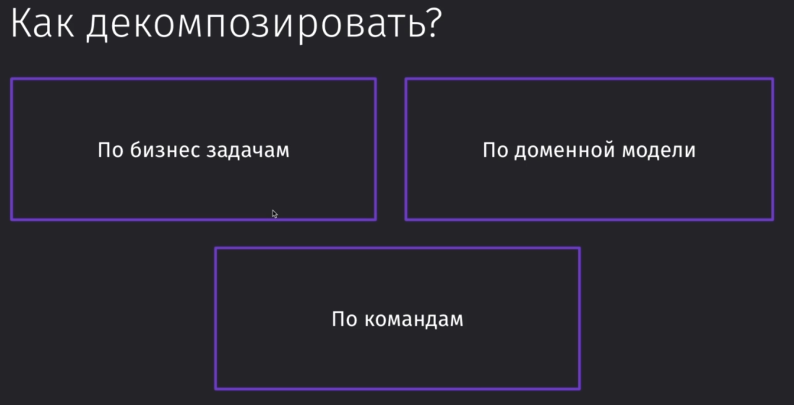
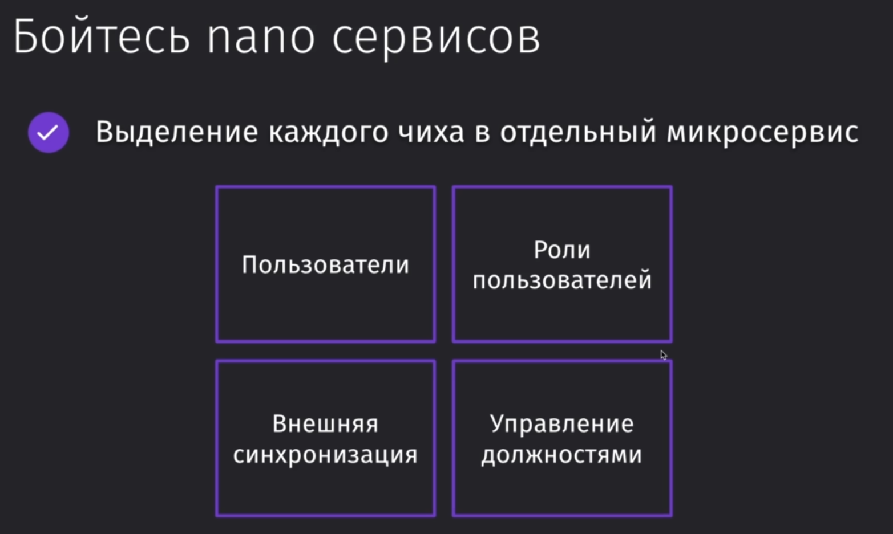

## 13 - Монолит VS Микросервисы

Монолит - это единое приложение, которое в себе инкапсулирует всю бизнес-логику, все зависимости, все связи с внешними системами и данное одно приложение разрабатывается всей командой и выкладывается в продакшн

Микросервис же - это наборы приложений, в рамках которых можно реализовать всю функциональность монолита, но разбитую на множество приложений, которые теми или иными образами связаны друг с другом

###### Монолит
Монолит представляет из себя одно приложение, с одной кодовой базой, которое работает по типу "Straight Forward" - все операции мы производим над одним проектом. Он прост с точки зрения восприятия и с точки зрения работы с ним.

Все плюсы монолита актуальны лишь на старте, когда приложение небольшое и не будет крайне сложным в разработке

Проблемы монолита:
- Со временем, когда приложение разрастается, появляется много проблем с тем, чтобы добавить в него новый функционал, так как приложение имеет огромное количество зависимостей.
- Приложение, построенное крайне давно и имеющее уже не поддерживаемый стек технологий, будет крайне сложно перевести на новый стек, потому как нужно будет соблюсти множество зависимостей и нюансов системы. Так же это экономически невыгодно.
- Так же нельзя выделить определённые ресурсы процессора под определённые модули. Например, для модуля пережатия изображений мы не можем выделить мало ОЗУ, но сильный процессор. Мы выделяем ресурсы под всё приложение сразу.
- Нужно очень много времени тратить на договорённости внутри команды, как переиспользовать отдельные кусочки кода

###### Микросервис

Микросервисная архитектура представляет собой большой набор отдельно работающих приложений, которые взаимосвязано работают друг с другом.

Микросервис позволяет нам:
- Быстро доводить отдельное приложение от первого коммита до релиза, так как мы можем быстро его собрать, протестировать и задеплоить
- Так же мы можем быстро обновить отдельное маленькое приложение, которое выполняет одну конкретную функцию, под новый стек или даже переписать его полностью

- Если упадёт одно определённое приложение, то не упадёт весь микросервис, так как он представляет из себя отдельные приложения (то есть пользователь может продолжать использовать приложение хотя бы частично)
- Очень просто поддерживать и обновлять те маленькие сервисы, что есть в проекте. Куда проще понять, как работает один сервис, чем понимать, как построена архитектура огромного монолита 

Проблемы микросервисов:
- Если мы неправильно определили архитектуру микросервисного приложения и поделили неправильно сервисы, то стоимость, чтобы переделать всю систему сопоставима с переписыванием всей системы с нуля 
- Чтобы выложить приложение, нужно понимать и работать с DevOps практиками: оркестрация, масштабирование, последовательная выкладка
- Наш код не вызывается другим кодом, как в монолите, и это создаёт другой подход к консистентности - нам нужно налаживать каналы связи внутри микросервиса (использовать тот же RabbitMQ).
- Мониторинг системы усложнён, так как между собой нужно связать огромное количество логов
- Мы должны жёстко задавать контракты на работу между сервисами, так как переписать их в дальнейшем будет очень сложно

В 90% случаев микросервисы - не нужны. Мы их выбираем только для того, чтобы можно было разрастать достаточно большой проект или проект, который станет достаточно большим. Так же можно изначально писать монолит, но в будущем разбить его на микросервисы.

## 14 - Вопросы масштабирования

Основная проблема разрастания монолита заключается в том, что предел роста ресурсов компьютера ограничен и мы не можем постоянно вставлять в него новые процессоры и ОЗУ - проще будет на ещё одном сервере поднять копию монолитного приложения и далее проводить балансировку нагрузки (с помощью того же NGINX) на сервера.

Так же мы можем производить балансировку по контенту, котрый запрашивает пользователь (если он перешёл на страницу генерации изображения, то переводить запрос на мощный сервер)

И теперь представим, что у нас микросервис. Тут уже мы не делаем копию всего приложения на каждом сервере - мы раскидываем отдельные функции по их степени нагрузки на отдельные сервера

А если нам нужно осилить возросшую нагрузку в 4 раза на определённый сервис, то мы можем просто натыкать 4 этих приложения на разные сервера, что не отъедает у нас столько же ресурсов, как работа с полноценным монолитом.

Так же можно настроить систему таким образом, что оно деплоило самостоятельно те сервисы, на которые возрастает сильно нагрузка (и всё в реальном времени!).

Микросервисы куда более производительны и просты в эксплуатации при работе с высокой нагрузкой на него.

Так же нужно упомянуть, что мы можем работать не с одной базой данных, а создать под определённые сервисы свои базы, чтобы ускорить работу с занесением информации.

## 15 - Декомпозиция функционала

Все представленные выше преимущества микросервисов будут работать только если мы правильно построили архитектуру и декомпозировали функционал по разным сервисам.

Все сервисы должны быть отделимы и максимально независимы друг от друга. Например, мы можем реализовать отдельный сервис по отправке уведомлений на почту.

- Сервисы должны быть максимально отделены друг от друга и выполнять определённый функционал. Если в монолите мы можем миновать какой-либо сервис и сразу отправить данные в базу, то в микросервисах мы должны обращаться к сервису по работе с базой.
- У нас не должно быть одного микросервиса, который управляет всеми остальными - все сервисы должны уметь жить отдельно.
- Все сервисы должны общаться между друг другом по средствам контрактов, что упростит общение между ними.

Взаимодействие с сервисом осуществляется через:
- Команды - это запрос с данными, который изменяет состояние сервиса (например, создать пост в блоге)
- Запрос так же отправляется в сервис, но не изменяет его состояние (получить 10 последних постов)

Все представленные способы позволяют получить ответ от сервиса в виде совершённого события

Все команды, запросы и события имеют определённые контракты, по которым они взаимодействуют

Делить сервис можно по определённым паттернам:
- По бизнес-задачам (например, программа может считать баланс)
- По доменной области (делится на продавцов и покупателей) - Domain-Driven Design
- По командам (по функционалу, который выполняет система)

Пример: мы имеем аналог Wildberries, в котором имеются пользователи и продавцы

Деление по бизнес-задачам:

Деление по доменным областям:

Так же не нужно перебарщивать с сервисами - выделять слишком много разных сервисов, которые относятся к одной доменной области не нужно. Это только осложнит работу с сервисом.

## 16 - Алгоритм декомпозиции

## 17 - Упражнение Схема после декомпозиции

