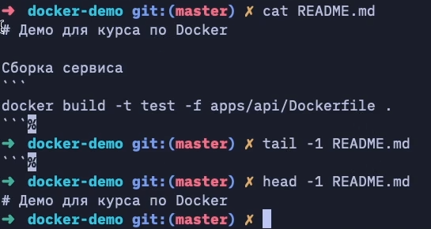
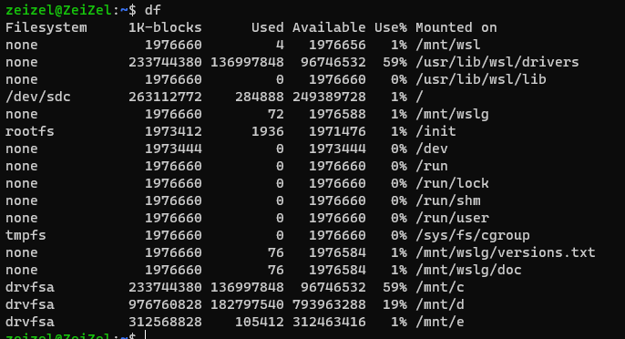

## Базовые команды linux

`pwd` - выведет текущую директорию 
`ls` - вывести список файлов в текущей папке
`ls -l` - вывести таблицей
`ls -la` - вывести таблицей все файлы, включая скрытые
`ctrl+r` - вызовет поиск команды, которая когда-то была вызывана

`cd app` - перейти в папку
`cd ..` - выйти на одну папку вверх
`cd ../files/apps` - выход на одну папку вверх и переход по пути
`mkdir test` - создание директории 
`rm package.json` - удаление одного файла
`rm -R test` - включается рекурсивное удаление и позволяет удалить всю папку
`cp README.md README2.md` - копирование файла
`mv README2.md README3.md `- перемещение файла (файл переименуется,  удалится из начальной точки и появится в конечной)
`cat README.md` - выведет содержимое файла

`less README.md` - выведет файл в подобии редактора, из которого можно выйти на ESC 

Так же можно объединять выполнение команд через оператор `|`
`cat package.json | grep "jest"` - выведет все строки с надписью "jest"


`find ./apps -name main.ts` - позволяет найти файл в папке


Оператор `>` позволяет перевести выходные данные в другую команду


`diff <file1> <file2>` - выводит разницу между файлами


`df` - отображает заполненность диска. Обычно некоторые операции не выполняются, когда диск оказывается полностью заполненным и можно проверить наличие места этой командой


>[!warning] Важно! 
> `sudo <команда>` - выполняет операцию от имени администратора

## Настройка Docker

Устанавливаем сертификаты 

```bash
sudo apt-get update
sudo apt-get install ca-certificates curl gnupg
```

Далее устанавливаем ключ докера

```bash
sudo install -m 0755 -d /etc/apt/keyrings

curl -fsSL https://download.docker.com/linux/ubuntu/gpg | sudo gpg --dearmor -o /etc/apt/keyrings/docker.gpg

sudo chmod a+r /etc/apt/keyrings/docker.gpg
```

Устанавливаем репозиторий

```bash
 echo \
  "deb [arch="$(dpkg --print-architecture)" signed-by=/etc/apt/keyrings/docker.gpg] https://download.docker.com/linux/ubuntu \
  "$(. /etc/os-release && echo "$VERSION_CODENAME")" stable" | \
  sudo tee /etc/apt/sources.list.d/docker.list > /dev/null
```

Ещё раз обновляем утилиту установки пакетов

```bash
sudo apt-get update
```

Устанавливаем пакеты докера

```bash
sudo apt-get install docker-ce docker-ce-cli containerd.io docker-buildx-plugin docker-compose-plugin
```

Проверяем работу докера

```bash
sudo docker run hello-world
```

Добавляем группу докера

```bash
sudo groupadd docker
```

Тут мы добавляем себя в группу докера

```bash
sudo usermod -aG docker $USER
```


