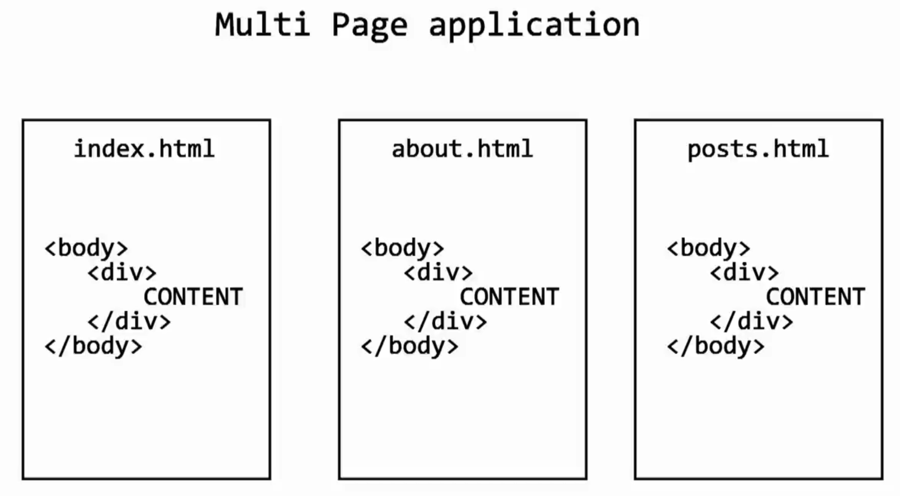
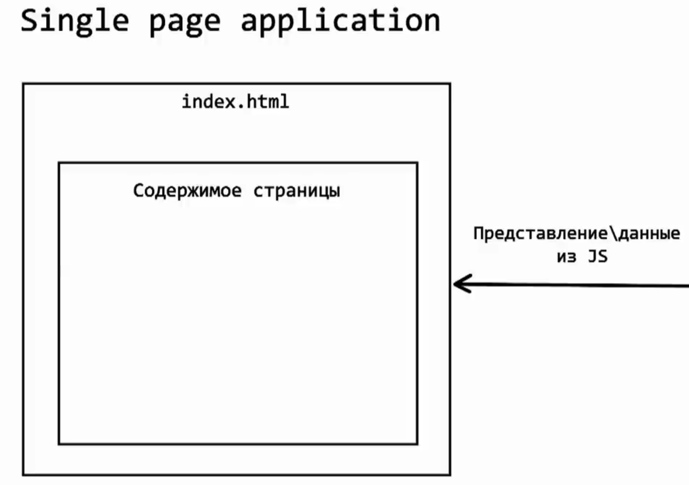
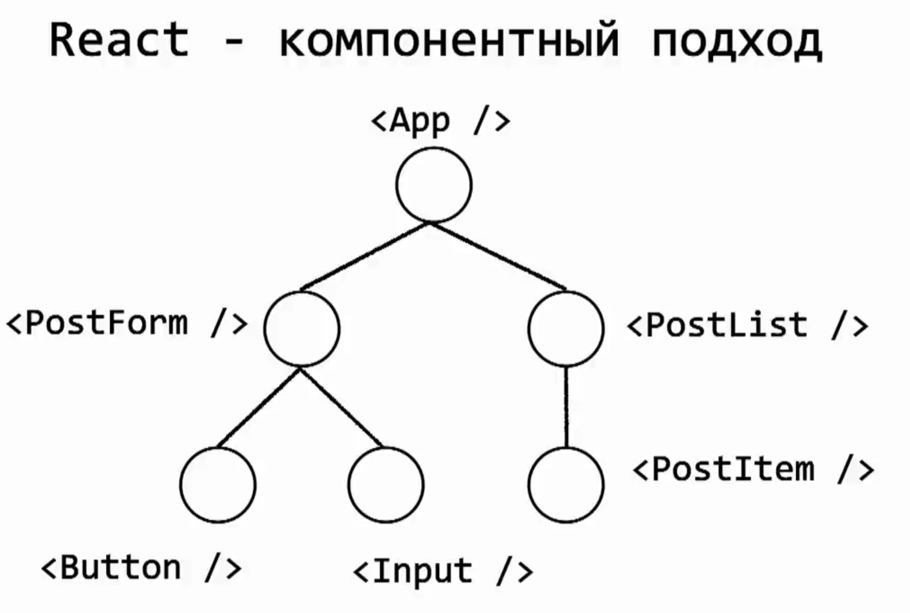
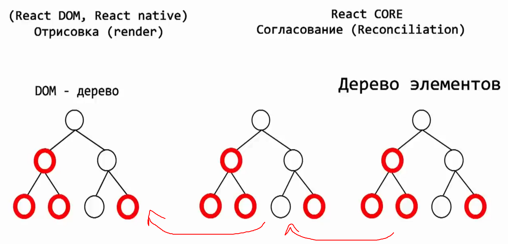

## **01 Введение**

### 001 Преимущества NextJS

Чтобы собрать современный сайт на React, нужно использовать крайне много сторонних фреймворков и библиотек, которые будут у нас реализовывать SSR, роутинг, модульность и так далее.

Однако можно выбрать один из фреймворков, который заменит нам огромную кучу сторонних технологий. Конкретно у нас есть два фреймворка, которые используются для разных случаев. 
Первый фреймворк используется на статичных сайтах, которые редко обновляются. 
Второй фреймворк уже используется на динамических сайтах для подхватывания данных и для их обновления в реальном времени

Преймущества Некста

## Теория 

==React== - это библиотека по отрисовке пользовательских интерфейсов. 
В браузере отрисовкой занимается ==ReactDOM==, а на приложениях для мобильных устройств отрисовка происходит за счёт ==React Native==.
В первую очередь, React позволяет нам создать ==SPA==.

Обычный подход - это создание ==MPA== (многостраничного приложения), когда у нас создаются отдельные HTML-документы под каждую страницу. 
Основным минусом такого подхода является то, что страницы каждый раз грузятся заново.

Современный подход - это создание SPA, которое представляет из себя приложение в браузере. Мы подгружаем не вёрстку, а JS-код, который и генерирует нам страницу в браузере. 
При таком подходе вес первой страницы будет больше, зато сайт будет работать куда быстрее.

Реакт использует в своей основе компонентный подход в реализации продукта - внутрь одного компонента мы вкладываем другие компоненты интерфейсов

При обычной работе с ДОМ-деревом нам нужно следить за большим количеством элементов. Реакт же в свою очередь сам следить за обновлениями интерфеса в зависимости от того, что мы и куда задали в этих компонентах. То есть разработчик больше времени тратит на проработку логики и распределение данных в приложении.
Мы изменяем данные - интерфейс подстраивается под эти данные.

Реакт строит внутри себя ==Дерево React-элементов== (которое обычно называют VirtualDOM, что не есть правильное определение, так как такое же дерево строится и для мобильных устройств). В браузере это дерево элементов представляет из себя облегчённую копию DOM-дерева. 

При каких-либо изменениях, которые должны попасть на дерево элементов, реакт строит второе дерево реакт-элементов, которое и принимает в себя все внесённые нами изменения. Затем происходит сравнение нынешнего дерева реакт-элементов с предыдущим. А уже только потом реакт переносит эти изменения на основное дерево элементов - DOM-дерево (то есть перерендеривает новый интерфейс).
Весь вышеописанный алгоритм называется ==Алгоритмом сравнения== (Reconciliation Algorithm)

Реакт выставляет внутри себя приоритетность рендера разных элементов на странице (более приоритетные - быстрее, менее приоритетные - медленнее), чем позволяет плавно рендерить их пользователю.

За отрисовку в браузере отвечает ReactDOM, за отрисовку на мобильных устройствах React Native.

