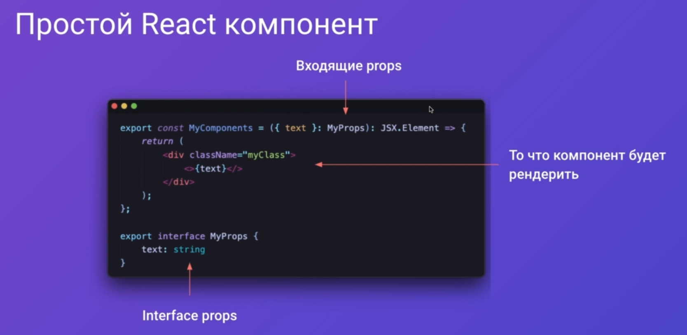
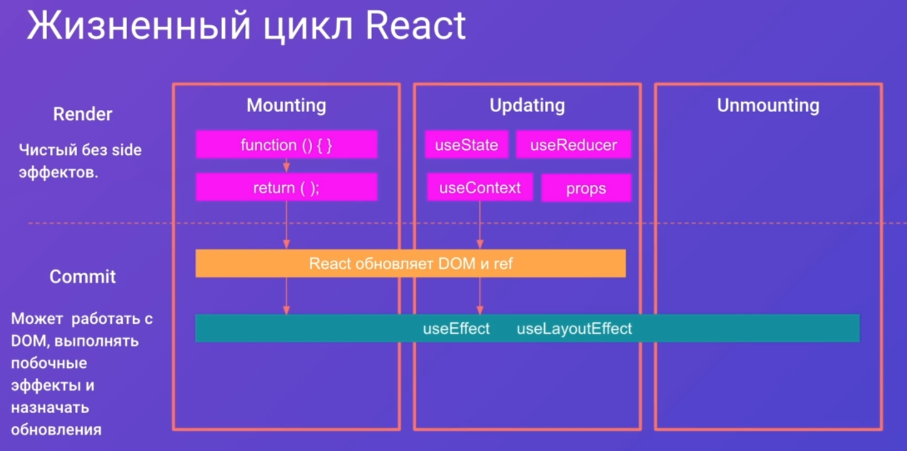
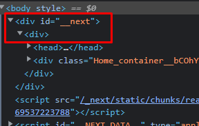
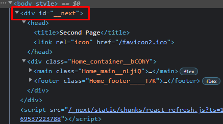
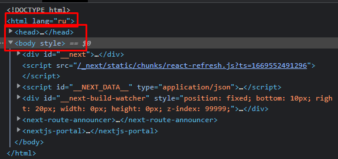

#NextJSHeadComponent #NextJSDocument

### 001 Жизненный цикл React

Реакт - это в первую очередь библиотека, так как в ней нет полноценного роутинга, архитектуры и остальных частей полноценного фреймворка. Реакт-компонент на странице представляет собой как целую страницу, так и отдельную кнопку.

На примере мы видим отдельный реакт-компонент. На входе он принимает от родителя пропсы. На выходе (`return()`) он должен будет отдать JSX-элемент. В результате этого JSX-элемента, мы говорим, что мы хотим отобразить этим компонентом в целом.
Основная цель реакта - это фокус на том, как нужно отрендерить эти элементы и компоненты и когда нам нужно перерендерить их



В рамках рендера компонент проходит несколько циклов. Жизненный цикл реакта делится на две большие части:
- ==Первичный Рендер== (генерация страницы либо на клиенте, либо на сервере). Тут мы работаем с ДОМ, выполняем некоторые побочные эффекты. Конкретно этот этап будет проходить на сервере, так как мы используем ==NextJS==
- ==Коммит== (отображение на странице, обновление ДОМ-дерева и срабатывание эффектов)

Делятся эти циклы на три состояния компонента:
- Mounting - монтирование страницы из компонентов. Тут происходит срабатывание функции и возвращение элемента реакта из `return`. Дальше выполнится обновление своего дерева элементов реакта и конечного дом-дерева. После построения дерева, происходят сайд-эффекты, которые мы можем вызвать хуками
- Updating - обновление компонента на странице, когда с ним что-нибудь происходит (например, срабатывание эффектов)
- Unmounting (размонтирование) - удаление компонента со страницы и из дерева. При удалении элемента со страницы можно так же вызывать подключенную анимацию к компоненту



Обновляется компонент реакта в нескольких случаях:
- Когда у него поменялось состояние (`useState`, `useReduce`)
- Когда у него поменялся глобальный контекст (`useContext`)
- И когда у него поменялся входящий `props`

### 002 Компонент head

Компонент `head` хранит в себе метаданные страницы и поднимает их на самый верх

`index.tsx`
```TSX
export default function Home(): JSX.Element {
	const author = " Lvov Valery";

	return (
		<div className={styles.container}>
		<Head>
			<title>Create Next App</title>
			<meta name="description"content="Generated by create nextapp" />
			<link rel="icon" href="/favicon.ico" />
		</Head>
		<main></main>
	);
}
```


И сразу нужно рассказать про особенности работы данного компонента:
1) `title` берётся из самого верхнего по вложенности файла (тут - `index.tsx`)
2) Чтобы разделять линки (например, если нам нужно другую фавиконку запилить на сайт), нужно проставить ключи на них `key={1}`

`_app.tsx`
```TSX
export default function App({ Component, pageProps }: AppProps): JSX.Element {
  return (
    <div>
      <head>
        <title>Second Page</title>
        <link key={2} rel="icon" href="/favicon2.ico" />
      </head>
      <Component {...pageProps}/>
    </div>
  );
}
```

`index.tsx`
```TSX
<link key={1} rel="icon" href="/favicon.ico" />
```

### 003 React Fragment

Компонент `<Fragment>` позволяет отрендерить объект на странице без вложения внутрь `div`-элемента. Его стоит использовать, чтобы не создавать лишней вложенности и реализовать передачу одного компонента реакта (див мы используем, чтобы не передавать массив объектов, который не может обработать библиотека)

До использования компонента:



После использования компонента лишнего дива нет



Это первый способ, которым мы можем вызвать компонент: `<Fragment>`

```TSX
import '../styles/globals.css';
import type { AppProps } from 'next/app';
import { Fragment } from 'react';

export default function App({ Component, pageProps }: AppProps): JSX.Element {
  return (
    <Fragment>
      <head>
        <title>Second Page</title>
        <link key={2} rel="icon" href="/favicon2.ico" />
      </head>
      <Component {...pageProps} />
    </Fragment>
  );
}
```

Так же мы можем вписать `<React.Fragment>`

```TSX
import React from 'react';

export default function App({ Component, pageProps }: AppProps): JSX.Element {
  return (
    <React.Fragment>
      <head>
        <title>Second Page</title>
        <link key={2} rel="icon" href="/favicon2.ico" />
      </head>
      <Component {...pageProps} />
    </React.Fragment>
  );
}
```

Ну и в конечном итоге мы можем просто написать `<>контент</>`

```TSX
export default function App({ Component, pageProps }: AppProps): JSX.Element {
  return (
    <>
      <head>
        <title>Second Page</title>
        <link key={2} rel="icon" href="/favicon2.ico" />
      </head>
      <Component {...pageProps} />
    </>
  );
}
```

### 004 Компонент Document

Если будут вопросы: https://nextjs.org/docs/advanced-features/custom-document

Данный компонент позволяет нам осуществить сразу несколько вещей:
1) позволяет передать язык в наш документ `lang="ru"` (например, без этого параметра не будут работать скринридеры)
2) даёт возможность добавить класс в `body`, если потребуется 
3) даёт нам возможность работать со структурой документа

`_document.tsx`
```TSX
import Document, {Html, Head, Main, NextScript, DocumentContext, DocumentInitialProps} from "next/document";

export default class MyDocument extends Document {
	// эта функция берёт пропсы из основного документа и перебрасывает в наш
	// таким образом, мы сохраняем пропсы в новом документе
	static async getInitialProps(context: DocumentContext): Promise<DocumentInitialProps> {
		const initialProps = await Document.getInitialProps(context);
		return { ...initialProps };
	}

	// тут происходит рендер HTML-структуры нашего документа
	render(): JSX.Element {
		return (
			<Html lang="ru">
				<Head/>
				<body className="someClass">
					<Main/>
					<NextScript/>
				</body>
			</Html>
		);
	}
}
```

