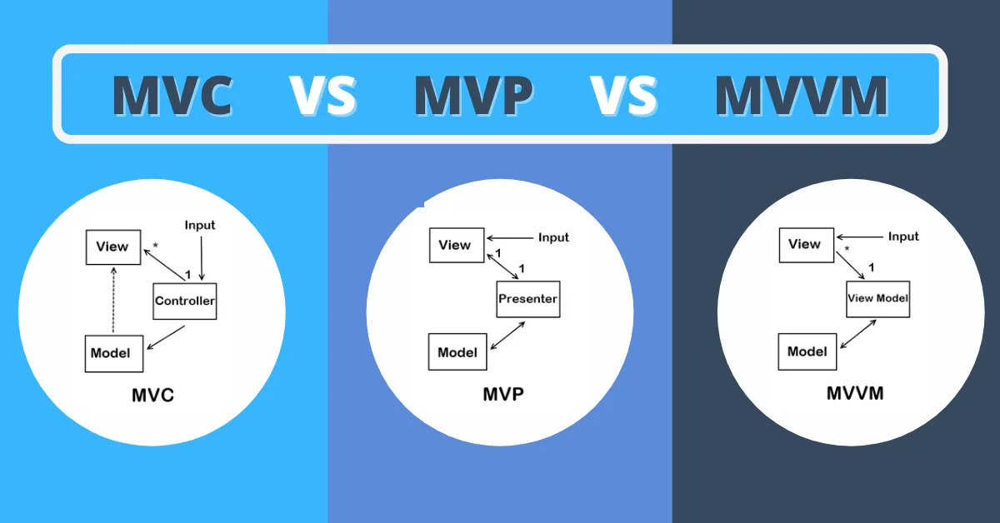

Работа с динамическими данными и со стейтом - это одна из основных задач разработчика. Если логика изменения данных написана правильно, то и их отображение будет несложной задачей.

Первое приложение у нас выглядит следующим образом:
- Все данные хранились в одном компоненте
- Все данные передавались по иерархии вниз, а изменения состояния передавались вверх через коллбэки
- Так же все состояния централизованы (они все находились в одном месте - в компоненте `App`)

Такой подход называется ==Property Drill==, когда мы просверливаем пути для передачи состояний по уровням через несколько компонентов. Такой подход не является достаточно логичным, так как некоторые компоненты могут хранить в себе ненужные для них состояния, которые мы просто перебрасываем дальше.

Второе приложение выглядит уже следующим образом:
- Каждый компонент хранит своё состояние у себя (один компонент содержит список персонажей, а другой список комиксов, третий содержит информацию об одном конкретном персонаже и так далее)

Такой подход сложно масштабировать, особенно, если появятся зависимости между компонентами

Чтобы решить вышеописанные проблемы, были придуманы определённые паттерны для работы с состояниями продуктов, такие как ==MVC==, ==MVP==, ==MVVM==

И чтобы решить проблему со сложными зависимостями, можно создать один большой источник стейтов для всех компонентов. Однако тут мы сталкиваемся с проблемой, что каждый компонент может поменять наш глобальный стейт

И чтобы решить уже вышеописанную проблему, был придуман следующий подход:
- Мы имеем наши компоненты **View**, которые при выполнении какого-либо действия создают **Actions** (который уже знает, что нужно обновить в стейте)
- Определённые события **Actions** (которые хранят информацию о требуемых изменениях) вызывают срабатывание определённых действий в компоненте **Reducer** (который уже знает, как именно обновить этот стейт). Операция передачи объекта **Actions** в **Reducer** называется ==dispatch==
- Компонент **Reducer** - это компонент, который находится в общем хранилище стейтов и он знает, что делать при любом запросе от компонентов сайта. То есть он регулирует обновление стейтов внутри **S**, чтобы компоненты могли перерисоваться на базе обновлённых данных
- Компонент **S** так же находится внутри хранилища и сам по себе просто хранит все состояния приложения. 

Так же в ==Redux== имеются ==селекторы== - это функции, которые получают часть данных из хранилища для дальнейшего использования (из **S** во **View**)

И вот так выглядит работа стейт-менеджера на реальном примере. Из `State` прошлые данные приходят в `Reducer`, чтобы сравнить с новыми значениями.

Примерно такой же подход использовался в хуке `useReducer`.

И тут важно уточнить, что запутаться в трёх разных документациях легко, поэтому нужно знать. что ищем:

Так же очень важное расширение для работы с редаксом в браузере, которое позволяет просмотреть состояния системы:

