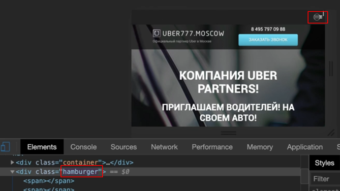
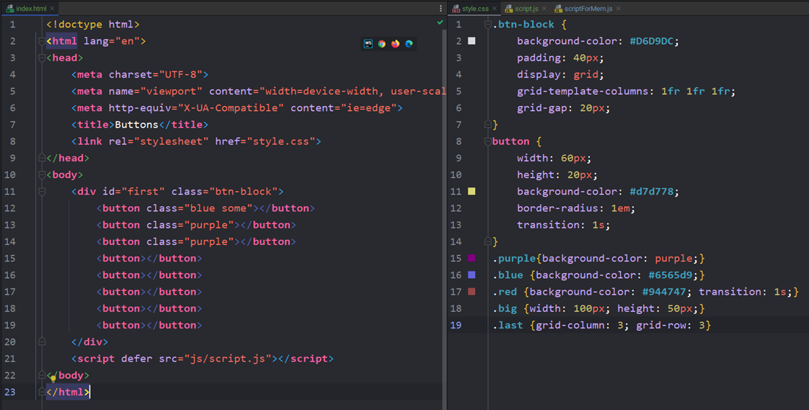
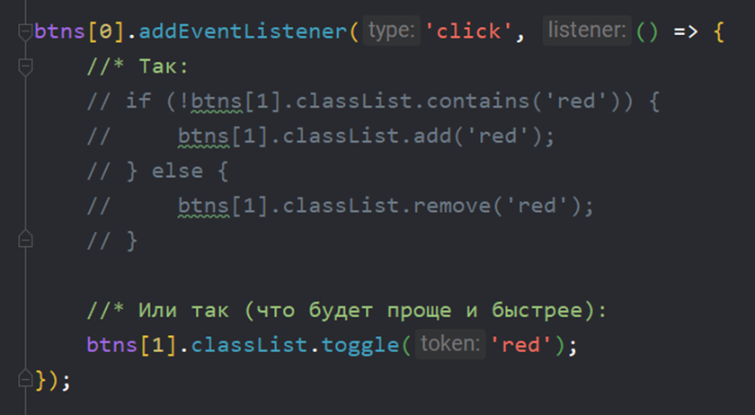
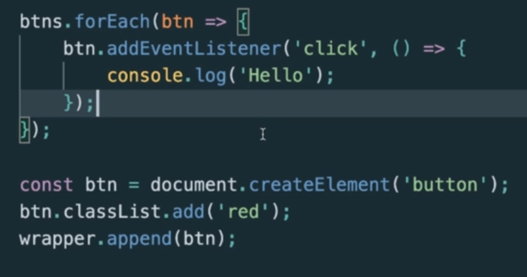
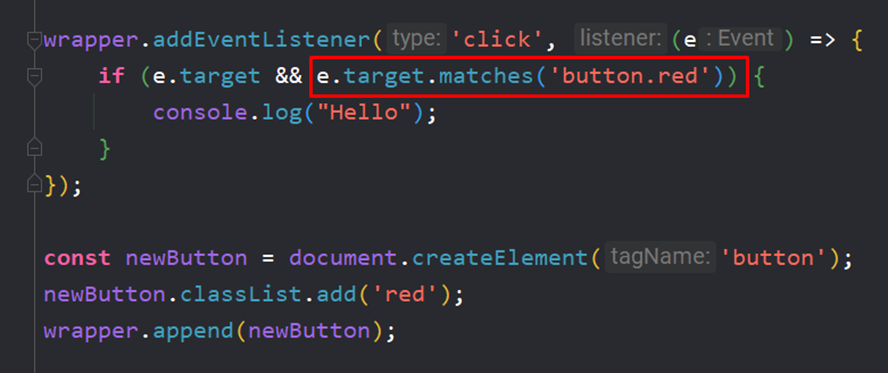

С помощью приведённых ниже методов обычно создают изменения в классах для применения новых стилей на объекте и проявления элементов. Конкретно данный гамбургер был сделан через использование метода `toggle()`

Изначальный код на странице:

Сначала мы получим псевдомассив со всеми нашими кнопками со страницы. Через `classList.length` можно получить количество классов на объекте. Через `classList.item(индекс)` можно получить наименование класса объекта под определённым индексом

Метод `classList.togle(`) крайне полезен и юзабелен. Данный метод добавит класс, если он отсутствует на объекте и удалит, если уже присуствует. Он может заменить целый блок с условной конструкцией, так как в его нутрянке и есть подобная проверка

Метод `contains()` проверяет наличие класса в выбранном объекте. С помощью него можно прописать условие, которое будет срабатывать при наличии определённого класса

И вот пример добавления/удаления класса через условную конструкцию и через `toggle()`

`className` – устаревший способ изменения классов. Он хранит в себе классы как строчку и использовать его неудобно

И сейчас нужно поговорить про добавление события для нескольких элементов на странице. Дело в том, что если нам нужно одинаковое событие на странице для нескольких элементов, то мы могли бы добавить `addEventListener` через `forEach` на все такие элементы. Однако такой подход немного устарел и имеет свои минусы в виде того, что если элемент отсутствовал на странице, то тот при появлении не будет иметь данный ивент.

Чтобы упростить задачу, нам нужно применить данный ивент на сам враппер, который в себе содержит эти элементы

Далее хорошо бы было узнать название элемента в самой HTML-структуре через дир - `event.target` (название элемента можно увидеть при нажатии на него на странице)

И теперь при нажатии любой кнопки внутри `wrapper` (даже если кнопка появилась позже в нём) у нас будет срабатывать `event`. При нажатии на сам враппер, ничего происходить не будет

Такой способ называется делегированием

Так же можно присвоить ивенты только тем кнопкам, которые имеют определённый класс (тут – `blue`)

И вот простой пример. Созданная кнопка после объявления ивента, уже имеет данный ивент, потому что он делегируется дочерним элементам

При таком коде новый ивент не будет добавлен на кнопку и она будет грустить одна такая☹

И так же есть продвинутая техника обращения к элементу через метод `matches()`, внутрь которого мы положим наименование элемента и селектор класса

