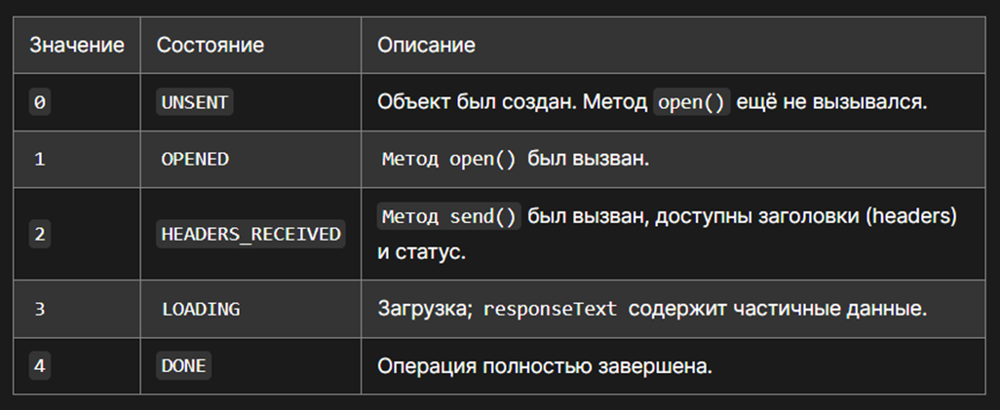

Технология AJAX (Async JS and XML) используется для динамической генерации контента на странице. Она позволяет интерактивно менять контент, что выглядит красиво и позволяет не перезагружать страницу для изменения контента. Это снижает количество потребляемого трафика (так как грузится только часть страницы, а не вся страница) и снижает нагрузку на сервер

Тут представлен код HTML и слева код – данные с сервера

Получаем инпуты

Два ивента для инпутов:

Три основных метода запросов на сервер

`Open`(`метод`(пост- или гет-запрос), `ссылка на файл запроса`, `асинхронность` (`true`/`false` – изначально стоит в `true`, так как выполняется запрос к серверу и работа страницы асинхронно и это нормально), `логин`, `пароль`)

`get`-запросы можно реализовать даже на простом сервере (тот же *Live Server*)

`setRequestHeader` – отправляет сам json-файл. В него мы вставляем заголовок типа и сам тип

`send` – в данном случае отправляет пустой запрос на получение данных. Однако, если мы будем использовать пост-запрос, то нужно будет в сенд передать отправляемые данные

Так же у нас есть определённые свойства, которые хранит наш реквест:

`status` - Содержит статус нашего [запроса](https://ru.wikipedia.org/wiki/%D0%A1%D0%BF%D0%B8%D1%81%D0%BE%D0%BA_%D0%BA%D0%BE%D0%B4%D0%BE%D0%B2_%D1%81%D0%BE%D1%81%D1%82%D0%BE%D1%8F%D0%BD%D0%B8%D1%8F_HTTP) (404 и тд)
`statusText` - текстовое описание ответа от сервера (OK(200), Not Found(404))  
`response` - ответ от сервера (задаёт бэк-энд разработчик)  
`readyState` - текущее состояние запроса (таблица)

Тут представлен код, который выполняет запрос на сервер, получает данные и обрабатывает их, чтобы вывести данные в инпут

Данный ивент срабатывает при выполнении запроса. Однако выполниться запрос может и с ошибкой, поэтому полностью условие убрать на проверку правильности – не получится. В остальном код работает ровно так же, только уже можно не проверять на полное выполнение запроса

И так выглядит итог

Полный код:

Первый вариант

Второй вариант

