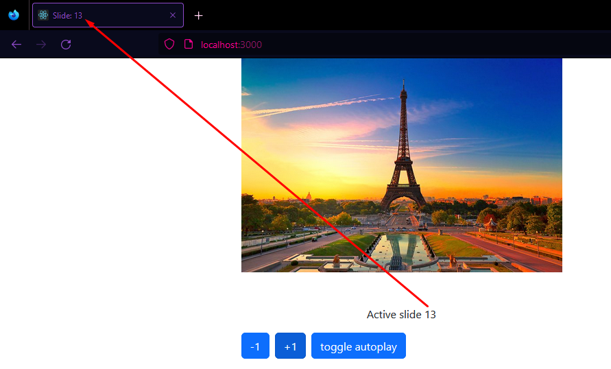
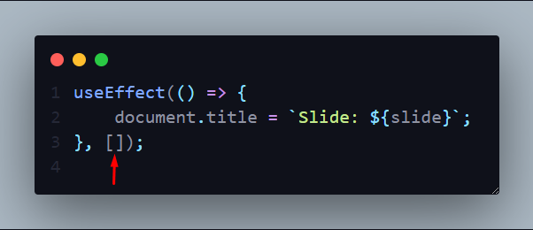
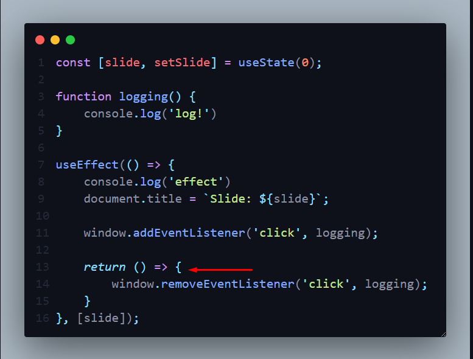

`useEffect()` - это хук, который выполняет эффекты на определённых этапах жизненного состояния компонента

Побочными действиями (эффектами) обычно являются:
- дозагрузка данных
- использования сторонних модулей
- запуск таймаутов
- логирование 
- изменение ДОМ-структуры

И далее нам нужно обновлять заголовок страницы в зависимости от состояния слайда

И тут показан пример использования хуков жизненного состояния `componentDidMount` и `componentDidUpdate` в классовом компоненте. Основная проблема такого подхода заключается в повторении кода.

И в функциональном компоненте эту же самую операцию выполняет одна функция `useEffect()`

```JS
import { Component, useEffect, useState } from 'react';
import { Container } from 'react-bootstrap';
import './App.css';

class SliderClass extends Component {
	constructor(props) {
		super(props);
		this.state = {
			autoplay: false,
			slide: 0,
		};
	}

	// при монтировании компонента, будет показываться элемент
	componentDidMount() {
		document.title = `Slide: ${this.state.slide}`;
	}

	// при обновлении компонента, будет показываться слайд
	componentDidUpdate() {
		document.title = `Slide: ${this.state.slide}`;
	}

	changeSlide = (i) => {
		this.setState(({ slide }) => ({
			slide: slide + i,
		}));
	};

	toggleAutoplay = () => {
		this.setState(({ autoplay }) => ({
			autoplay: !autoplay,
		}));
	};

	render() {
		return (
			<Container className='wrapper'>
				<div className='slider w-50 m-auto'>
					
					<div className='text-center mt-5'>
						Active slide {this.state.slide} <br /> {this.state.autoplay ? 'auto' : null}
					</div>
					<div className='buttons mt-3'>
						<button
							className='btn btn-primary me-2'
							onClick={() => this.changeSlide(-1)}
						>
							-1
						</button>
						<button
							className='btn btn-primary me-2'
							onClick={() => this.changeSlide(1)}
						>
							+1
						</button>
						<button className='btn btn-primary me-2' onClick={this.toggleAutoplay}>
							toggle autoplay
						</button>
					</div>
				</div>
			</Container>
		);
	}
}

const SliderFunction = (props) => {
	const [slide, setSlide] = useState(0);
	const [autoplay, setAutoplay] = useState(false);

	// и сейчас мы будем каждый раз вызывать перерендер данного элемента
	useEffect(() => {
		document.title = `Slide: ${slide}`;
	});

	function changeSlide(i) {
		setSlide((slide) => slide + i);
	}

	function toggleAutoplay() {
		setAutoplay((autoplay) => !autoplay);
	}

	return (
		<Container className='wrapper'>
			<div className='slider w-50 m-auto'>
				
				<div className='text-center mt-5'>
					Active slide {slide} <br /> {autoplay ? 'auto' : null}
				</div>
				<div className='buttons mt-3'>
					<button className='btn btn-primary me-2' onClick={() => changeSlide(-1)}>
						-1
					</button>
					<button className='btn btn-primary me-2' onClick={() => setSlide(slide + 1)}>
						+1
					</button>
					<button className='btn btn-primary me-2' onClick={toggleAutoplay}>
						toggle autoplay
					</button>
				</div>
			</div>
		</Container>
	);
};

function App() {
	return (
		<div>
			<SliderClass />
			<SliderFunction />
		</div>
	);
}

export default App;
```

И теперь оба компонента выполняют свои функции одинаково



И так же нужно сказать про разные состояния работы хука `useEffect`

При такой записи эффект будет выполняться каждый раз при обновлении компонента.
Дело заключается в том, что так функция будет работать как `componentDidMount` и функция будет меняться при каждом рендере, то есть каждый раз будет создаваться новая функция (которая передаётся в `useEffect`). Реализован так хук, чтобы не было багов с замыканием, чтобы получать актуальную переменную из состояния.


Такая запись хука будет вызвать срабатывание функции при любом изменении стейта на странице, что не очень хороший подход, так как у нас есть и другие стейты на странице, которые не относятся 


Чтобы исправить проблему выше, можно передать второй аргумент в хук - зависимости, которые будут триггерить срабатывание функции


И теперь вызываться функция будет только при изменении целевого состояния


Если нам нужно сэмулировать работу функции `componentDidMount`, тогда нам нужно передать пустой массив зависимостей, что вызовет срабатывание функции только один раз - при загрузке 



>[!note] Так же мы можем создать несколько хуков `useEffect`.Желательно создавать отдельные эффекты на каждое действие.

И далее рассмотрим поведение, когда нам нужно реализовать поведение `componentWillUnmount`, когда при размонтировании компонента нам нужно произвести все отписки (отключить листенеры и таймауты)

Чтобы выполнить данную операцию, нужно просто из эффекта вернуть другую функцию, которая выполнит заданную операцию при размонтировании



Добавим в родительский компонент возможность удалить компонент со страницы

```JS
function App() {
	const [slide, setSlide] = useState(true);

	return (
		<>
			<button onClick={() => setSlide(!slide)}>Слайдер</button>
			{/* <SliderClass /> */}
			{slide ? <SliderFunction /> : null}
		</>
	);
}
```

И теперь при каждом монтировании компонента появляется уведомление


