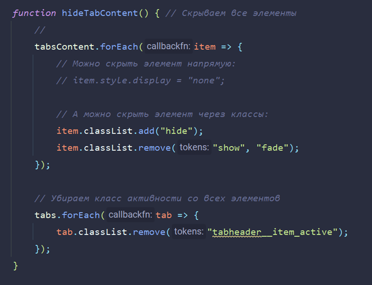
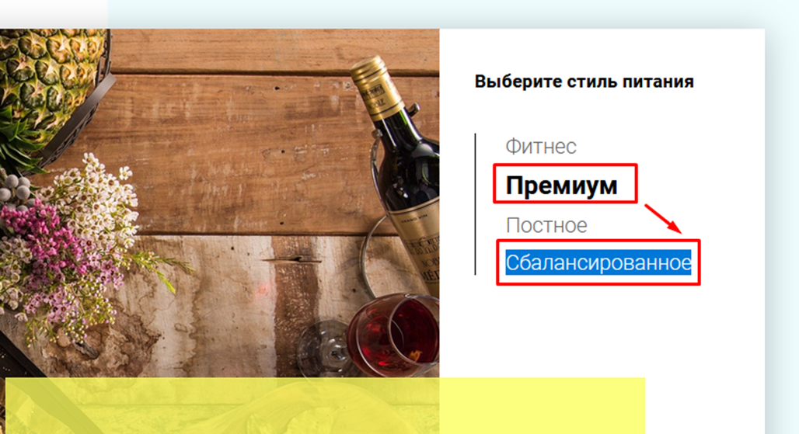
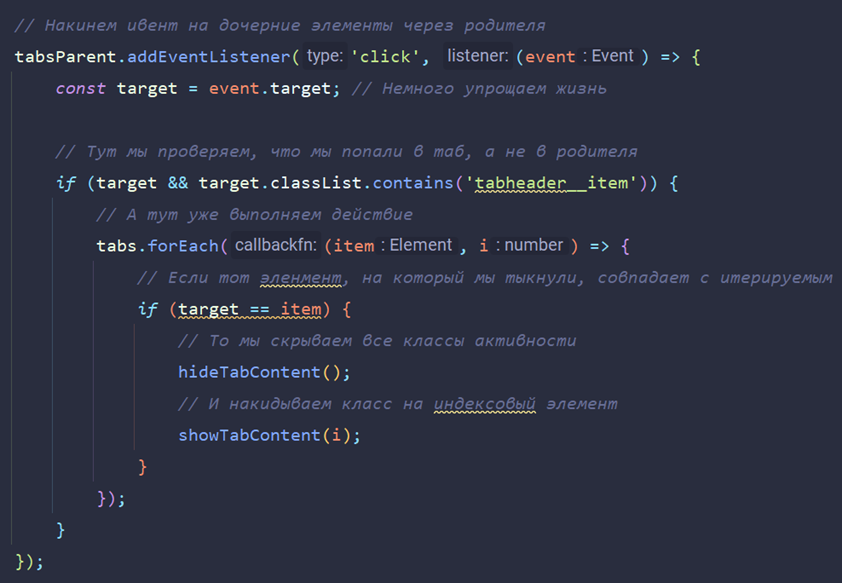

Вот хороший пример структуры CSS-документа, когда разные стили находятся в разных блоках. Такой подход упростит создание большого сайта

Ну и немного дополнительных стилей, с которыми можно будет порабоать из JS

Так выглядят наши переключате ли табов

Так выглядят сами табы

Для начала мы запишем весь наш код в ивентлистенер документа, который будет срабатывать при загрузке всей дом-структуры

Данной функцией мы прячем весь контент наших табов (добавляем хайд и снимаем шоу с анимацией фэйда на всех элементах через цикл)

И дальше реализована функция, которая показывает нужные табы по индексу. По умолчанию индекс равен нулю. Тут мы ремувим хайд и добавляем шоу и фэйд. Так же добавляем класс активности для переключателя табов

И самая сложная часть: смена активности таба. Её мы будем реализовывать через проверку тыкнутого элемента с `event.target`. Его айди закинем в метод `showTabContent()`

Ивент будет срабатывать при клике внутри родителя.

Для начала мы упростим обращение к таргету. Потом мы создадим условие, которое будет срабатывать, если элемент имеет нужный нам класс (класс элемента внутри родителя).

Дальше мы внутри условия будем перебирать все наши кнопки для переключения изображений. В качестве аргументов используем саму кнопку и её индекс.

Внутри создаём ещё одно условие - если кнопка будет совпадать с таргетом, то будем прятать весь контент и показывать нашу кнопку по индексу

