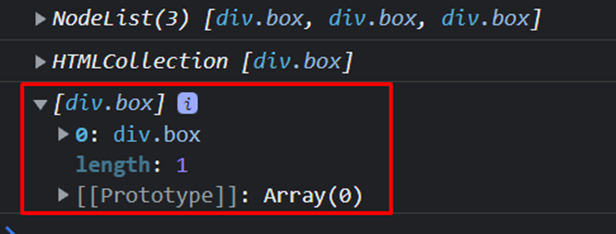

В консоли мы видим коллекции, которые были созданы благодаря `querySelector` и `getElementByClassName`

```JS
const boxesQuery = document.querySelectorAll('.box');
const boxesGet = document.getElementByClassName('box');

console.log(boxesQuery);
console.log(boxesGet);
console.log(document.body.children);
```


И сейчас перед нами встаёт разница между живыми коллекциями и статическими.

Современный способ обращения к объектам представляет из себя статическую коллекцию, которая статично хранит в себе состояние DOM-дерева. Старый способ обращения к объектам отображает текущее состояние DOM-дерева

```JS
const boxesQuery = document.querySelectorAll('.box');
const boxesGet = document.getElementByClassName('box');

boxesQuery[0].remove();
boxesGet[0].remove();

console.log(boxesQuery);
console.log(boxesGet);
console.log(document.body.children);
```


И встаёт иногда такая потребность, чтобы следить за состоянием DOM-дерева в течение его жизни. Мы можем сделать массив из данной коллекции, но тут уже встаёт проблема: массив – это уже статичный объект и следить за DOM-деревом не получится

```JS
// генерируем массив из псевдомассива элементов страницы
console.log(Array.from(boxesGet));
```



Тут мы добавляем дополнительно пять боксов через цикл


И тут представлены два метода, которые можно применять на псевдомассивах.

1) `matches()` – принимает в себя селектор и при его нахождении в объекте возвращает `true`
2) `closest()` – принимает в себя класс и выводит ближайший родительский элемент с таким классом.

Мы имеем структуру: `wrapper > innerWrapper > box`. И при поиске враппера выведется вся эта структура

