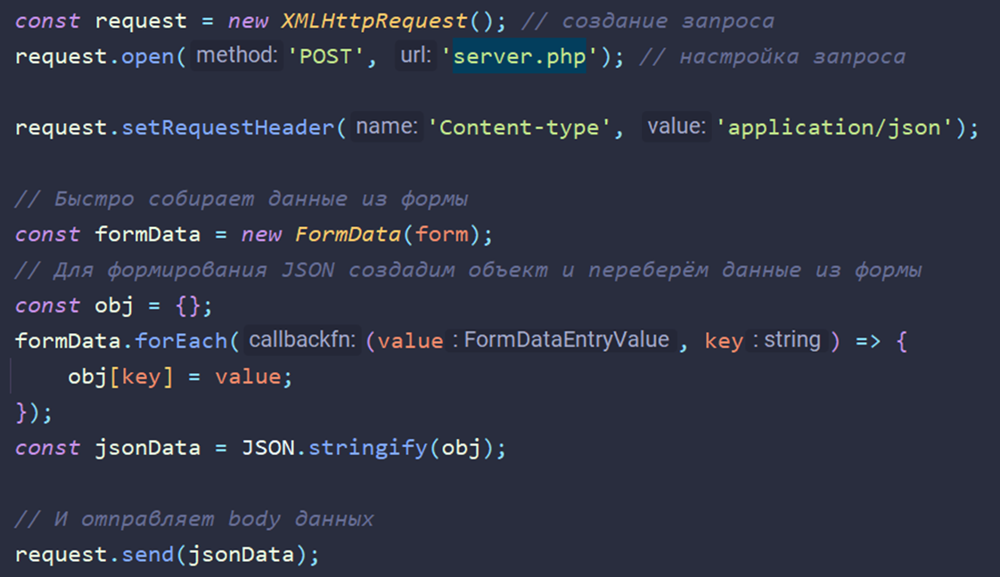
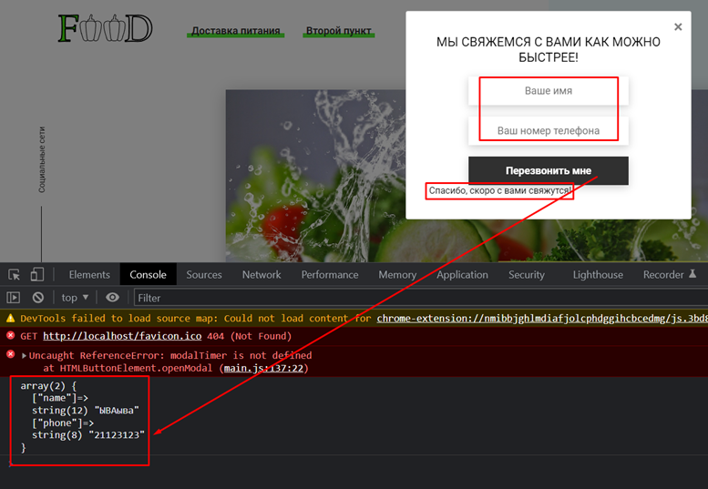
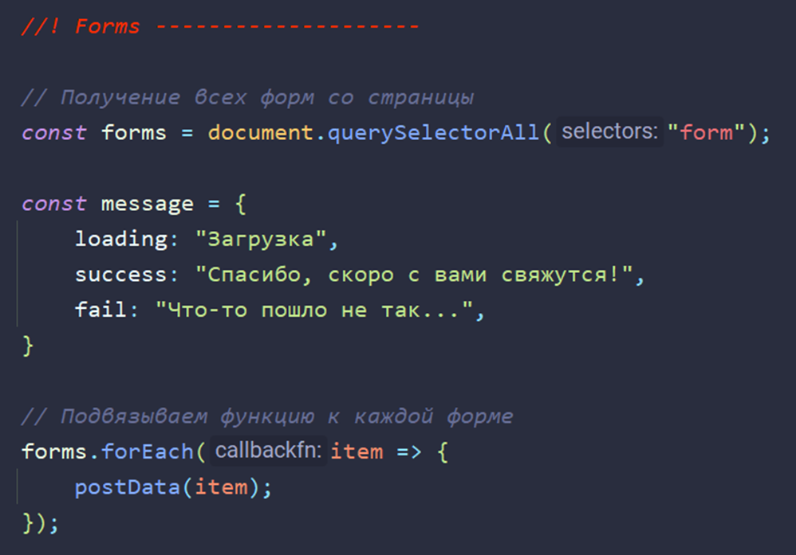
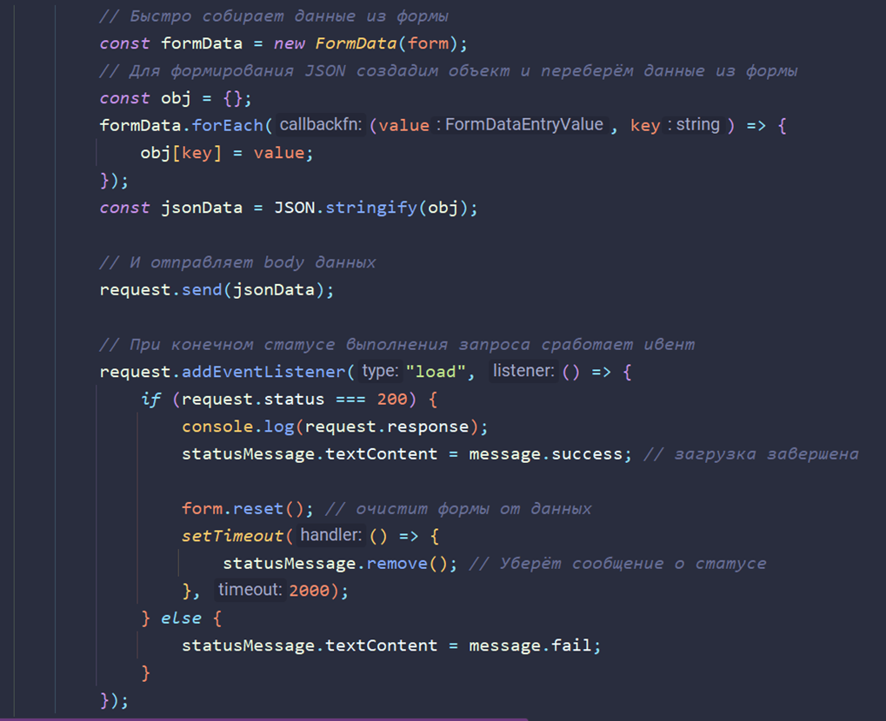

Сейчас нужно будет реализовать ПОСТ-запрос отправку данных на сервер и ответ пользователю

PHP файл будет возвращать данные, которые мы отправляем на сервер (принимает данные с клиента, превратит в строку и вернёт обратно) – это response от сервера

В классической работе браузера (без модификаций через JS) при отправке данных – они перезагружают страницу и показывают отправленные данные в url

Если инпут создан через тег `button`, то его тег `type` автоматически будет иметь `submit`

Самым первым делом мы получим все формы на нашей странице и заранее подготовим ответы пользователю по статусу отправки данных

И дальше нам нужно будет создать фунцию, которая будет отправку наших данных на удалённый сервер. Внутри функции будет располагаться ивент, который будет срабатывать на инпутах формы при сабмите (баттоны изначально имеют в себе такой вшитый атрибут). Обязательно в начале нужно сбросить обычное поведение объекта при срабатывании (чтобы страница не перезагружалась)

Так же отдельно хочется выделить данный функционал. Он позволяет не брать отдельно каждую форму и не перебирать отдельно значения. Данный конструктор позволяет собрать автоматически все данные с формы, которую в него пихнули

> Однако обязательно, чтобы сработал `FormData`, нужно чтобы в инпутах внутри формы были прописаны атрибуты `name=”имя_формы”`

И дальше нам нужно создать ивент листенер внутри функции, который при полной загрузке запроса будет выводить в консоль сам отправленный запрос (для нас), показывать статус отправки для пользователя и очищать формы.

`reset` – сбросит форму
`remove` – удаляет объект со страницы

И в конечном итоге нам нужно применить нашу созданную функцию на все формы (через функцию мы накидываем ивент-листенеры на формы и формируем из них данные)

И сразу при запуске мы встречаемся с непонятной ошибкой, которая нам говорит, что наши данные анонимны и не могут быть обработаны сервером

И тут уже кроется очень важная особенность работы с ПОСТ-запросами. Если мы используем `XMLHttpRequest`, *ПОСТ-запрос* и передаём данные через `FormData`, то *указывать хедер нам нелья*, так как вылезет ошибка

И так же теперь в консоли мы можем увидеть данные

Ну и так же в нетворке можно просмотреть и данные, которые были отправлены на сервер

И так же можно переписать немного код для работы с JSON-данными, а не отправлять через FormatData. Тут уже хедер нам нужно использовать

Так же нужно упомянуть, что PHP не умеет нативно работать с JSON

Вот php-код, который обработает JSON-данные с сервера

- И код работает нормально и ровно так же, как и раньше

Полный код:

