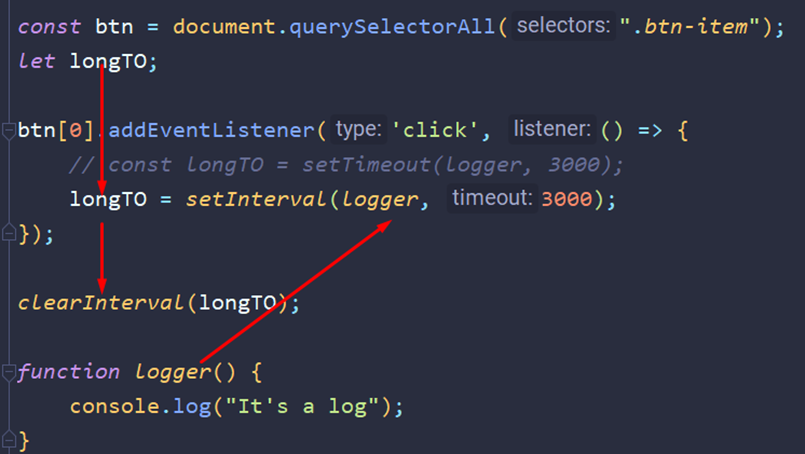
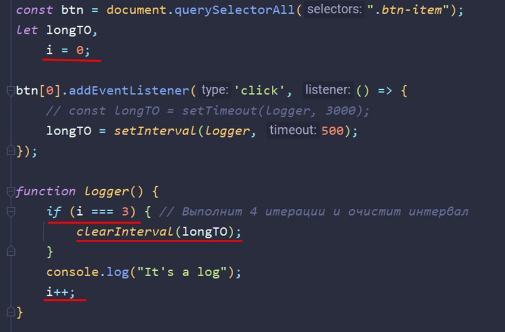

Примерно так можно написать `setTimeout()` в обычных условиях. Первым аргументом функция принимает колбэк-функцию, вторым аргументом – таймаут. Все остальные аргументы – это аргументы для вложенной колбэк-функции

Так же мы можем вложить именованную функцию в таймаут. Тут нужно заметить, что внури мы не вызываем функцию, а просто вкладываем её имя. Как видно, могут выполняться и функции, расположенные ниже их вызова

Когда мы передаём `setTimeout()` в переменную, мы передаём числовой идентификатор этой функции. Делается это для того, чтобы чётко определять различные `setTimeout` в коде, так как таких асинхронных функций может быть много

И так же мы можем очистить интервал и отменить его выполнение

Таким способом мы можем задать таймаут для определённой кнопки. Так же через таймаут часто задают всплытие каких-нибудь модальных окон на сайтах

И так же мы можем воспользоваться не только таймаутом, но и задать выполнение функции по интервалу (в примере каждые 3 секунды) через `setInterval()`

И уже в таким случае наш код сможет добраться до переменной с интервалом. Однако тут мы встречаемся с другой проблемой: `clearInterval` не выполнится, так как он идёт в синхронном потоке кода. Дело в том, что на момент выполнения у него не будет никакого значения, вместо него в нём будет `undefined` (`clearInterval(longTO = undefined)`)

Чтобы очистка интервала не выходила из потока, нам нужно задать в самой функции определённое условие, по которому будет выполнятся очистка интервала изнутри самого этого интервала

И сейчас мы подбираемся к проблеме, которая заключается в том, что `setInterval` не учитывает то, сколько времени выполняется функция внутри него. Он просто выполняет функцию раз в определённое время, которое ему задали. Сама же функция внутри него может выполняться и гораздо дольше.

И тут уже приходит рекурсивный `setTimeout()`. Он, в свою очередь, сначала выполняет функцию и уже только потом ожидает выделенное время. Создаётся такой таймаут через перевызов по его идентификатору (переменной)

И тут уже представлено создание анимации блока, который перемещается по боксу при нажатии на кнопку.

Первым делом, получаем нашу кнопку, через которую будем запускать анимацию.

Во-вторых, создадим анимацию, внутри которой будем хранить сам бокс, который будем перемещать. Там же инициализируем наш счётчик позиции и идентификатор `setInterval`. Так же внутри расположим функцию, которая будет менять позицию каждый кадр. Эта функция будет помещена в интервал.

Конечной точкой нашего блока будет сдвиг до конца блока (тут 600 бокс и 120 движущийся блок – 480 длина пути). Проверка будет выполняться, пока позиция не будет равна нужному нам числу. После мы очищаем интервал

Интересная особенность: даже если написать периодичнсть в интервале = 0, то всё равно на уровне кода она может иметь минимум в 4 миллисекунды.

