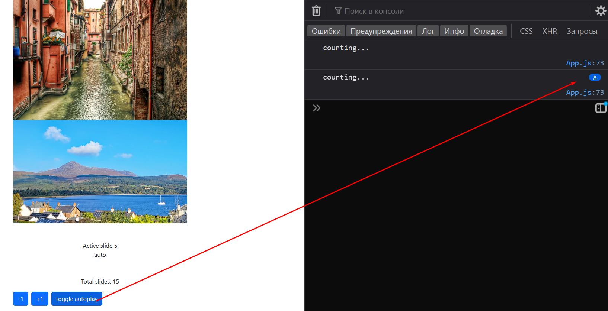
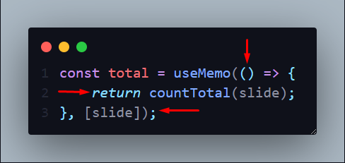
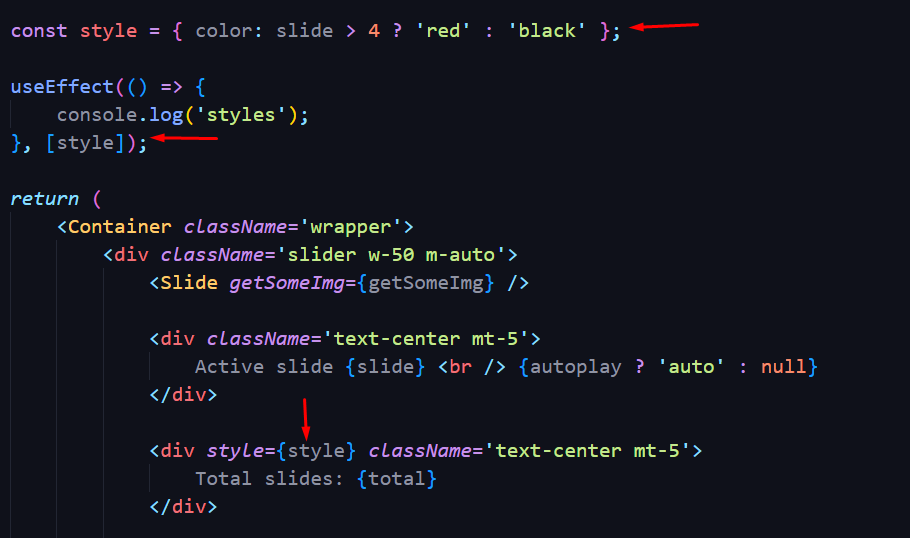

`useMemo()` - это хук, который возвращает мемоизированное значение (результат вычислений запоминается в кеше)

И далее мы реализовали функцию подсчёта суммарного количества слайдов через `countTotal()`

```JS
// функция подсчёта общего количества слайдов
const countTotal = (num) => {
	console.log('counting...');
	return num + 10;
};

const SliderFunction = (props) => {
	const [slide, setSlide] = useState(0);
	const [autoplay, setAutoplay] = useState(false);

	useEffect(() => {
		document.title = `Slide: ${slide}`;
	}, [slide]);

	const getSomeImg = useCallback(() => {
		return [
			'https://www.planetware.com/i/home-promo-italy.jpg',
			'https://www.planetware.com/wpimages/2023/02/scotland-isle-of-arran-top-things-to-do-intro-paragraph-goat-fell.jpg',
		];
	}, [slide]);

	// вызываем функцию подсчёта слайдов
	const total = countTotal(slide);

	return (
		<Container className='wrapper'>
			<div className='slider w-50 m-auto'>
				<Slide getSomeImg={getSomeImg} />

				<div className='text-center mt-5'>
					Active slide {slide} <br /> {autoplay ? 'auto' : null}
				</div>

				<div className='text-center mt-5'>Total slides: {total}</div>

				<div className='buttons mt-3'>
					<button className='btn btn-primary me-2' onClick={() => setSlide(slide - 1)}>
						-1
					</button>
					<button className='btn btn-primary me-2' onClick={() => setSlide(slide + 1)}>
						+1
					</button>
					<button className='btn btn-primary me-2' onClick={() => setAutoplay(!autoplay)}>
						toggle autoplay
					</button>
				</div>
			</div>
		</Container>
	);
};
```

Основная проблема, которую мы сейчас имеем - функция вызывается ещё раз даже когда мы мы меняем совсем не связанное с ней состояние. Если операция подсчёта была бы очень ресурсозатратной, то производительность бы сильно упала



И чтобы исправить вышеописанную ситуацию, можно воспользоваться хуком `useMemo()`. Этот хук принимает первым аргументом функцию, а вторым аргументом зависимости, при изменении которых будет пересчитываться значение.

Данный хук используется для запоминания значения, которое возвращает функция, чтобы не выполнять тяжёлые операции пересчёта каждый раз.

Если передать пустой массив зависимостей, то значение посчитается ровно один раз.



Представим такую ситуацию, что нам нужно менять стили при определённых условиях у объекта.
Если выводить в консоль уведомление об изменении стилей, то можно увидеть, что при смене любого состояния у нас переприсваивается значение свойств в компоненте. Это происходит потому, что при обновлении компонента у нас будет в переменную `style` заноситься новый объект, от чего и будет срабатывать `useEffect`.




Чтобы исправить данную ситуацию, нужно занести объект в `useMemo`, что сохранит значение переменной в кеше браузера и внутри компонента объект не будет обновляться каждый раз и не будет вызвать срабатывание хука `useEffect`


