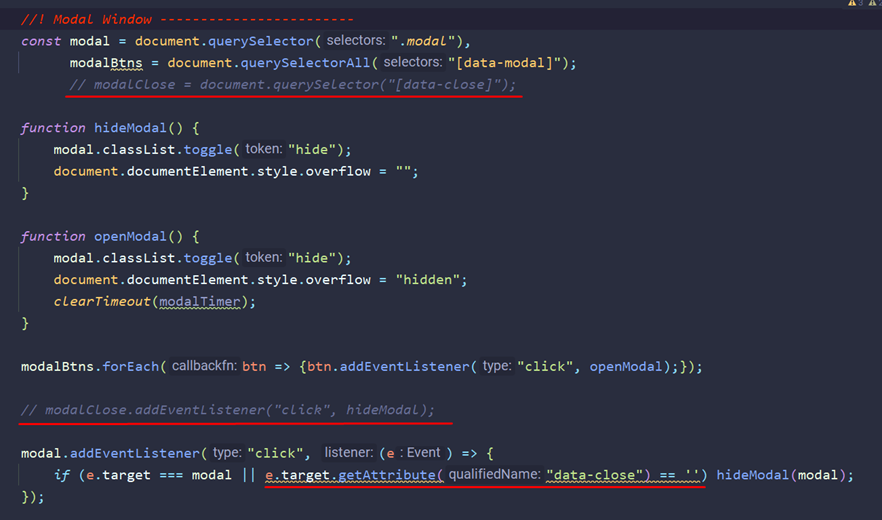
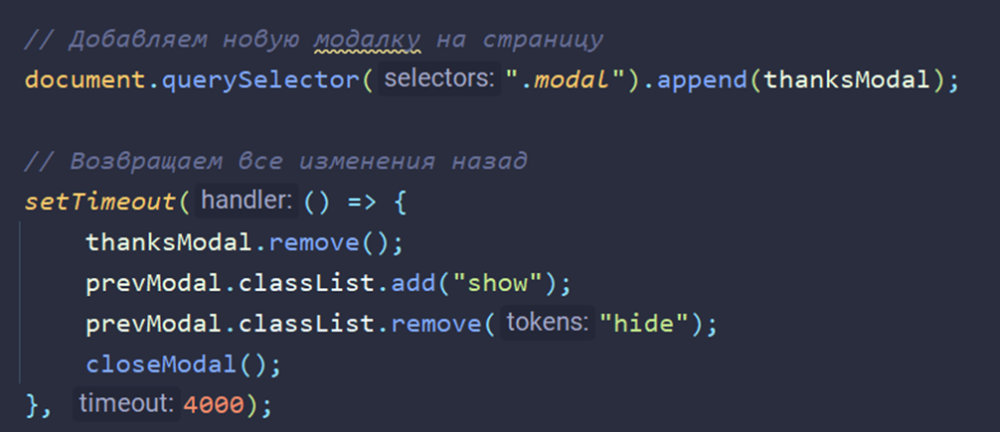
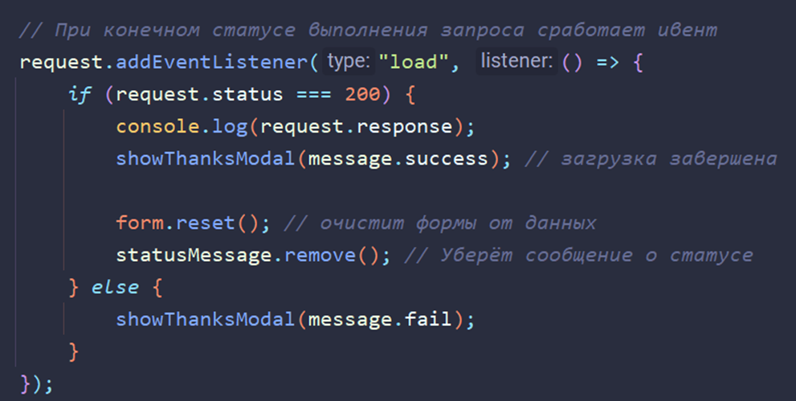
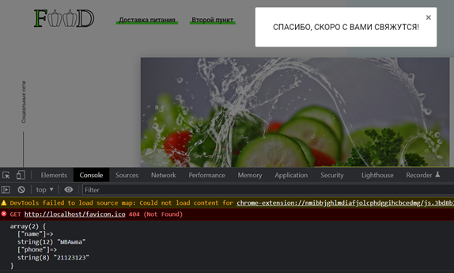
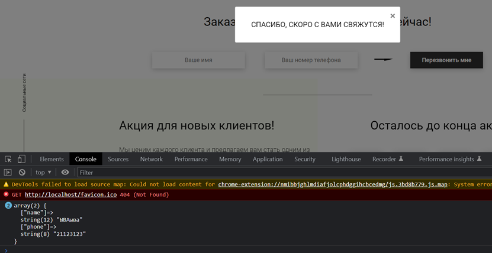

На сегодня нам нужно сделать красивое оповещение пользователя о загрузке (если она будет долгой).

Первым делом – уберём код с нашего крестика для закрывания модального окна. Мы можем вызвать закрывание прямо внутри условия определения закрытия модального окна (обратиться к крестику через его персональный атрибут `data-close`)

Дальше мы должны превести наше модальное окно в генеративный вариант. То есть мы его должны возвращать с помощью JS. Сохраним оригинал в виде prevModal и скроем его. Дальше уже реализуем саму генерацию этого окна и будем сгенерированное окно вставлять в сам блок кода с модальным окном

И далее применяем нашу функцию

И теперь обе модалки какое-то небольшое время показывают окно диалога

Дальше добавляем наш загрузочный спиннер (это свг-анимация, которую можно добавить как картинку)

И такой код позволит вставить нашу СВГшку после блока форм снизу (чтобы не ломать вёрстку)

