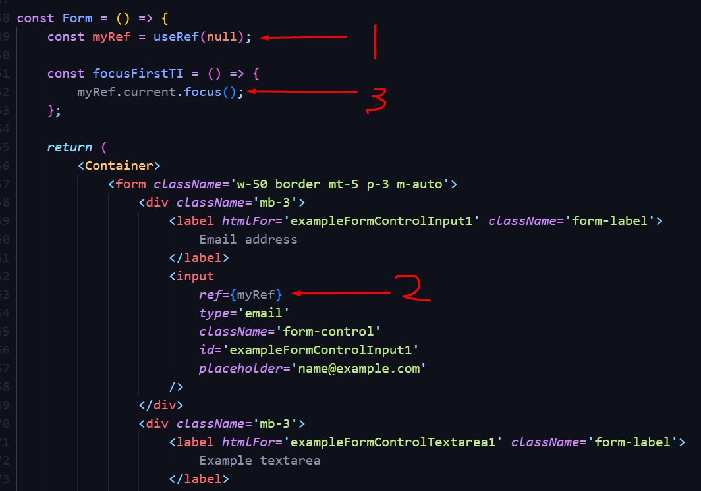

`useRef()` - это хук, который предоставляет прямой доступ к ДОМ-элементам на странице

1) Создаём переменную, которая будет хранить ссылку на нужный нам элемент
2) Передаём реф в элемент ДОМ-дерева
3) Вызываем срабатывание функции



Далее представленный ниже код выполняет:
- при изменении состояния (внутри первого инпута) `useEffect` выводит в консоль значение свойства `current` у рефа
- при клике по текстэрии, значение в рефе будет увеличиваться на 1
- при дальнейшем вводе в первый инпут будет выводиться значение рефа, которое уже было увеличено 

Таким образом мы сохранили динамическое значение внутри свойства `current`, которое будет изменяться без перерендера компонента 

```JS
const Form = () => {
	const [text, setText] = useState('');

	const myRef = useRef(1);

	// отображаем значение рефа в консоли
	useEffect(() => console.log(myRef.current));

	return (
		<Container>
			<form className='w-50 border mt-5 p-3 m-auto'>
				<div className='mb-3'>
					<label htmlFor='exampleFormControlInput1' className='form-label'>
						Email address
					</label>
					<input
						// заносим текст в состояние
						onChange={(e) => setText(e.target.value)}
						type='email'
						className='form-control'
						id='exampleFormControlInput1'
						placeholder='name@example.com'
					/>
				</div>
				<div className='mb-3'>
					<label htmlFor='exampleFormControlTextarea1' className='form-label'>
						Example textarea
					</label>
					<textarea
						// увеличиваем значение на 1
						onClick={() => myRef.current++}
						className='form-control'
						id='exampleFormControlTextarea1'
						rows='3'
					></textarea>
				</div>
			</form>
		</Container>
	);
};
```


И при вынесении изменения свойства в эффект, можно увидеть, что компонент не перерендеривается каждый раз, а просто увеличивает свойство, находящееся в рефе

```JS
const Form = () => {
	const [text, setText] = useState('');

	const myRef = useRef(1);

	useEffect(() => {
		myRef.current++; // обновление свойства происходит тут
		console.log(myRef.current);
	});

	return (
		<Container>
			<form className='w-50 border mt-5 p-3 m-auto'>
				<div className='mb-3'>
					<label htmlFor='exampleFormControlInput1' className='form-label'>
						Email address
					</label>
					<input
						onChange={(e) => setText(e.target.value)}
						type='email'
						className='form-control'
						id='exampleFormControlInput1'
						placeholder='name@example.com'
					/>
				</div>
				<div className='mb-3'>
					<label htmlFor='exampleFormControlTextarea1' className='form-label'>
						Example textarea
					</label>
					<textarea
						className='form-control'
						id='exampleFormControlTextarea1'
						rows='3'
					></textarea>
				</div>
			</form>
		</Container>
	);
};
```


Так же мы можем использовать реф для сохранения предыдущего состояния компонента. Конкретно тут после записи в первый `input` его прошлое состояние переносится в `textarea` 

```JS
const Form = () => {
	const [text, setText] = useState('');

	const myRef = useRef(1);

	useEffect(() => {
		myRef.current = text;
	});

	return (
		<Container>
			<form className='w-50 border mt-5 p-3 m-auto'>
				<div className='mb-3'>
					<label htmlFor='exampleFormControlInput1' className='form-label'>
						Email address
					</label>
					<input
						onChange={(e) => setText(e.target.value)}
						type='email'
						className='form-control'
						id='exampleFormControlInput1'
						placeholder='name@example.com'
					/>
				</div>
				<div className='mb-3'>
					<label htmlFor='exampleFormControlTextarea1' className='form-label'>
						Example textarea
					</label>
					<textarea
						value={myRef.current}
						className='form-control'
						id='exampleFormControlTextarea1'
						rows='3'
					></textarea>
				</div>
			</form>
		</Container>
	);
};
```


