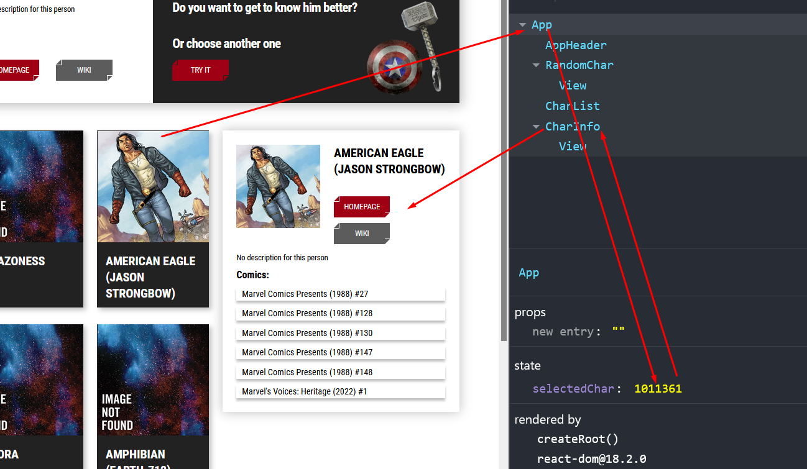

Сейчас нам нужно реализовать загрузку списка персонажей на странице, а так же реализовать вывод информации по ним при нажатии на карточку в боковом меню страницы

В компоненте `App` добавим состояние `selectedChar`, которое будет хранить `id` выбранного персонажа и метод `onSelectedChar`, который мы будем вызывать внутри компонента `CharList`, чтобы получить этот нужный нам `id` персонажа

`src > components > app > App.js`
```JS
class App extends Component {  
   // это состояние выбранного персонажа  
   state = {  
      selectedChar: null,  
   };  
  
   // это метод, который будет вызываться из CharList и передаст в родительский компонент id выбранного персонажа  
   onSelectedChar = (id) => {  
      this.setState({ selectedChar: id });  
   };  
  
   render() {  
      return (  
         <div className='app'>  
            <AppHeader />  
            <main>               
	           <RandomChar />  
               <div className='char__content'>  
                  <CharList onCharSelected={this.onSelectedChar} />  
                  <CharInfo charId={this.state.selectedChar} />  
               </div>  
                 
            </main>  
         </div>  
      );  
   }  
}  
  
export default App;
```

Таким образом реализована логика списка персонажей на странице

Так же при клике на карточку будет вызваться функция `onCharSelected()`, которая вернёт в компонент `App` нужный нам `id` персонажа

`src > components > charList > CharList.js`
```JS
import './charList.scss';  
import { Component } from 'react';  
import MarvelService from '../../services/marvel.service';  
import ErrorMessage from '../ErrorMessage/ErrorMessage';  
import Spinner from '../Spinner/Spinner';  
  
class CharList extends Component {  
   state = {  
      charList: [],  
      loading: true,  
      error: false,  
   };  
  
   marvelService = new MarvelService();  
  
   componentDidMount() {  
      this.marvelService.getAllCharacters().then(this.onCharListLoaded).catch(this.onError);  
   }  
  
   onCharListLoaded = (charList) => {  
      this.setState({  
         charList,  
         loading: false,  
      });  
   };  
  
   onError = () => {  
      this.setState({  
         error: true,  
         loading: false,  
      });  
   };  
  
   // это метод рендера отдельных элементов карточек  
   renderItems(arr) {  
      const items = arr.map((item) => {  
         let imgStyle = { objectFit: 'cover' };  
         if (  
            item.thumbnail ===  
            'http://i.annihil.us/u/prod/marvel/i/mg/b/40/image_not_available.jpg'  
         ) {  
            imgStyle = { objectFit: 'unset' };  
         }  
  
         return (  
            <li  
               className='char__item'  
               key={item.id}  
            // при клике будет срабатывать колл-бэк функция, которая мы передали из App  
               onClick={() => this.props.onCharSelected(item.id)}  
            >               
			     
               <div className='char__name'>{item.name}</div>  
            </li>  
         );  
      });  
  
      // А эта конструкция вынесена для центровки спиннера/ошибки  
      return <ul className='char__grid'>{items}</ul>;  
   }  
  
   render() {  
      const { charList, loading, error } = this.state;  
  
      const items = this.renderItems(charList);  
  
      const errorMessage = error ? <ErrorMessage /> : null;  
      const spinner = loading ? <Spinner /> : null;  
      const content = !(loading || error) ? items : null;  
  
      return (  
         <div className='char__list'>  
            {errorMessage}  
            {spinner}  
            {content}  
            <button className='button button__main button__long'>  
               <div className='inner'>load more</div>  
            </button>  
         </div>  
      );  
   }  
}  
  
export default CharList;
```


Так же добавим получение комиксов с сервера

`src > service > marvel.service.js`
```JS
_transformCharacter = (char) => {  
   return {  
      id: char.id,  
      name: char.name,  
      description: char.description  
         ? char.description.slice(0, 150) + '...'  
         : 'No description for this person',  
      thumbnail: char.thumbnail.path + '.' + char.thumbnail.extension,  
      homepage: char.urls[0].url,  
      wiki: char.urls[1].url,  
      comics: char.comics.items,  
   };  
};
```

И далее нам нужно реализовать рендер компонента информации персонажей:
- при загрузке страницы `componentDidMount` обновляем персонажа `updateChar`
- при обновлении пропсов так же через `componentDidUpdate` обновляем персонажа

`src > components > charInfo > CharInfo.js`
```JS
import { Component } from 'react';  
import './charInfo.scss';  
import MarvelService from '../../services/marvel.service';  
import ErrorMessage from '../ErrorMessage/ErrorMessage';  
import Spinner from '../Spinner/Spinner';  
import Skeleton from '../skeleton/Skeleton';  
  
// это основной компонент логики и состояния  
class CharInfo extends Component {  
   state = {  
      char: null,  
      loading: false,  
      error: false,  
   };  
  
   marvelService = new MarvelService();  
  
   componentDidMount() {  
      this.updateChar();  
   }  
  
   // получает при срабатывании предыдущее состояние и предыдущие пропсы  
   componentDidUpdate(prevProps, prevState, screenshot) {  
      // если текущий ID персонажа из пропсов не равен предыдущим, то обновляем компонент  
      // это условие исключит бесконечный цикл обновлений, который может начаться      
      if (this.props.charId !== prevProps.charId) {  
         this.updateChar();  
      }  
   }  
  
   // этот метот будет обновлять выводимого в компоненте персонажа  
   updateChar = () => {  
      const { charId } = this.props;  

	  // если id персонажа нет, то возвращаемся из функции
      if (!charId) return;  

	  // активируем загрузку
      this.onCharLoading();  

	  // получаем персонажа по запросу
	  this.marvelService.getCharacter(charId)
		.then(this.onCharLoaded)
		.catch(this.onError);  
   };  
  
   // три стандартных метода для обновления состояния персонажа:  
   onCharLoaded = (char) => {  
      this.setState({ char, loading: false });  
   };  
  
   onCharLoading = () => {  
      this.setState({ loading: true });  
   };  
  
   onError = () => {  
      this.setState({ loading: false, error: true });  
   };  
  
   render() {  
      const { char, loading, error } = this.state;  
  
      const showSkeleton = !(error || loading || char) ? <Skeleton /> : null;  
      const showError = error ? <ErrorMessage /> : null;  
      const showLoading = loading ? <Spinner /> : null;  
      const showContent = !(error || loading || !char) ? <View char={char} /> : null;  
  
      return (  
         <div className='char__info'>  
            {showSkeleton}  
            {showLoading}  
            {showContent}  
            {showError}  
         </div>      
	  );  
   }  
}  
  
// а это компонент интерфейса  
const View = ({ char }) => {  
   const { name, description, thumbnail, homepage, wiki, comics } = char;  
  
   // определяем стили для картинки, если она не найдена  
   let imgStyle = { objectFit: 'cover' };  
   if (thumbnail === 'http://i.annihil.us/u/prod/marvel/i/mg/b/40/image_not_available.jpg') {  
      imgStyle = { objectFit: 'contain' };  
   }  
  
   return (  
      <>  
         <div className='char__basics'>  
              
            <div>               <div className='char__info-name'>{name}</div>  
               <div className='char__btns'>  
                  <a href={homepage} className='button button__main'>  
                     <div className='inner'>homepage</div>  
                  </a>  
                  <a href={wiki} className='button button__secondary'>  
                     <div className='inner'>Wiki</div>  
                  </a>  
               </div>  
            </div>  
         </div>  
         <div className='char__descr'>{description}</div>  
         <div className='char__comics'>Comics:</div>  
         <ul className='char__comics-list'>  
            {comics.length < 1 ? 'No comics for this person' : null}  
            {comics.map((c, i) => (  
               <li key={i} className='char__comics-item'>  
                  {c.name}  
               </li>  
            ))}  
         </ul>  
      </>  
   );  
};  
  
export default CharInfo;
```

Итог: до нажатия на персонажей - отображается скелетон, а уже при нажатии на персонажа, у нас подгружаются данные в `info` для отображения 


