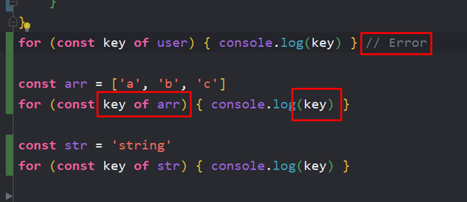
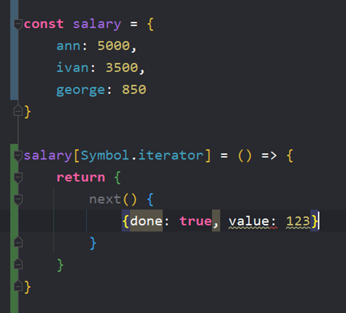
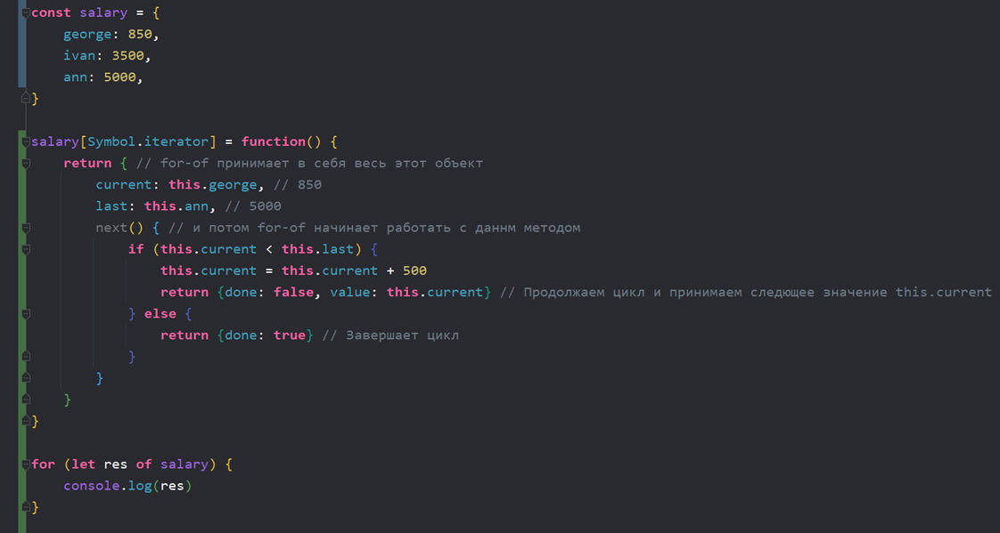

Кратко повторим конструкцию `for-in`. Она проходится по всем элементам объекта (массива). Однако её главная проблема в том, что она может проходиться не по порядку

Когда мы говорим уже про конструкцию `for-of`, то она сразу уже выдаёт значение. Однако может выдать значение только итерируемого объекта. То есть перебрать массив или строку через `for-of` - возможно, а уже при переборе объекта выйдет ошибка, так как объект – это неитерируемая единица.

Основной плюс `for-of` заключается в том, что он выведет все значения из массива именно в том порядке, в котором они записаны.

И тут опять же можно увидеть, что `for-of` перебирает только те значения, которые являются собственными (проверить можно через `hasOwnProperty()`)

Грубо говоря, итерируемые объекты – это те структуры, которые хранят в себе символ-итератор

Итератор – это метод, который возвращает объект с методом `next()`

Чтобы перебрать объект, нужно ему добавить итератор самостоятельно

Когда мы используем `for-of`, то он вызывает этот прописанный метод (на скрине) 1 раз и этот метод должен нам вернуть итератор (а именно объект с методом `next()`). И дальше `for-of` будет работать с тем объектом, который вернулся из этого метода.

Внутри метода находится само отображение выполнения возврата значения и само значение

И тут уже более подробно опишем:

Мы имеем объект `salary`. После него мы создаём через символ наш итератор. Итератор хранит в себе функцию. Функция возвращает объект, внутри которого имеется несколько свойств и метод `next()`.

Метод `next()` в себе имеет определённую логику – тут мы остановим выполнение цикла только тогда, когда внутри объекта первое свойство будет иметь значение больше, чем последнее.

Цикл будет продолжаться, пока возвращаемый `done` будет иметь значение `false`. Чтобы передать значение в следующий цикл, нужно передать его через `value`. Останавливается цикл через `done: true`

Тут ещё нужно отметить, что функция должна иметь вид: `function(){}`. Стрелочная работать не будет

И вот через `for-of` наконец-то мы можем перебрать объект. Однако перебор будет выполнять определённую логику

Так же такой итератор можно вызывать и вручную. Мы можем присвоить итератор в переменную и так как это метод, то его можно вызвать сразу через `()`

