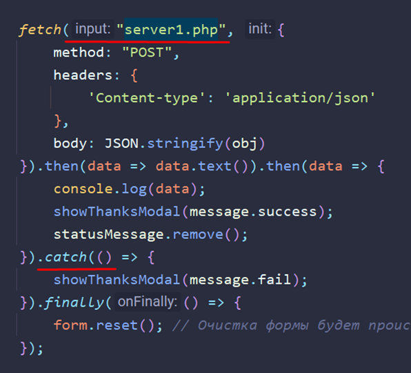

`fetch` – это конструкция с GET-запросом, которая внутри представляет из себя промис (то есть чейны работают так же как и в промисах)

Стандартно фетч возвращает промис, который выполняется в любом случае (кроме отсутствия интернета)

Чтобы отправить данные на сервер, нужно уже будет немного модифицировать фетч-запрос

Вторым аргументов в фетч передаётся объект с настройками, который заменяет сразу три метода стандартного реквеста. Мы прописываем тип запроса, бади с отправляемыми данными на сервер (например, отправим данные из формы) и тип заголовков (если отправляем JSON)

И сейчас на сайте с едой можно будет заменить все наши `XMLHTTPRequests` на короткий и понятный `fetch`, который в себе содержит все нужные нам реквесты, да ещё и исполняется асинхронно

И как итог мы заменили огромное количество кода с реквестами и данной проверкой

На данную короткую запись

Так же если мы допишем этот короткий участок кода, то мы сможем увидеть текст нашего запроса

Теперь так же можно удалить парсинг объекта и перенести его прямо в фетч

Ну и примерно так выглядит ответ от серера

Ну и так же нужно работать с особенностями фетча. Дело в том, что он не вернёт реджект, даже если у нас проблемы при связи с сервером. Единственное что, так это статус фетча поменяется с ОК на false.

Реджект сработает только при сбое сети / отсутствии интернета

