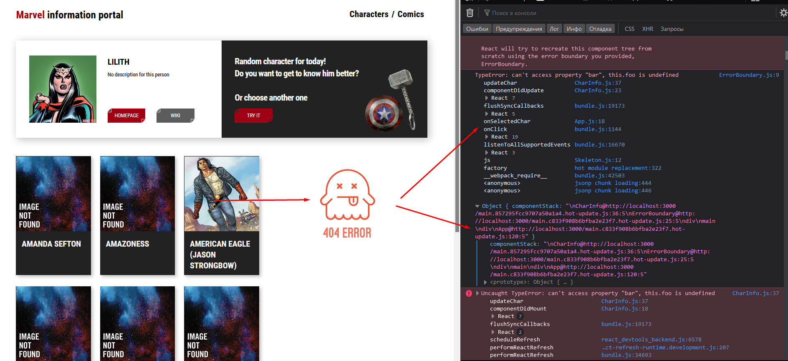

Попробуем воспользоваться методом, который срабатывает при появлении ошибки в компоненте `componentDidCatch`. В нём мы установим состояние ошибки компонента и выведем информацию о полученных аргументах.

`src > component > charInfo > CharInfo.js`
```JS
// сработает при ошибке  
// error - сама ошибка / errorInfo - информация о компоненте, в котором произошла ошибка  
componentDidCatch(error, errorInfo) {  
   console.log(error, errorInfo);  
   this.setState({ error: true });  
}  
  
updateChar = () => {  
   const { charId } = this.props;  
  
   if (!charId) return;  
  
   this.onCharLoading();  
  
   this.marvelService.getCharacter(charId).then(this.onCharLoaded).catch(this.onError);  
  
   // ошибка  
   this.foo.bar = 0;  
};
```

И, как мы видим, ошибка всё равно выскакивает и в консоли нет информации из метода. Логика данного хука была изменена в 16 версии реакта и теперь она не предотвращает краш всей страницы. Это было сделано с целью предотвращения отправки на сервер некорректных данных. 


И тут мы переходим к такому подходу, как **Error Boundary** (предохранители) - это функционал, который собой оборачивает наш компонент, и если в нём происходит ошибка, то он её отлавливает

>[!note] Подобный компонент можно сделать только через класс - в функциональном подходе он ещё не реализован 

И так выглядит реализация классового компонента `ErrorBoundary`:
- создаём состояние ошибки
- метод `componentDidCatch` будет совершать определённое действие при отлове ошибки (выведет нам объекты в консоль и запишет состояние ошибки)
- далее по условию выведем компонент ошибки, если переловили ошибку, а если не переловили, то выведем просто обёрнутый компонент

Метод `getDerivedStateFromError` тут не нужен, но он может пригодиться, если нам нужно только записать состояние внутри данного класса

`src > component > ErrorBoundary > ErrorBoundary.js`
```JS
import React, { Component } from 'react';  
import ErrorMessage from '../ErrorMessage/ErrorMessage';  
  
class ErrorBoundary extends Component {  
   // состояние ошибки  
   state = {  
      error: false,  
   };  
  
   // эта функция может выполнить только изменение состояния - больше ничего  
   static getDerivedStateFromError(error) {  
      return { error: true };  
   }  
  
   // сейчас метод перелова ошибки сработает  
   componentDidCatch(error, errorInfo) {  
      console.log(error, errorInfo);  
      this.setState({ error: true });  
   }  
  
   render() {  
      // возвращаем ошибку  
      if (this.state.error) {  
         return <ErrorMessage />;  
      }  
  
      // возвращаем компонент, который был вложен внутрь этого компонента  
      return this.props.children;  
   }  
}  
  
export default ErrorBoundary;
```

И далее нам нужно просто обернуть предполагаемый компонент с ошибкой внутрь `ErrorBoundary`

`src > component > app > App.js`
```JS
render() {  
   return (  
      <div className='app'>  
         <AppHeader />  
         <main>            
	        <ErrorBoundary>  
               <RandomChar />  
            </ErrorBoundary>  
            <div className='char__content'>  
               <ErrorBoundary>  
                  <CharList onCharSelected={this.onSelectedChar} />  
               </ErrorBoundary>  
               <ErrorBoundary>                  
	               <CharInfo charId={this.state.selectedChar} />  
               </ErrorBoundary>  
            </div>  
              
         </main>  
      </div>  
   );  
}
```

Итог: на месте, где у нас появилась ошибка будет отображаться компонент ошибки



Но так же важно знать:

>[!warning] Предохранитель ловит ошибки только в:
>- Методе `render()`
>- В методах жизненного цикла
>- В конструкторах дочерних компонентов
>- На серверном рендеринге
