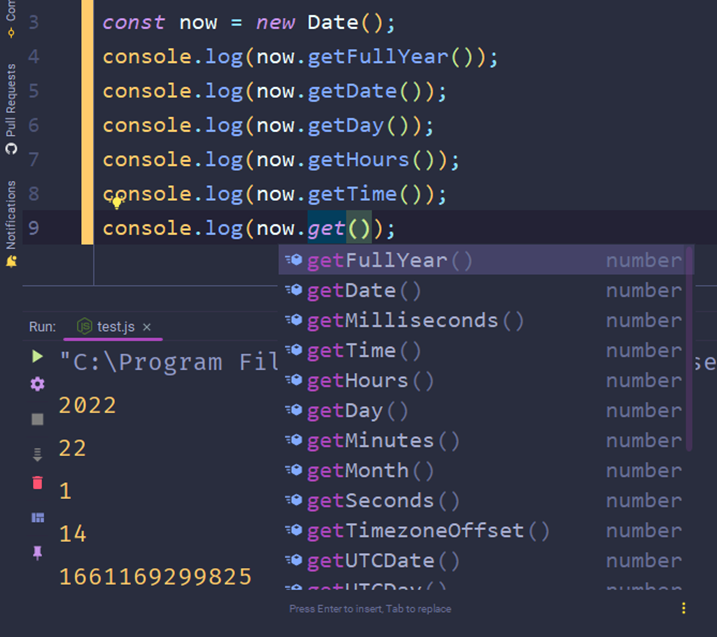
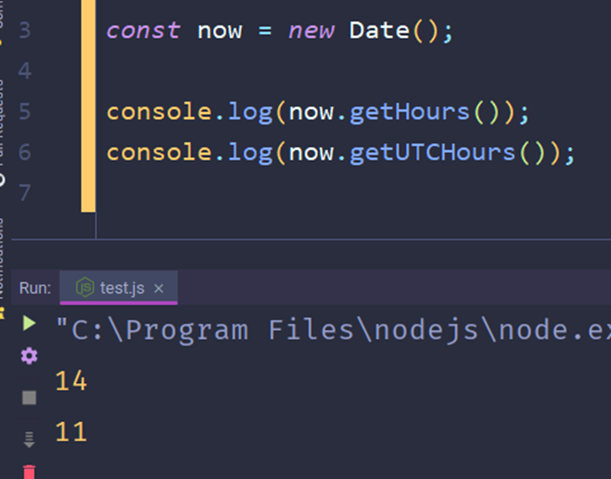
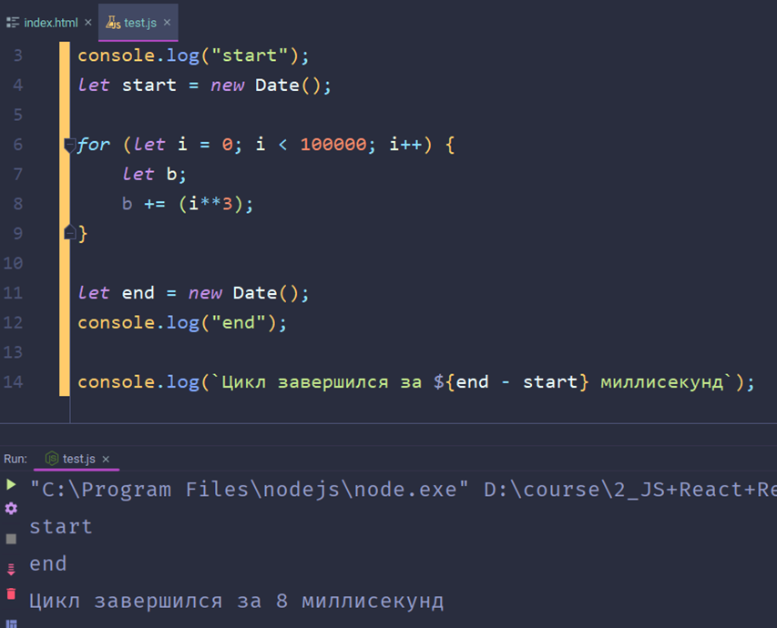

Дата задаётся обычно через конструктор `Date()`

Однако можно вписать и цифрами через запятую все нужные даты. Как можно увидеть, месяцы идут с 0, а время идёт по гринвичу. Поэтому при вводе 5 месяц 20 часов, мы получим – 6 месяц (так как он имеет индекс пять) и 17 часов (так как пояс +3 МСК)

Так же интересно знать, что все даты в JS выражаются в миллисекундах и их можно перевести как в дату, так и обратно в мс. Так же отсчёт времени идёт от 1970 года

Так же мы можем быстро посмотреть все нужные методы дат через `get`

Так же у нас есть возможность получить два разных часовых пояса

Через `set` мы можем установить нужное нам время. Проверять такой код в консоли не получится – это нужно делать сразу в браузере

Ну и не самая очевидная часть заключается в том, что можно так же вставить и остальные значения времени

Два варианта записи даты: первый обычный, второй через парсинг

Так же дата позволяет сделать таймер и высчитывать миллисекунды между выполнением операций.

Тут было подсчитано время выполнения операции

