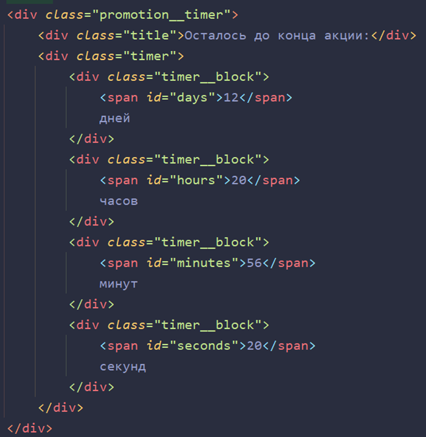

Собственно, блок кода, в котором у нас и происходит всё действо

Первая константа хранит в себе конечное время, когда таймер прекратит свою работу. Внутри функции `getTimeRemaining` мы получаем всё время, дни, часы, минуты и секунды по-отдельности (получаем из разницы между нынешним временем и дедлайном) и возвращаем объект с данными значениями

Дальше в функции `clockTime` мы производим изменение времени. Время меняется через функцию `updateClock`, которая вызвается каждую секунду через `setInterval`. Внутри обновления часов мы получаем данные из нашей первой функции и подставляем значения полученного объекта в `innerHTML` наших блоков со временем.

Если время к моменту вызова часов уже уйдёт в минус (например, на дворе уже будет 1ое сентября), то интервал очистится.

Так же для вставляемых значений времени была применена отедельная функция, которая подставляет 0 к числам из одной цифры.

А вот и сама функция, которая переводит одиночные цифры в двуциферные(да-да)

И теперь мы имеем прекрасный счётчик на нашем сайте!

