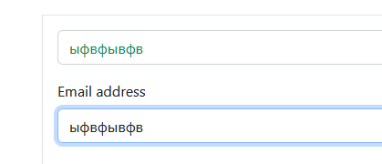
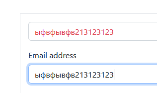

```JS
const Form = () => {
	const [text, setText] = useState('');

	return (
		<Container>
			<form className='w-50 border mt-5 p-3 m-auto'>
				<div className='mb-3'>
					<input 
						value={text} 
						type='text' 
						className='form-control' 
						readOnly 
					/>
					<label 
						htmlFor='exampleFormControlInput1' 
						className='form-label mt-3'
					>
						Email address
					</label>
					<input
						onChange={(e) => setText(e.target.value)}
						type='email'
						className='form-control'
						id='exampleFormControlInput1'
						placeholder='name@example.com'
					/>
				</div>
				<div className='mb-3'>
					<label 
						htmlFor='exampleFormControlTextarea1' 
						className='form-label'
					>
						Example textarea
					</label>
					<textarea
						className='form-control'
						id='exampleFormControlTextarea1'
						rows='3'
					></textarea>
				</div>
			</form>
		</Container>
	);
};
```






```JS
// первая версия
const validateInput = (text) => {
	if (text.search(/\d/) >= 0) {
		return true;
	}

	return false;
};

// вторая версия
const validateInput = (text) => {
	return text.search(/\d/) >= 0 ? true : false;
};

// третья версия
const validateInput = (text) => {
	return text.search(/\d/) >= 0;
};
```

И сейчас мы добавили в работу ещё одно поле для ввода текста - код был повторён. 
Тут мы сталкиваемся с такой ситуацией, что мы постоянно повторяем код, который написали единожды

```JS
const Form = () => {
	const [text, setText] = useState('');
	const [textArea, setTextArea] = useState('');

	// функция, которая будет валидировать инпут (если символов 0, то вернёт фолс)
	const validateInput = (text) => {
		return text.search(/\d/) >= 0;
	};

	// тут уже будем хранить условие с выбором класса
	const colorInput = validateInput(text) ? 'text-danger' : 'text-success';

	return (
		<Container>
			<form className='w-50 border mt-5 p-3 m-auto'>
				<div className='mb-3'>
					<input
						/* вставляем текст с нескольких инпутов */
						value={`${text} / ${textArea}`}
						type='text'
						/* вставляем класс */
						className={`form-control ${colorInput}``}
						readOnly
					/>
					<label 
						htmlFor='exampleFormControlInput1' 
						className='form-label mt-3'>
						Email address
					</label>
					<input
						onChange={(e) => setText(e.target.value)}
						type='email'
						className='form-control'
						id='exampleFormControlInput1'
						placeholder='name@example.com'
					/>
				</div>
				<div className='mb-3'>
					<label 
						htmlFor='exampleFormControlTextarea1' 
						className='form-label'>
						Example textarea
					</label>
					<textarea
						/* установка нвого состояния */
						onChange={(e) => setTextArea(e.target.value)}
						className='form-control'
						id='exampleFormControlTextarea1'
						rows='3'
					></textarea>
				</div>
			</form>
		</Container>
	);
};
```


И теперь мы можем выделить всю вышеописанную повторяемую логику в отдельный хук. Кастомный хук - это механизм повторого использования логики с состоянием.

Таким образом выглядит классический кастомный хук. Обычно он возвращает несколько объектов в массиве и сохраняет в себе определённую логику


Либо мы можем собрать всю логику хука в отдельную переменную, если возвращать из него объект. Такой подход позволит создать несколько независимых объектов


Пример использования хука внутри компонента:
- Инициализируем хук два раза для двух наших элементов формы
- Мы не передаём внутрь функции `validateInput` текст (переменная `colorInput`), так как он берётся из внутреннего состояния хука, который относится к данному инпуту 
- В элементы мы передаём `value` и `onChange`, которые относятся к инкапсулированной логике их хуков

```JS
const useInputWithValidate = (initialValue) => {
	const [value, setValue] = useState(initialValue);

	const onChange = (event) => {
		setValue(event.target.value);
	};

	const validateInput = () => {
		return value.search(/\d/) >= 0;
	};

	return { value, onChange, validateInput };
};

const Form = () => {
	// использование хука
	const input = useInputWithValidate('');
	const textArea = useInputWithValidate('');

	const colorInput = input.validateInput() ? 'text-danger' : 'text-success';

	return (
		<Container>
			<form className='w-50 border mt-5 p-3 m-auto'>
				<div className='mb-3'>
					<input
						/* вставляем текст с нескольких инпутов */
						value={`${input.value} / ${textArea.value}`}
						type='text'
						/* вставляем класс */
						className={`form-control ${colorInput}``}
						readOnly
					/>
					<label 
						htmlFor='exampleFormControlInput1' 
						className='form-label mt-3'
					>
						Email address
					</label>
					<input
						// установим изменение состояния из хука
						onChange={input.onChange}
						// значение инпута
						value={input.value}
						type='email'
						className='form-control'
						id='exampleFormControlInput1'
						placeholder='name@example.com'
					/>
				</div>
				<div className='mb-3'>
					<label 
						htmlFor='exampleFormControlTextarea1' 
						className='form-label'
					>
						Example textarea
					</label>
					<textarea
						// установим изменение состояния из хука
						onChange={textArea.onChange}
						// значение инпута
						value={textArea.value}
						className='form-control'
						id='exampleFormControlTextarea1'
						rows='3'
					></textarea>
				</div>
			</form>
		</Container>
	);
};
```

Итог: мы имеем оптимизированную форму


Так же можно взглянуть на:
- [Топ 10 библиотек хуков в реакте](https://www.bornfight.com/blog/top-10-react-hook-libraries/)
- [Гид по своим хукам в реакте](https://usehooks.com/)

Пример хука тогглера из второй ссылки:

```JS
import { useCallback, useState } from 'react';
// Usage
function App() {
    // Call the hook which returns, current value and the toggler function
    const [isTextChanged, setIsTextChanged] = useToggle();
    
    return (
        <button 
	        onClick={setIsTextChanged}
	    >
	        {isTextChanged ? 'Toggled' : 'Click to Toggle'}
	    </button>
    );
}
// Hook
// Parameter is the boolean, with default "false" value
const useToggle = (initialState = false) => {
    // Initialize the state
    const [state, setState] = useState(initialState);
    
    // Define and memorize toggler function in case we pass down the component,
    // This function change the boolean value to it's opposite value
    const toggle = useCallback(() => setState(state => !state), []);
    
    return [state, toggle]
}
```