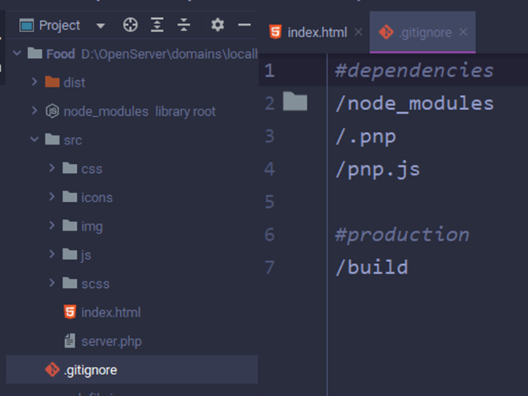
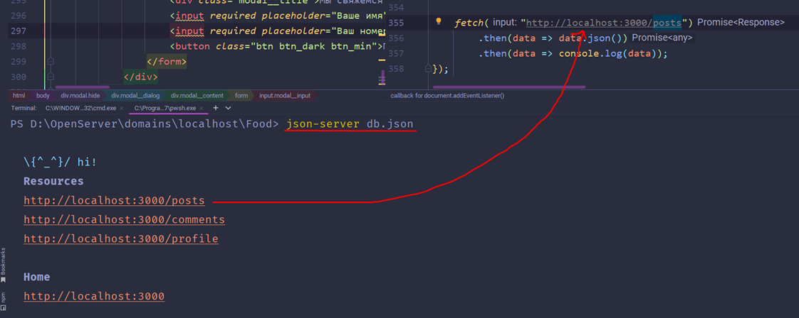

Для использования npm в проекте, сначала нужно инициализировать этот проект

```bash
npm init

npm i json-server --save-dev
```


Чтобы не загружать на облако папку с модулями, можно её добавить в гитигнор



Так же если перед нами встанет такая ситуация, когда нам нужно будет установить нод-модули для проекта, у которого есть только json с зависимостями, то нужно прописать

```bash
npm i
```


Если мы напишем запрос именно к нашей базе данных, то мы будем получать все данные со страницы сразу, но в реквестах ничего не будет (так как там отображаются пост-запросы)


Чтобы активировать установленный `json-server` на ПК, нужно прописать

`json-server ссылка_на_датабазу`

И дальше вставить одну из ссылок на ресурсы (нам расширение сразу выдаёт ссылки на данные)



Ну и так же в расширении будет прописываться скорость выполнения запроса и сам запрос. Уже в браузере будет возвращаться не огромный объект, а конкретный массив


