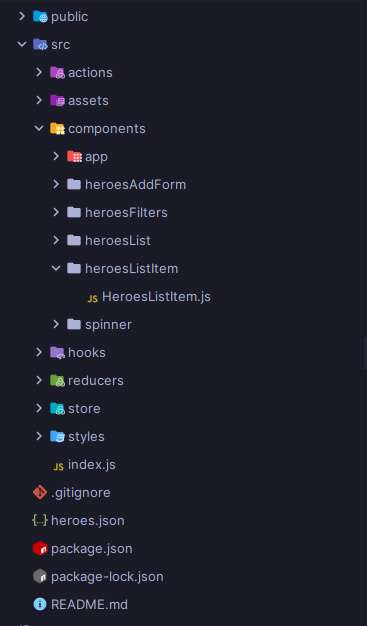
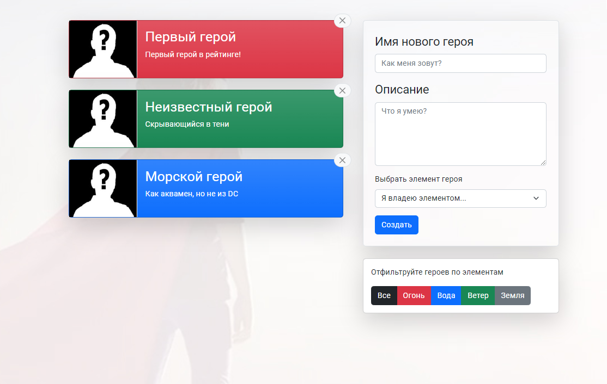

Структура проекта выглядит примерно следующим образом:



Это тот файл приложения, который будет шэриться через `json-server` и от которого будут выводиться новые посты

`heroses.json`
```JSON
{
    "heroes": [
        {
            "id": 1,
            "name": "Первый герой",
            "description": "Первый герой в рейтинге!",
            "element": "fire"
        },
        {
            "id": 2,
            "name": "Неизвестный герой",
            "description": "Скрывающийся в тени",
            "element": "wind"
        },
        {
            "id": 3,
            "name": "Морской герой",
            "description": "Как аквамен, но не из DC",
            "element": "water"
        }
    ],
    "filters": [
        "all",
        "fire",
        "water",
        "wind",
        "earth"
    ]
}
```

Стор редакса

`src > store > index.js`
```JS
import { createStore } from 'redux';
import reducer from '../reducers';

const store = createStore(reducer, window.__REDUX_DEVTOOLS_EXTENSION__ && window.__REDUX_DEVTOOLS_EXTENSION__());

export default store;
```

Редьюсер редакса. Пока он один, но в дальнейшем будет пополняться их количество.

Все типы экшенов должны быть написаны заглавными буквами. Если они относятся к запросам на сервер, то мы имеем состояние отправки запроса на сервер, полученного ответа от сервера или ошибки.

Второй кейс редьюсера так же в качестве `payload` принимает в себя список героев, который будет отображаться на странице

`src > reducer > index.js`
```JS
const initialState = {
    heroes: [], // герои
    heroesLoadingStatus: 'idle', // начальный статус загрузки
    filters: [] // фильтры просмотра
}

const reducer = (state = initialState, action) => {
    switch (action.type) {
        case 'HEROES_FETCHING':
            return {
                ...state,
                heroesLoadingStatus: 'loading'
            }
        case 'HEROES_FETCHED':
            return {
                ...state,
                heroes: action.payload,
                heroesLoadingStatus: 'idle'
            }
        case 'HEROES_FETCHING_ERROR':
            return {
                ...state,
                heroesLoadingStatus: 'error'
            }
        default: return state
    }
}

export default reducer;
```

А уже тут описаны экшены редакса.

Экщен `heroesFetched` принимает в себя так же список героев, который пришёл от сервера и сохраняет его в состояние.

`src > actions > index.js`
```JS
export const heroesFetching = () => {
    return {
        type: 'HEROES_FETCHING'
    }
}

export const heroesFetched = (heroes) => {
    return {
        type: 'HEROES_FETCHED',
        payload: heroes
    }
}

export const heroesFetchingError = () => {
    return {
        type: 'HEROES_FETCHING_ERROR'
    }
}
```

Хук отправки запроса на сервер будет возвращать один ответ от сервера

`src > hooks > http.hook.js`
```JS
import { useCallback } from "react";

export const useHttp = () => {
    // const [process, setProcess] = useState('waiting');

    const request = useCallback(async (url, method = 'GET', body = null, headers = {'Content-Type': 'application/json'}) => {

        // setProcess('loading');

        try {
            const response = await fetch(url, {method, body, headers});

            if (!response.ok) {
                throw new Error(`Could not fetch ${url}, status: ${response.status}`);
            }

            const data = await response.json();

            return data;
        } catch(e) {
            // setProcess('error');
            throw e;
        }
    }, []);

    // const clearError = useCallback(() => {
        // setProcess('loading');
    // }, []);

    return {
	    request, 
		// clearError, 
		// process, 
		// setProcess
    }
}
```

Тут уже располагается вся основная часть приложения

`src > index.js`
```JS
import React from 'react';
import ReactDOM from 'react-dom';
import { Provider } from 'react-redux';

import App from './components/app/App';
import store from './store';

import './styles/index.scss';

ReactDOM.render(
  <React.StrictMode>
    <Provider store={store}>
      <App />
    </Provider>
  </React.StrictMode>,
  document.getElementById('root')
);
```

Это основной компонент `App`

`src > components > app > App.js`
```JS
import HeroesList from '../heroesList/HeroesList';
import HeroesAddForm from '../heroesAddForm/HeroesAddForm';
import HeroesFilters from '../heroesFilters/HeroesFilters';

import './app.scss';

const App = () => {
    
    return (
        <main className="app">
            <div className="content">
                <HeroesList/>
                <div className="content__interactive">
                    <HeroesAddForm/>
                    <HeroesFilters/>
                </div>
            </div>
        </main>
    )
}

export default App;
```

Чтобы запустить два сервера вместе (react и json-server), нужно будет установить дополнительную библиотеку, которая позволяет запустить две команды одновременно: 

```bash
npm i concurrently
```

И так теперь выглядит сдвоенный запрос:

`package.json`
```JSON
"start": "concurrently \"react-scripts start\" \"npx json-server heroes.json --port 3001\"",
```

Это компонент, который выводит список элементов карточек героев

`components > heroesList > HeroesList.js`
```JS
import { useHttp } from '../../hooks/http.hook';
import { useEffect } from 'react';
import { useDispatch, useSelector } from 'react-redux';

import { heroesFetching, heroesFetched, heroesFetchingError } from '../../actions';
import HeroesListItem from '../heroesListItem/HeroesListItem';
import Spinner from '../spinner/Spinner';

// список персонажей
const HeroesList = () => {
	// из глобального хранилища получаем героев и статус их загрузки
	const { heroes, heroesLoadingStatus } = useSelector((state) => state);
	const dispatch = useDispatch(); // получаем диспетч
	const { request } = useHttp(); // получаем хук запроса на сервер

	// при загрузке страницы
	useEffect(() => {
		// устанавливаем состояние в загрузку
		dispatch(heroesFetching());

		// отправляем запрос на сервер на получение персонажей
		request('http://localhost:3001/heroes')
			.then((data) => dispatch(heroesFetched(data))) // герои получены
			.catch(() => dispatch(heroesFetchingError())); // получили ошибку с сервера
	}, []);

    // если герои загружаются
	if (heroesLoadingStatus === 'loading') {
		// то возвращаем загрузку
        return <Spinner />; 
        
        // если ошибка 
	} else if (heroesLoadingStatus === 'error') {
        // то возвращаем ошибку
		return <h5 className='text-center mt-5'>Ошибка загрузки</h5>;
	}

    // рендер списка героев
	const renderHeroesList = (arr) => {
		if (arr.length === 0) {
			return <h5 className='text-center mt-5'>Героев пока нет</h5>;
		}

		return arr.map(({ id, ...props }) => {
			return <HeroesListItem key={id} {...props} />;
		});
	};

    // элементы списка героев
	const elements = renderHeroesList(heroes);
	
    // возвращаем список героев
    return <ul>{elements}</ul>;
};

export default HeroesList;
```

А это компонент самой карточки

`components > heroesListItem > HeroesListItem.js`
```JS
const HeroesListItem = ({name, description, element}) => {
    // тут будет храниться класс, который попадёт в айтем
    let elementClassName;

    // тут мы присваиваем класс по выбранному элементу
    switch (element) {
        case 'fire':
            elementClassName = 'bg-danger bg-gradient';
            break;
        case 'water':
            elementClassName = 'bg-primary bg-gradient';
            break;
        case 'wind':
            elementClassName = 'bg-success bg-gradient';
            break;
        case 'earth':
            elementClassName = 'bg-secondary bg-gradient';
            break;
        default:
            elementClassName = 'bg-warning bg-gradient';
    }

    return (
        <li 
            className={`card flex-row mb-4 shadow-lg text-white ${elementClassName}``}>
            
            <div className="card-body">
                
                <h3 className="card-title">{name}</h3>
                <p className="card-text">{description}</p>
            </div>
            <span className="position-absolute top-0 start-100 translate-middle badge border rounded-pill bg-light">
                <button type="button" className="btn-close btn-close" aria-label="Close"></button>
            </span>
        </li>
    )
}

export default HeroesListItem;
```

Тут уже находится вёрстка компонента смена активностей классов: 

`components > heroesFilters > HeroesFilters.js`
```JS
const HeroesFilters = () => {
    return (
        <div className="card shadow-lg mt-4">
            <div className="card-body">
                <p className="card-text">Отфильтруйте героев по элементам</p>
                <div className="btn-group">
                    <button className="btn btn-outline-dark active">Все</button>
                    <button className="btn btn-danger">Огонь</button>
                    <button className="btn btn-primary">Вода</button>
                    <button className="btn btn-success">Ветер</button>
                    <button className="btn btn-secondary">Земля</button>
                </div>
            </div>
        </div>
    )
}

export default HeroesFilters;
```

Тут представлена вёрстка формы для добавления персонажей без логики

`components > heroesAddForm > HeroesAddForm.js`
```JS
const HeroesAddForm = () => {
    return (
        <form className="border p-4 shadow-lg rounded">
            <div className="mb-3">
                <label htmlFor="name" className="form-label fs-4">Имя нового героя</label>
                <input 
                    required
                    type="text" 
                    name="name" 
                    className="form-control" 
                    id="name" 
                    placeholder="Как меня зовут?"/>
            </div>

            <div className="mb-3">
                <label htmlFor="text" className="form-label fs-4">Описание</label>
                <textarea
                    required
                    name="text" 
                    className="form-control" 
                    id="text" 
                    placeholder="Что я умею?"
                    style={{"height": '130px'}}/>
            </div>

            <div className="mb-3">
                <label htmlFor="element" className="form-label">Выбрать элемент героя</label>
                <select 
                    required
                    className="form-select" 
                    id="element" 
                    name="element">
                    <option >Я владею элементом...</option>
                    <option value="fire">Огонь</option>
                    <option value="water">Вода</option>
                    <option value="wind">Ветер</option>
                    <option value="earth">Земля</option>
                </select>
            </div>

            <button type="submit" className="btn btn-primary">Создать</button>
        </form>
    )
}

export default HeroesAddForm;
```

И так выглядит итоговое приложение, которое нужно дорабатывать, чтобы оно отправляло запросы на `json-server`, создавало новых персонажей, меняло стейт и фильтровало персонажей по элементам:


