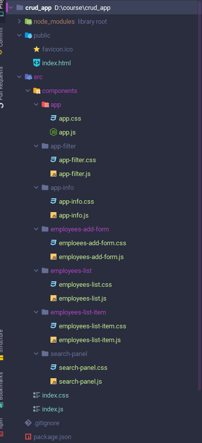

**CRUD** — акроним, обозначающий четыре базовые функции, используемые при работе с базами данных: создание (create), чтение (read), модификация (update), удаление (delete). Это стандартная классификация функций по манипуляции данными.
В [SQL](https://ru.wikipedia.org/wiki/SQL "SQL") этим функциям, операциям соответствуют операторы [Insert](https://ru.wikipedia.org/wiki/Insert_(SQL) "Insert (SQL)") (создание записей), [Select](https://ru.wikipedia.org/wiki/Select_(SQL) "Select (SQL)") (чтение записей), [Update](https://ru.wikipedia.org/wiki/Update_(SQL) "Update (SQL)") (редактирование записей), [Delete](https://ru.wikipedia.org/wiki/Delete_(SQL) "Delete (SQL)") (удаление записей).

Конкретно будет реализовываться проект, который позволит добавлять, удалять, изменять и читать сотрудников и как-то с этими данными взаимодействовать

И в самом начале нам нужно поделить макет на отдельные составные части - компоненты, которые будут представлять собой интерфейс приложения


Первым делом, нужно добавить определённые библиотеки в HTML для стилизации приложения: bootstrap и font-awesome

```HTML
<!-- Head -->

<link rel="stylesheet" href="https://cdnjs.cloudflare.com/ajax/libs/bootstrap/5.2.1/css/bootstrap.min.css"/>  
<link rel="stylesheet" href="https://cdnjs.cloudflare.com/ajax/libs/font-awesome/6.2.0/css/all.min.css"/>  

<title>React App</title>  
```


Для начала определимся со структурой. В папке src храним все исходники проекта. Внутри этой папки нужно хранить два основных файла index js и css. Там же создадим папку components, которая будет хранить все реакт-файлы. Все компоненты делим по папкам, которые именуем в порядке ==cebab-case==. Основной папкой тут будет App и его JS-файл



Сразу нужно сказать, что без разницы, будем мы писать JS или JSX расширение файла - вебпак всё соберёт

Основной файл рендера: 

`index.js`
```JSX
import React, {StrictMode} from 'react';  
import ReactDOM from 'react-dom/client';  
import './index.css';  
  
import App from './components/app/app';  
  
const root = ReactDOM.createRoot(document.getElementById('root'));  
root.render(  
    <StrictMode>  
        <App/>  
    </StrictMode>  
);
```

Основной файл для компонентов, который отправляется на рендер:

`app.js`
```JSX
// Импорты компонентов
import AppInfo from '../app-info/app-info';  
import SearchPanel from '../search-panel/search-panel';  
import AppFilter from '../app-filter/app-filter';  
import EmployeesList from '../employees-list/employees-list';  
import EmployeesAddForm from '../employees-add-form/employees-add-form';  
// Импорты стилей
import './app.css';  

// Сборная рендер-функция, которая отображает все компоненты
function App() {  
    return (  
        <div className="app">  
            <AppInfo/>  
  
            <div className="search-panel">  
                <SearchPanel/>  
                <AppFilter/>  
            </div>  
  
            <EmployeesList/>  
  
            <EmployeesAddForm/>  
        </div>  
    );  
}  

// Экспорт рендер-функции
export default App;
```

Пример компонента, который хранит в себе другой компонент:

`employees-list.js`
```JSX
import EmployeesListItem from '../employees-list-item/employees-list-item';  // импорт другого компонента
import './employees-list.css';  // импорт стилей
  
const EmployeesList = () => {  
    return (  
        <ul className="app-list list-group">  
            <EmployeesListItem/>  
            <EmployeesListItem/>  
            <EmployeesListItem/>  
        </ul>  
    );  
}  

// Экспорт компонента 
export default EmployeesList;
```

Стили компонента:

`employees-list.css`
```CSS
.app-list {  
    margin-top: 30px;  
    background-color: #3D5A80;  
    border-radius: 4px;  
    box-shadow: 15px 15px 15px rgba(0, 0, 0, .15);  
    color: #fff;  
}
```

Пример полноценного компонента со стилями:

`employees-list-item.js`
```JSX
import './employees-list-item.css';  
  
const EmployeesListItem = () => {  
    return (  
        <li className="list-group-item d-flex justify-content-between">  
            <span className="list-group-item-label">  
                John Smith  
            </span>  
            <input type="text" className="list-group-item-input" defaultValue="1000$"/>  
            <div className="d-flex justify-content-center align-items-center">  
                <button type="button" className="btn-cookie btn-sm">  
                    <i className="fas fa-cookie"></i>  
                </button>  
                <button type="button" className="btn-trash btn-sm">  
                    <i className="fas fa-trash"></i>  
                </button>  
                <i className="fas fa-star"></i>  
            </div>  
        </li>  
    );  
}  
  
export default EmployeesListItem;
```

`defaultValue` - это атрибут инпута, который задаёт начальное значение по умолчанию