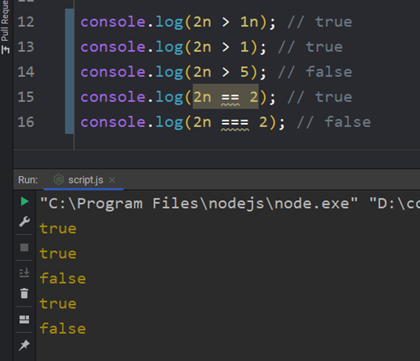

Таким способом мы можем вывести максимальное число в интеджере. Иногда появляются ситуации, когда нам нужно использовать числа больше (например, при работе в банках)

И для этого уже используется тип данных `BigInt`. Его можно написать двумя способами:

1) Через `n` на конце
2) Через метод `BigInt`. Этот метод может принимать как число, так и строку

Большие числа нельзя складывать с обычными и нельзя использовать внутри методов `Math` – это два их самых основных ограничения. Так же они работают почти со всеми унарными операторами (кроме `+`). Обычные операции с двумя большими числами – работают. При делении друг на друга большие числа округляются в меньшую сторону

К операциям сравнения большие числа относятся нормально и их можно сравнить даже с обычными числами

Чтобы сложить большие и обычные числа можно воспользоваться таким синтаксисом:

>[!info] И самое важное: 
> - `BigInt` нужно использовать только тогда, когда это реально необходимо. Потому что при переводе большого числа в обычное, все не входящие в диапазон цифры – отпадут. 
> - Например, число `21342134721934721347921389421893231` откинет значения до `2134213472193472`