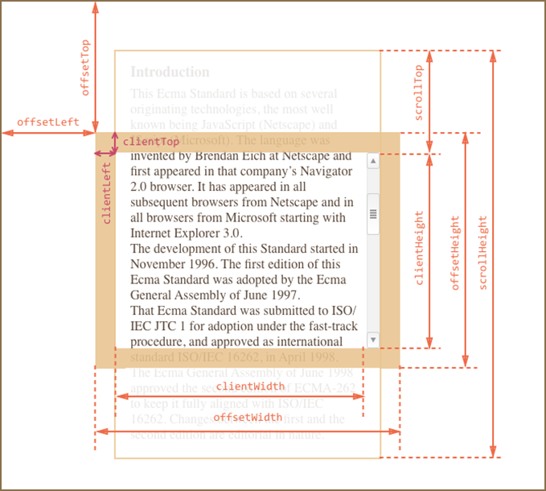
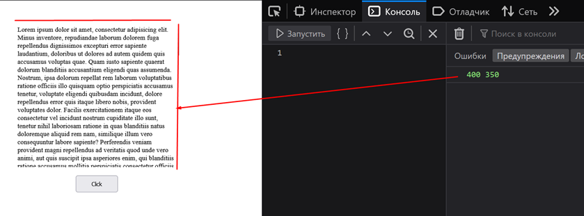
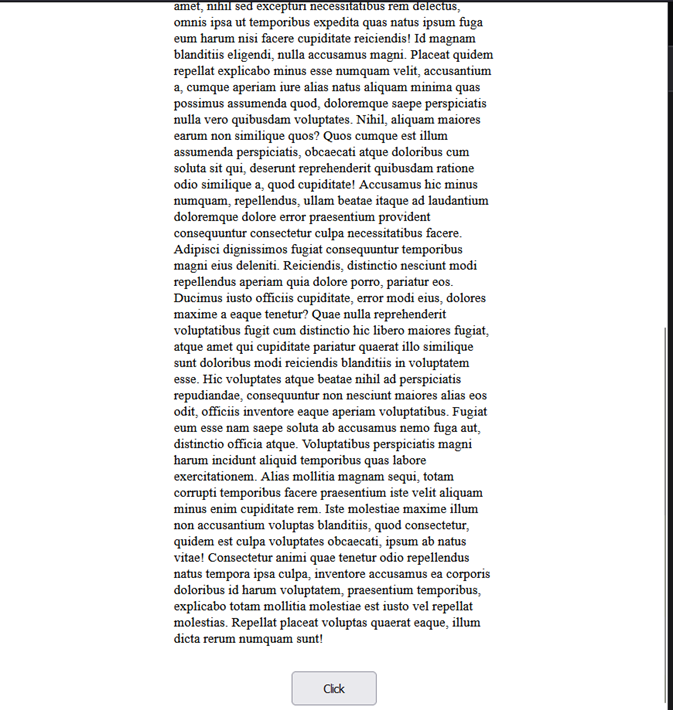
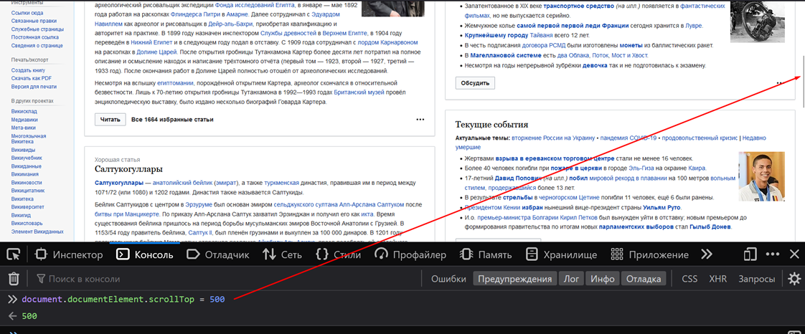
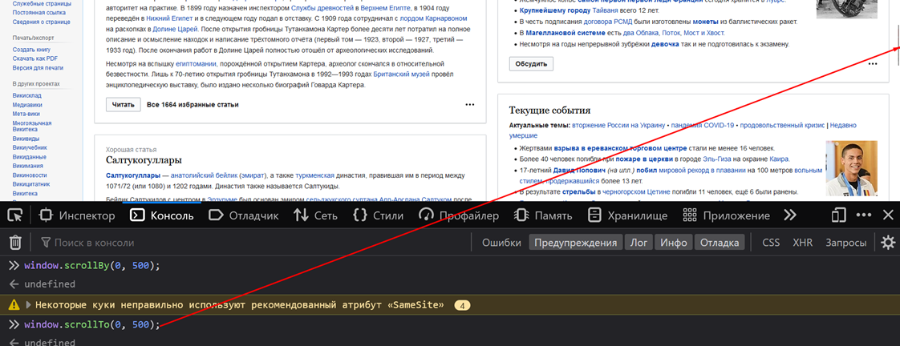

Есть три основных понятия среди глобальных объектов: `document` (сам документ с элементами), `window` (отображаемое окно, размер которого уменьшается, например, когда мы уменьшаем браузер) и `screen` (весь видимый монитор)

И в первую очередь хочется поговорить про получение размеров элемента через его свйоства, которые мы моежем получить через JS

Пример использования:

Тут стоит отметить, что на получаемые значения так же влияет и тип `box-sizing` (тот же `border-box`, который часто используется на страницах)

Так же мы можем показать полностью свёрнутое окно через свойство бокса, в котором хранится полная высота свёрнутого объекта

Так же мы можем отобразить свойство JS, которое хранит в себе положение по скроллу в пикселях

Данные методы позволяют отобразить *Computed Styles* конкретного объекта

И тут хочется немного прояснить про *Computes Styles* (вычисленные стили). Это стили, которые уже применены на объект. Они могут вычисляться автоматически как `margin: 0 auto`, который под копотом постоянно вычисляется браузером

И мы можем получить данные стили с помощью JS

Такой код и использование метрик относительно объектов позволяет, например сделать быстрый скролл по кнопке от начала страницы к середине (например)

Так же тут стоит отметить особенности обращения к самому документу, так как операции проходят не с самим document, а с `documentElement`

Уже данный метод позволяет проскроллить относительно текущего положения по нужным нам координатам

Второй метод будет уже работать относительно всей страницы

