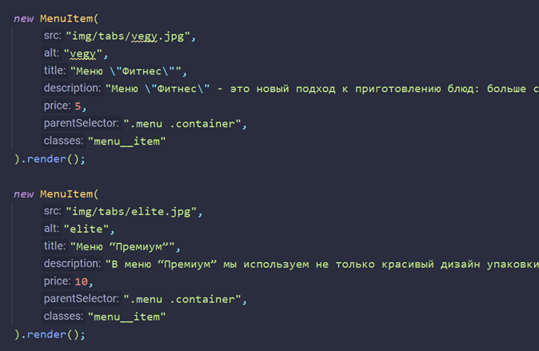
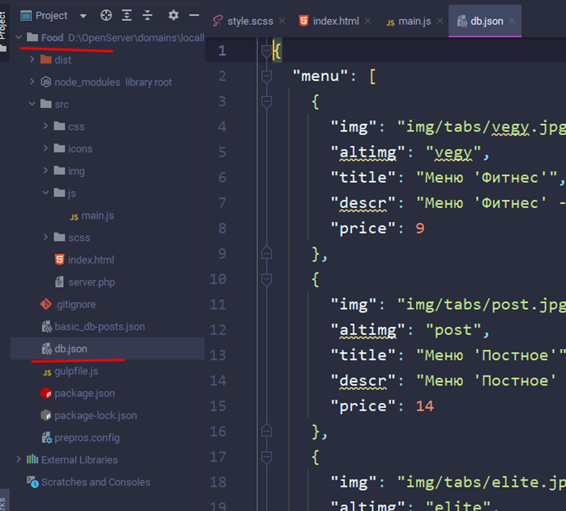
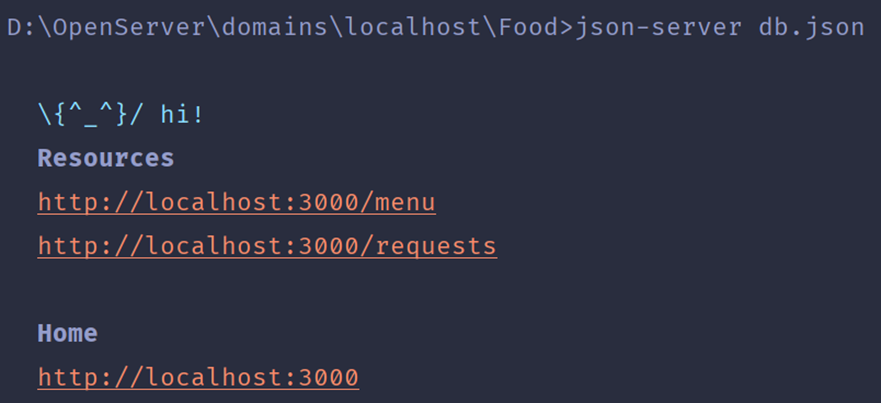
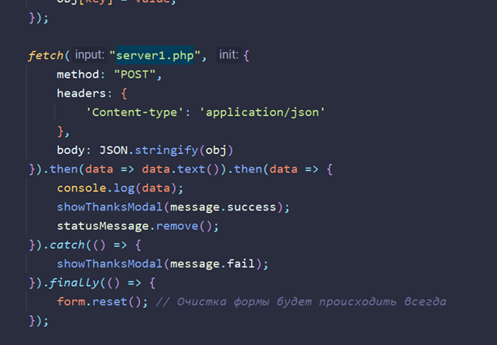
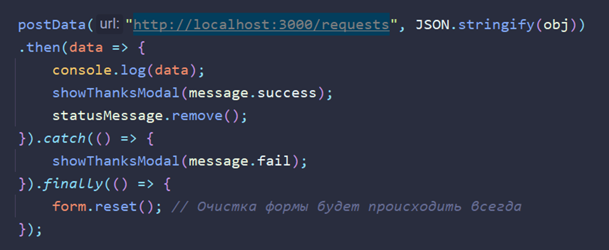
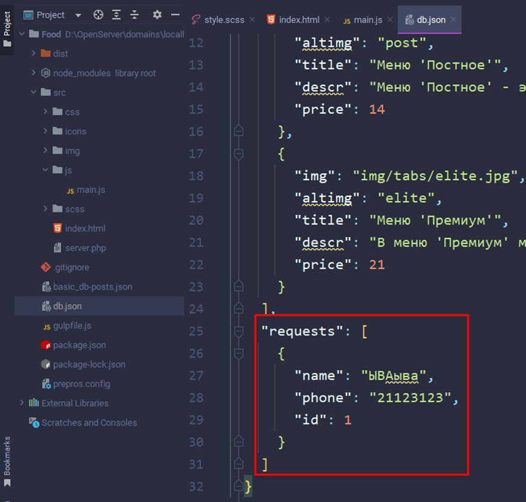
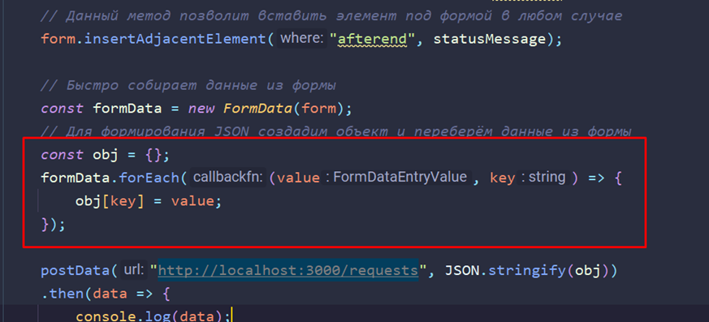
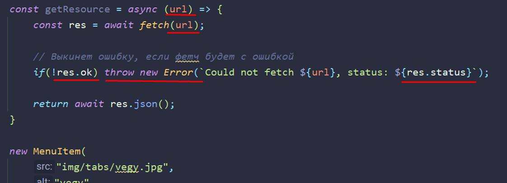
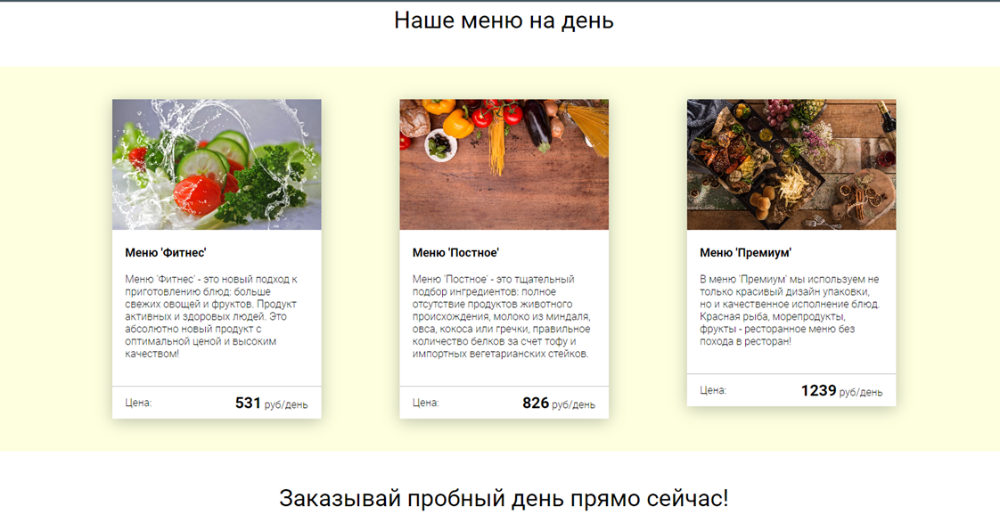

В данном уроке нужно заменить отображение карточек на сайте с самостоятельного их создания через свои аргументы на создание по аргументам, полученным с сервера (а именно с нашей базы данных)

Ну и далее нашу датабазу нужно поместить в корень проекта и отдельно запустить json-server, чтобы работать с этой датабазой

И дальше нам нужно заменить фетч-запрос в нашем `postData`, чтобы мы могли запрашивать разыне данные по определённым параметрам.

Для этого сначала переименуем нашу основную функцию и сам пост данных забьём в отдельную функцию, внутри которой и будем вызывать фетч. Результат фетча (это промис) будем сразу переводить в JSON

И дальше мы встречаемся с проблемой. `Promise` – это асинхронный код, который выполняется вне основного потока функции. Поэтому на момент возвращения результата мы получим `error`, так как `res` будет равен `undefined`. Чтобы решить проблему, нужно превратить код в синхронный, чтобы `return` дождался выполнения промиса

И далее нам приходит на помощь конструкция `async`/`await`. Она работает примерно по такому принципу:

`async` говорит, что в функции есть асинхронные функции (промисы), а уже сам `await` говорит этой функции, что это и есть асинхронная функция и что её результата выполнения нужно дождаться, прежде чем выполнять код дальше. То есть выполнение кода остановится до получения любого результата этой функции

Так же `await` можно накинуть и на метод, который переводит промис в json (так как неизвестно насколько большой ответ от сервера придёт)

Примерно так выглядит итоговый запрос. Ссылка взята из `json-server` и перевод данных в текст убран (самый первый чейн)

И такой ответ от сервера мы получаем

И самая прикольная вещь тут – это наш первый постинг данных на сервер с записью ответа в датабазу

Ну и далее мы можем немного заменить такой формат записи данных из формдаты в объект

Мы можем это реализовать через метод `entries`, который переводит свойства объекта в массивы

И поэтому мы сейчас выполним такую комбинацию:
1) Сначала `formData` переведём в массив массивов (можно записать и `Object.entires(formData)`)
2) Потом переведём через `Object.fromEntires()` этот массив массивов в обычный объект
3) Потом через `stringify` переведём объект в json-формат данных
4) Передадим переменную с джсоном в `postData`

Дальше переходим ко второй части, где мы должны заменить генерацию наших карточек из собственных запросов и генераций.

Тут нам нужны простые гет-запросы, поэтому оставляем только ссылку.

Дальше нам нужно решить проблему с тем, что `fetch` может вернуть `error`. `catch` нам недоступен, так как он вызывается только при отсутствии интернета. Делается это просто. У `fetch` есть свойство «`ok`» и нам нужно проверить, что если он отрицательный, то нам нужно будет выдать ошибку. В ошибке можно указать ещё и свойство статуса фетча

И дальше нам нужно выполнить наш запрос. При отправке запроса на сервер, мы получаем всю нашу дадабазу.

Затем в `then` обрабатываем наш запрос. Все данные (само меню) хранятся в массиве (массив объектов, где объект - менюшка), поэтому нужно будет перебрать полученную дату через `forEach`.

В переборе мы не передаём `item`, а сразу можем деструктуризировать полученный элемент на отдельные свойства, чтобы было проще (чтобы не обращаться постоянно `item.img`, `item.altimg` и так далее)

Так же можно таким способом реализовать рендер элементов на странице – не через наш созданный класс, а через функцию, которая принимает в себя массив карточек

