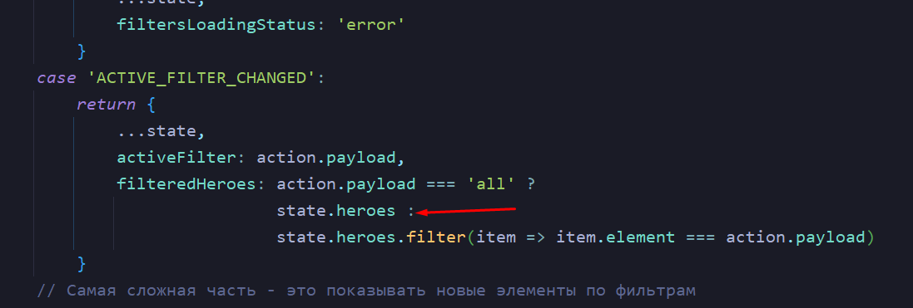
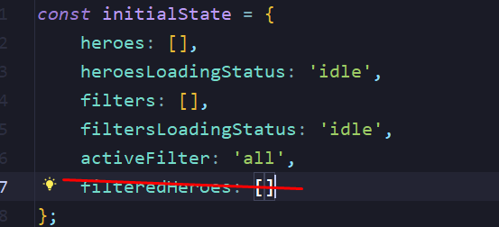
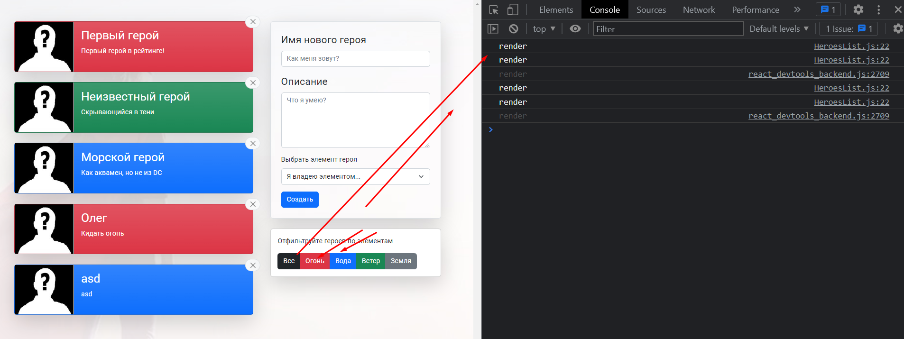

При разрастании приложения увеличивается и количество действий, которые должен контролировать реакт. Если экшены можно спокойно разделить по папкам и обращаться конкретно к нужным, то данное разрастание не позволит спокойно поделить функцию-редьюсер

В нашем приложении достаточно логичным будет отделить логику работы с персонажами и фильтрами. Однако мы сталкиваемся с тем, что фильтры так же используют состояние персонажей, чтобы контролировать их список.



Чтобы сократить код и разбить логику, можно:
- разделить логику редьюсера через функцию `combineReducers`
- вынести фильтрацию внутрь компонента, чтобы разбить логику стейтов

Тут мы выносим фильтрацию полученных данных из стейта и теперь её не нужно проводить внутри редьюсера

`components > heroesList > HeroesList.js`
```JS
const HeroesList = () => {
	const filteredHeroes = useSelector((state) => {
		if (state.activeFilter === 'all') {
			return state.heroes;
		} else {
			return state.heroes.filter((item) => state.heroes === state.activeFilter);
		}
	});

	// сейчас отсюда достаём просто статус загрузки
	const heroesLoadingStatus = useSelector((state) => state.heroesLoadingStatus);

	/// CODE ...
```

Теперь нам не нужно данное состояние



И данная фильтрация в редьюсере


Вынесем из главного `reducer` логику по работе с персонажами и его стейты в отдельный файл

`reducers > heroes.js`
```JS
const initialState = {
	heroes: [],
	heroesLoadingStatus: 'idle',
};

export const heroes = (state = initialState, action) => {
	switch (action.type) {
		case 'HEROES_FETCHING':
			return {
				...state,
				heroesLoadingStatus: 'loading',
			};
		case 'HEROES_FETCHED':
			return {
				...state,
				heroes: action.payload,
				heroesLoadingStatus: 'idle',
			};
		case 'HEROES_FETCHING_ERROR':
			return {
				...state,
				heroesLoadingStatus: 'error',
			};
		// Самая сложная часть - это показывать новые элементы по фильтрам
		// при создании или удалении
		case 'HERO_CREATED':
			return {
				...state,
				heroes: [...state.heroes, action.payload],
			};
		case 'HERO_DELETED':
			return {
				...state,
				heroes: state.heroes.filter((item) => item.id !== action.payload),
			};
		default:
			return state;
	}
};
```

Тут уже будем хранить логику фильтрации

`reducers > filters.js`
```JS
const initialState = {
	filters: [],
	filtersLoadingStatus: 'idle',
	activeFilter: 'all',
};

export const filters = (state = initialState, action) => {
	switch (action.type) {
		case 'FILTERS_FETCHING':
			return {
				...state,
				filtersLoadingStatus: 'loading',
			};
		case 'FILTERS_FETCHED':
			return {
				...state,
				filters: action.payload,
				filtersLoadingStatus: 'idle',
			};
		case 'FILTERS_FETCHING_ERROR':
			return {
				...state,
				filtersLoadingStatus: 'error',
			};
		case 'ACTIVE_FILTER_CHANGED':
			return {
				...state,
				activeFilter: action.payload,
			};
		default:
			return state;
	}
};
```

И тут через функцию `combineReducers` объединяем две функции редьюсера в один внутри объекта. Теперь обычный `reducer` не нужен и его можно будет удалить

`store > index.js`
```JS
import { createStore, combineReducers } from 'redux';
import { heroes } from '../reducers/heroes';
import { filters } from '../reducers/filters';

const store = createStore(
	combineReducers({ heroes, filters }),
	window.__REDUX_DEVTOOLS_EXTENSION__ && window.__REDUX_DEVTOOLS_EXTENSION__(),
);

export default store;
```

И теперь, после манипуляций с объединением редьюсеров, нужно будет вытаскивать нужные объекты из объектов, которые были названы и переданы в `combineReducers`


И вот уже с таким синтаксисом мы можем импортировать поля из нескольких объектов
Однако такой подход приводит к тому, что компонент будет перерисовываться при каждом изменении стейта
*Такой вариант не стоит использовать в проекте, так как он не оптимизирован*

```JS
const someState = useSelector((state) => ({  
   activeFilter: state.filters.activeFilter,  
   heroes: state.heroes.heroes,  
}));
```

Откорректируем логику филтрации героев.
Но тут мы встретимся с такой проблемой, что каждый раз при нажатии кнопки фильтрации, у нас будет воспроизводиться перерендер компонента. Это происходит из-за того, что каждый раз у нас вызывается `useSelector()` при изменении глобального стейта.

`components > heroesList > HeroesList.js`
```JS
const HeroesList = () => {  
   const filteredHeroes = useSelector((state) => {  
      if (state.filters.activeFilter === 'all') {  
	      console.log('render');
         return state.heroes.heroes;  
      } else {  
         return state.heroes.heroes.filter(  
            (item) => item.element === state.filters.activeFilter,  
         );  
      }  
   });

	/// CODE ...
```


Чтобы решить данную проблему, нужно мемоизировать функцию вызова `useSelector()`

```bash
npm i reselect
```

Данный модуль позволяет нам вызвать по определённым правилам функцию `useSelector`. То есть мы создаём массив запросов в селектор первым аргументом, а вторым аргументом берём полученные значения и используем их в функции, которую хотели использовать в селекторе. 
После вышеописанных манипуляций просто помещаем функцию реселекта внутрь `useSelector` 

`components > heroesList > HeroesList.js`
```JS
import { createSelector } from 'reselect';

/// CODE ...

// эта функция будет вызвать useSelector по заданным правилам и будет мемоизировать значение  
const filteredHeroesSelector = createSelector(  
   // вызываем срабатывание двух селекторов  
   // получаем сам активный фильтр и массив героев   [(state) => state.filters.activeFilter, (state) => state.heroes.heroes],  
   // производим операции над результатами двух вызванных селекторов  
   (filter, heroes) => {  
      if (filter === 'all') {  
         console.log('render');  
         return heroes;  
      } else {  
         return heroes.filter((item) => item.element === filter);  
      }  
   },  
);  
  
const filteredHeroes = useSelector(filteredHeroesSelector);

/// CODE ...
```

Теперь рендер вызвается только тогда, когда данные в стейте изменяются


