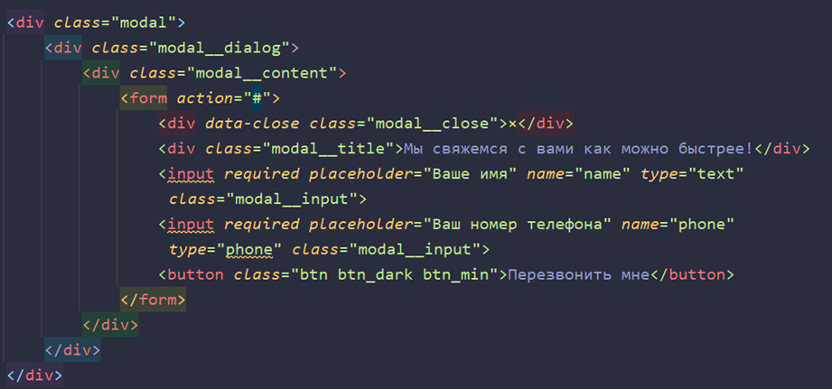
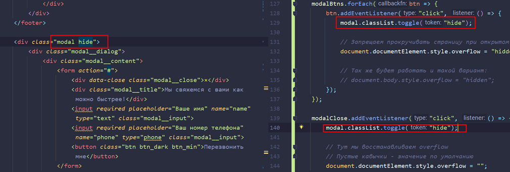
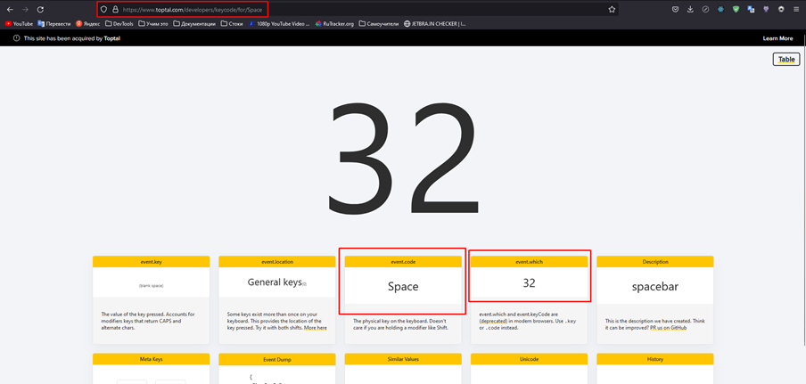

**Важно!** В HTML есть кастомные атрибуты, которые мы можем задавать самостоятельно. Это атрибуты, которые начинаются на «`data-`» - после дефиса мы можем прописывать свои значения

Блок кода модального окна (display: none – по умолчанию)

Это кнопка вызова модального окна

Это код для стоковой странички. Тут стоит отметить, что при вызове модельного окна мы скрываем оверфлоу Так же при использовании в качестве значения для стилей «“”» пустой строки – добавляется значение по умолчанию самим браузером

Если мы хотим сделать отображение или закрытие через тугл, то нужно будет убрать настройки дисплея из стилей и добавить класс хайд изначально

Так же будет удобно для пользователя, если мы позволим закрывать модальное окно через клик по пустому пространству

Так же в плохом коде можно встретить и такое объявление ивента. Дело в том, что ивент уже объявлен внутри обработчика события. Однако такая запись считается плохим тоном

Ну и добавим закрытие модального окна через Escape. Тут уже нужно проверять кнопку через событие «`keydown`» (кнопка нажата) и параметр внутри «`e.code`»

Чтобы определить нужную нам кнопку, можно воспользоваться уже заранее заготовленными таблицами [кейкодов](https://www.toptal.com/developers/keycode) или нужными сайтами

Примечание: если бы мы добавляли и удаляли класс с объекта через `add()-remove()`, то нужно было бы дописать ещё и такое условие

