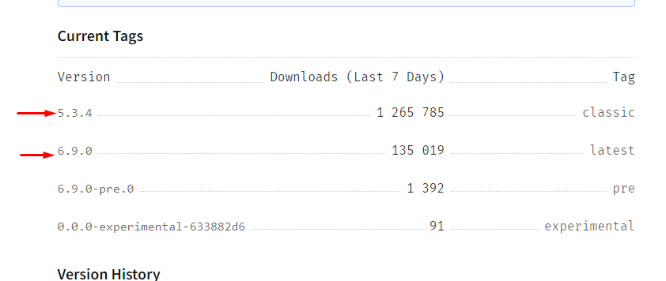
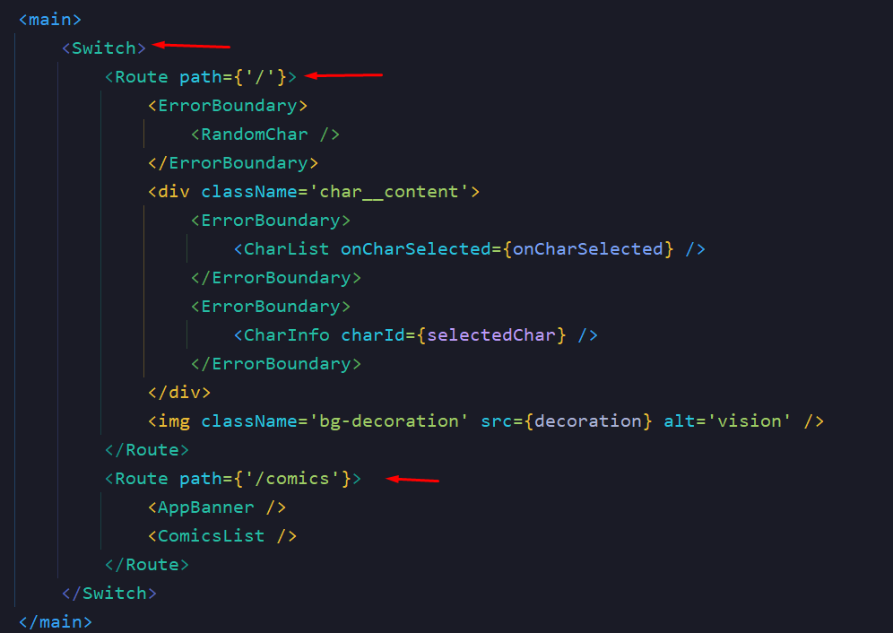
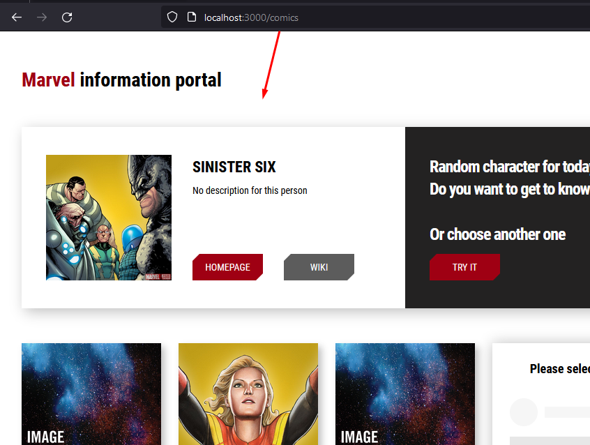
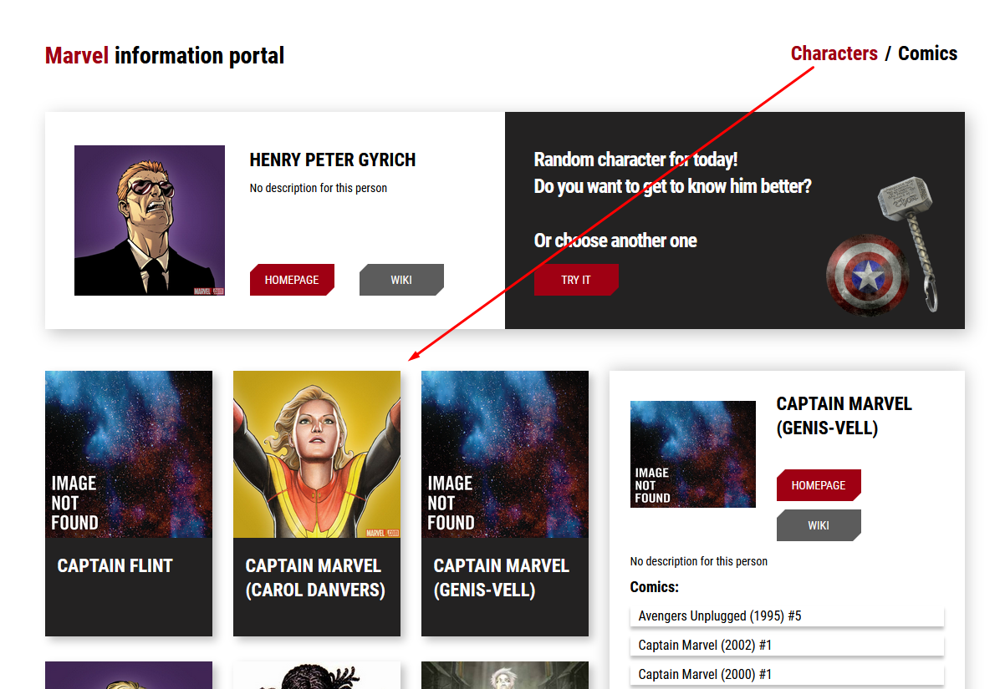

Сейчас имеется сразу несколько версий реакт-роутер-дома, но стоит начать с пятой 



Устанавливаем нужную нам версию через `@версия`

```bash
npm i react-router-dom@5.3.4
```

И далее нам нужно закинуть в проект три компонента из роутер-дома:
- `BrowserRouter` - роутер по всем страницам приложения (отслеживает переход по ссылкам)
- `Route` - отдельный роут приложения
- `Switch` 

И далее обернём все наши страницы подобным образом:
- В `BrowserRouter` (который переименовали в `Router`) поместим всё наше приложение
- А в отдельный `Route` поместим компоненты, которые должны рендериться на отдельной странице

`components > app > App.js`
```JS
import { useState } from 'react';
import { BrowserRouter as Router, Route, Switch } from 'react-router-dom';

const App = () => {
	const [selectedChar, setSelectedChar] = useState(null);

	const onCharSelected = (id) => {
		setSelectedChar(id);
	};

	return (
		<Router>
			<div className='app'>
				<AppHeader />
				<main>
					<Route path={'/'}>
						<ErrorBoundary>
							<RandomChar />
						</ErrorBoundary>
						<div className='char__content'>
							<ErrorBoundary>
								<CharList onCharSelected={onCharSelected} />
							</ErrorBoundary>
							<ErrorBoundary>
								<CharInfo charId={selectedChar} />
							</ErrorBoundary>
						</div>
						
					</Route>
					<Route path={'/comics'}>
						<AppBanner />
						<ComicsList />
					</Route>
				</main>
			</div>
		</Router>
	);
};

export default App;
```

Но тут стоит заметить, что роутер компонует между собой элементы с ссылками, которые хранят одинаковые значения. То есть в данном случае первый роут и второй объединятся, так как `/` и `/comics` имеют при себе слеш


И при переходе на `/comics` у нас будет следующая картина:

Такой подход был бы уместен, если мы заранее спланировали бы вёрстку таким образом, что нам нужно показывать дополнительные данные (тыкаем по карточке товара и раскрывается его расширенное описание)


`Switch` - переключатель по роутам - он уже загружает отдельный роут как новую страницу

Однако тут мы упираемся в такую особенность работы свича, что он грузит только первую ссылку, которая совпадает с `url`, имеющейся на странице

То есть свитч грузит только первую страницу, которая совпала с первой ссылкой (которая всегда `/`) и не смотрит на следующие ссылки, которые имеют тот же маршрут





Чтобы исправить проблему, у нас есть два пути решения:
1) Главную страницу `/` расположить в конце списка свича
2) Добавить атрибут `exact`, который обязует, чтобы рендер был только по написанию полного и правильного пути

Вот пример использования первого подхода (все `/имя` нужно будет писать до `/` главной страницы)


И вот пример использования обязующего атрибута


Результат:


И далее, чтобы добавить ссылки в наш проект, нужно в нужное место в компоненте добавить компонент `Link`, который в качестве ссылки в себя принимает атрибут `to`

`components > appHeader > AppHeader.js`
```JS
import { Link } from 'react-router-dom';

const AppHeader = () => {
	return (
		<header className='app__header'>
			<h1 className='app__title'>
				// вместо a и href вставляем Link и to
				<Link to={'/'}>
					<span>Marvel</span> information portal
				</Link>
			</h1>
			<nav className='app__menu'>
				<ul>
					<li>
						<Link to={'/'}>Characters</Link>
					</li>
					/
					<li>
						<Link to={'/comics'}>Comics</Link>
					</li>
				</ul>
			</nav>
		</header>
	);
};

export default AppHeader;
```

И сейчас ссылки для перехода по страницам работают


Так же мы имеем функцию `redirect`, которая при определённых условиях позволяет заредиректить пользователя (например, если он не залогинен или определённой ссылки не существует)

```JS
import { redirect } from "react-router-dom";

const loader = async () => {
  const user = await getUser();
  if (!user) {
    return redirect("/login");
  }
  return null;
};
```

Так же мы имеем атрибут `NavLink`, который позволяет нам стилизовать активную ссылку. Его особенностью является наличие атрибута `activeStyle` 

Однако, когда мы добавляем стили для наших элементов, стоит добавлять атрибут `exact`, чтобы стили применялись не ко всем элементам сразу, а только к нужным

`components > appHeader > AppHeader.js`
```JS
import { Link, NavLink } from 'react-router-dom';

const AppHeader = () => {
	return (
		<header className='app__header'>
			<h1 className='app__title'>
				<Link to={'/'}>
					<span>Marvel</span> information portal
				</Link>
			</h1>
			<nav className='app__menu'>
				<ul>
					<li>
						<NavLink 
							exact 
							activeStyle={{ color: '#9F0013' }} 
							to={'/'}
						>	
							Characters
						</NavLink>
					</li>
					/
					<li>
						<NavLink 
							exact 
							activeStyle={{ color: '#9F0013' }} 
							to={'/comics'}
						>
							Comics
						</NavLink>
					</li>
				</ul>
			</nav>
		</header>
	);
};
```



И далее мы можем вынести страницы в отдельные компоненты и поместить их в папку `pages`

`src > components > pages > ComicsList.js`
```JS
import React from 'react';
import AppBanner from '../appBanner/AppBanner';
import ComicsList from '../comicsList/ComicsList';

const ComicsPage = () => {
	return (
		<>
			<AppBanner />
			<ComicsList />
		</>
	);
};

export default ComicsPage;
```

`src > components > pages > MainPage.js`
```JS
import React, { useState } from 'react';
import ErrorBoundary from '../ErrorBoundary/ErrorBoundary';
import RandomChar from '../randomChar/RandomChar';
import CharList from '../charList/CharList';
import CharInfo from '../charInfo/CharInfo';
import decoration from '../../resources/img/vision.png';

const MainPage = () => {
	const [selectedChar, setSelectedChar] = useState(null);

	const onCharSelected = (id) => {
		setSelectedChar(id);
	};

	return (
		<>
			<ErrorBoundary>
				<RandomChar />
			</ErrorBoundary>
			<div className='char__content'>
				<ErrorBoundary>
					<CharList onCharSelected={onCharSelected} />
				</ErrorBoundary>
				<ErrorBoundary>
					<CharInfo charId={selectedChar} />
				</ErrorBoundary>
			</div>
			
		</>
	);
};

export default MainPage;
```

А далее экспортировать их через `index.js`, который сократит до них путь

`src > components > pages > index.js`
```JS
import MainPage from './MainPage';
import ComicsPage from './ComicsPage';

export { MainPage, ComicsPage };
```

И тут используем импорт

`src > components > app > App.js`
```JS
import { BrowserRouter as Router, Route, Switch } from 'react-router-dom';

import AppHeader from '../appHeader/AppHeader';
// импортируем страницы из одного файла
import { ComicsPage, MainPage } from '../pages';

const App = () => {
	return (
		<Router>
			<div className='app'>
				<AppHeader />
				<main>
					<Switch>
						<Route exact path={'/'}>
							<MainPage />
						</Route>
						<Route exact path={'/comics'}>
							<ComicsPage />
						</Route>
					</Switch>
				</main>
			</div>
		</Router>
	);
};

export default App;
```


