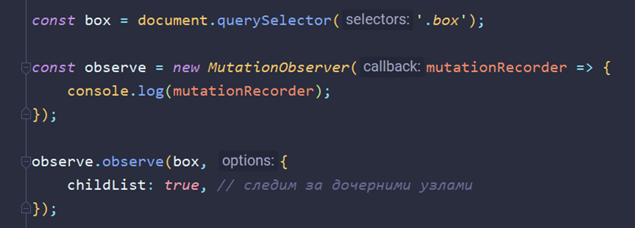

Атрибут `contenteditable="true"`позволяет нам редактировать контент внутри определённого блока. Это интересный тег, который позволяет нам менять контент внутри блока

Такой атрибут используют чаще в CMS, когда нужно отредактировать контент на готовой странице. Сохранение данного контента уже выполняет логика бэкэнда

И примерно таким образом мы можем задать слежку за элементом через `observer`. Конкретно тут обсервер получает в себя колбэк-функцию, которая хранит в себе рекорды (логи изменений). Далее мы инициализируем слежку через `observe(элемент, выполняемая функция)`

Отключить слежку можно через `observer.disconnect()`

[тут](https://developer.mozilla.org/ru/docs/Web/API/MutationObserver) находятся все опции мутировщика

И теперь мы можем просмотреть изменения элемента.
1) `Observer` срабатывает уже после изменений. Мы работаем с результатом изменений
2) Это асинхронная операция. Поэтому она может выполниться чуть позже или чуть раньше
3) При остановке `Observer`, он так же стирается и сборщиком мусора

Так же есть `Perfomance`, `Resize` и `Intersection` обсёрверы