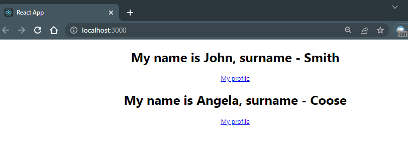
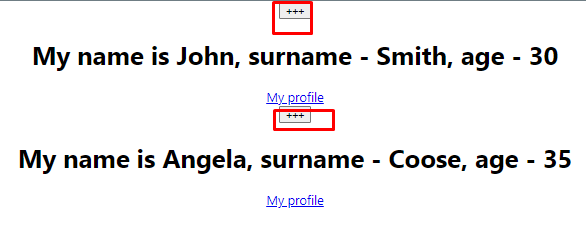

Перепишем немного приложение из первых уроков под классы с использованием компонентов:

```JSX
// Импортим сам компонент
import { Component } from 'react';  
import './App.css';  

// Экстендим класс от компонента
class WhoAmI extends Component {  

	// Так же конструктор можно тут удалить, если в нём кроме super() ничего не вызывается
    constructor(props) {  
        super(props);  
    }
      
    render() {  
        const {name, surname, link} = this.props;  
        return (  
            <div>  
                <h1>My name is {name}, surname - {surname}</h1>  
                <a href={link}>My profile</a>  
            </div>  
        );  
    };  
}  
  
function App() {  
    return (  
        <div className="App">  
            <WhoAmI name='John' surname="Smith" link="google.com" />  
            <WhoAmI name='Angela' surname="Coose" link="facebook.com" />  
        </div>  
    );  
}  
  
export default App;
```


И конкретно в React мы можем прописать переменную, которая будет хранить в себе значения определённых состояний. Состояния - это динамически изменяемые объекты на странице. Мы не можем их изменять напрямую, но можем попробовать поменять особым образом

```JSX
class WhoAmI extends Component {  
    constructor(props) {  
        super(props);  
        this.state = {  
            years: 27,  
        }    
    }  
  
    render() {  
        const {name, surname, link} = this.props;  
        return (  
            <div>  
                <h1>My name is {name}, surname - {surname}, age - {this.state.years}</h1>  
                <a href={link}>My profile</a>  
            </div>  
        );  
    };  
}
```


И в этом примере в метод рендера мы закинули кнопку, которая будет вызвать метод для смены состояния и написали сам метод для смены состояния. 

Для смены состояний обязательно нужно использовать стрелочные функции, чтобы наследовать контекст. 

Сам объект мы не мутируем - нужно передавать внутри `setState()` новый объект с нужным значением. 

`setState()` - при запуске активирует перерисовку всего компонента с новым состоянием

```JSX
class WhoAmI extends Component {  
    constructor(props) {  
        super(props);  
        this.state = {  
            years: 27,  
        }    
    }  

	// -- Метод смены состояний
    // Обязательно нужно тут использовать стрелочную функцию  
    nextYear = () => {  
        console.log('+++');  
        // Правильная смена состояния  
        this.setState({  
            // Делать через инкремент ("++") не стоит, так как это мутирует состояние объекта  
            years: this.state.years + 1,  
        });  
    }  
  
    render() {  
        const {name, surname, link} = this.props;  
        return (  
            <div>  
	            {// А тут добавили кнопку, которая вызовет метод}
                <button onClick={this.nextYear}>+++</button>  
                <h1>My name is {name}, surname - {surname}, age - {this.state.years}</h1>  
                <a href={link}>My profile</a>  
            </div>  
        );  
    };  
}
```


>[!warning] Особенности работы хуков:
> - Функция `setState` асинхронна, поэтому когда мы её очень быстро выполняем, она может не успеть поменять состояние объекта и мы можем пропустить изменения.
> - В React есть механизмы для объединения сразу нескольких изменений состояний в одно изменение состояния. 
> - Чтобы избежать проблем с асинхронным изменением состояния, нужно использовать для изменения объекта колбэк-функцию

Тут уже нужно отметить несколько моментов. 
1) Сейчас в метод `setState` мы передаём коллбэк-функцию, которая заставит Реакт сначала выполнить текущее изменение состояния, а уже только потом изменять новое состояние. 
2) Сам объект `{}`, который передаётся через коллбэк оборачивается в скобки, чтобы не вызвать внутри `return`, поэтому получается такая конструкция: `state => ({})`
3) `setState` меняет состояние только тех свойств объекта state, которые мы в него передали. То есть свойство `text` (которое мы отображаем в качестве текста кнопки) меняться не будет и перезагружаться на странице тоже, что снижает потребление ресурсов

```JSX
constructor(props) {  
    super(props);  
    this.state = {  
        years: 27,  
        text: '+++',  
    }
}  
  
nextYear = () => {  
    console.log('+++');  
    this.setState((state) => ({  
        years: state.years + 1,  
    }));  
}  
  
render() {  
    const {name, surname, link} = this.props;  
    return (  
        <div>  
            <button onClick={this.nextYear}>{this.state.text}</button>  
            <h1>My name is {name}, surname - {surname}, age - {this.state.years}</h1>  
            <a href={link}>My profile</a>  
        </div>  
    );  
};
```


>[!info] Итог:
> - У компонента может быть своё внутреннее состояние, которое динамически меняется
> - Состояние может быть как у классовых, так и у функциональных компонентов
> - Состояние напрямую менять ==нельзя== - только через команду `setState` 
> - `setState` и какое-либо изменение состояния - это асинхронная операция и если мы хотим сохранить точность и последовательность данных, нужно передавать коллбек-функцию
> - В команде `setState` мы можем менять только те свойства объекта, которые нам нужны - остальные останутся без изменений
 


