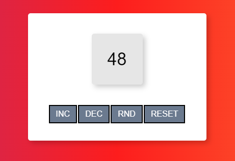

>[!faq] Задание:
 > 1) Начальное значение счетчика должно передаваться через props
 > 2) INC и DEC увеличивают и уменьшают счетчик соответственно на 1. Без ограничений, но можете добавить границу в -50/50. По достижению границы ничего не происходит
 > 3) RND изменяет счетчик в случайное значение от -50 до 50. Конструкцию можете прогуглить за 20 секунд :) Не зависит от предыдущего состояния
 > 4) RESET сбрасывает счетчик в 0 или в начальное значение из пропсов. Выберите один из вариантов

Начальный код:

```HTML
<div id="app">
</div>
```

```CSS
* {
  box-sizing: border-box;
}
html, body {
  height: 100%;
}

body {
  background: rgb(131,58,180);
background: linear-gradient(90deg, rgba(131,58,180,1) 0%, rgba(253,29,29,1) 50%, rgba(252,176,69,1) 100%);
}

.app {
  width: 350px;
  height: 250px;
  background-color: #fff;
  margin: 50px auto 0 auto;
  padding: 40px;
  border-radius: 5px;
  box-shadow: 5px 5px 10px rgba(0,0,0, .2);
}

.counter {
  width: 100px;
  height: 100px;
  border-radius: 5px;
  box-shadow: 5px 5px 10px rgba(0,0,0, .2);
  background-color: #e6e6e6;
  text-align: center;
  line-height: 100px;
  font-size: 34px;
  margin: 0 auto;
}

.controls {
  display: flex;
  justify-content: space-around;
  margin-top: 40px;
}

.controls button {
  padding: 7px 12px;
  cursor: pointer;
  background-color: #6B7A8F;
  color: white;
}
```

```JSX
class App extends React.Component {
  constructor(props) {
    super(props);
  }
  
  // Используйте только стрелочную форму методов
  // Почему? Подробный ответ будет в следующем уроке
  
  render() {
    return (
      <div class="app">
        <div class="counter">10</div>
        <div class="controls">
          <button>INC</button>
          <button>DEC</button>
          <button>RND</button>
          <button>RESET</button>
        </div>
      </div>
    )
  }
}

ReactDOM.render(<App counter={0}/>, document.getElementById('app'));

```

Результат:

```JSX
class App extends React.Component {
  constructor(props) {
    super(props);
    this.state = {
      counter: 10,
    }
  }
  
  // Используйте только стрелочную форму методов
  // Почему? Подробный ответ будет в следующем уроке

  increment = () => {
    this.setState(state => ({
      counter: state.counter + 1,
    }));
  }
  
  decrement = () => {
    this.setState(state => ({
      counter: state.counter - 1,
    }));
  }
  
  randomize = () => {
    this.setState(state => ({
      counter: Math.floor(Math.random() * (50 - (-50)) + (-50)),
    }));
  }
  
  reset = () => {
    this.setState(state => ({
      counter: 10,
    }));
  }
  
  render() {
    return (
      <div class="app">
        <div class="counter">{this.state.counter}</div>
        <div class="controls">
          <button onClick = {this.increment}>INC</button>
          <button onClick = {this.decrement}>DEC</button>
          <button onClick = {this.randomize}>RND</button>
          <button onClick = {this.reset}>RESET</button>
        </div>
      </div>
    )
  }
}

ReactDOM.render(<App counter={0}/>, document.getElementById('app'));
```

All is works!@!!
