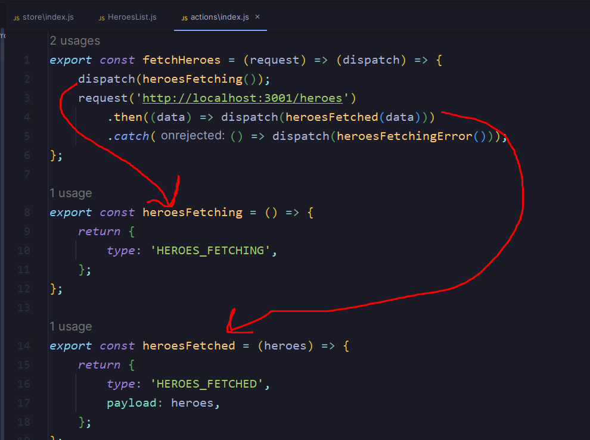

Основная задача модуля `redux-thunk` передавать функцию, которая потом будет производить асинхронную операцию

Устанавливаем пакет в проект. 

```bash
npm i redux-thunk
```

И далее, чтобы убедиться, что он работает, можно просто попробовать передать `actionCreater` функцию в `dispatch` без вызова:

`components > heroesList > HeroesList.js`
```JS
// функция получения персонажей с сервера
useEffect(() => {  
   dispatch(heroesFetching); // передаём функцию экшена без вызова
   request('http://localhost:3001/heroes')  
      .then((data) => dispatch(heroesFetched(data)))  
      .catch(() => dispatch(heroesFetchingError()));  
}, []);
```

Так же мы можем расширять наши экшены, так как в их вложенную функцию может автоматически поступать dispatch, над которым мы можем проводить различные манипуляции. 
Конкретно тут будет срабатывать передача данных в стейт через определённый промежуток времени.

`actions > index.js`
```JS
// когда мы вызываем функцию, она возвращает функцию, принимающую в себя dispatch  
// dispatch приходит в функцию автоматически, так как мы используем thunk middleware  
export const activeFilterChanged = (filter) => (dispatch) => {  
   setTimeout(() => {  
      dispatch({  
         type: 'ACTIVE_FILTER_CHANGED',  
         payload: filter,  
      });  
   }, 1000);  
};
```

Но так же мы можем и упростить себе жизнь тем, что мы можем вызвать логику диспетча прямо внутри самой папки экшенов. 
Конкретно, мы можем вынести запрос на получение персонажей и занесение их в стейт прямо из экшенов. Там нам не нужно будет импортировать и экспортировать отдельные экшены - можно будет ими просто воспользоваться.

`actions > index.js`
```JS
export const fetchHeroes = (request) => (dispatch) => {
	dispatch(heroesFetching());
	request('http://localhost:3001/heroes')
		.then((data) => dispatch(heroesFetched(data)))
		.catch(() => dispatch(heroesFetchingError()));
};
```



И тут далее в самом компоненте уже можем воспользоваться одним экшеном, который сам занесёт данные по персонажам в стейт, передав в него функцию совершения реквеста

`components > heroesList > HeroesList.js`
```JS
import { fetchHeroes, heroDeleted } from '../../actions';

const HeroesList = () => {
	/// CODE ...
	
	const { request } = useHttp();

	useEffect(() => {
		dispatch(fetchHeroes(request));
	}, []);
```
