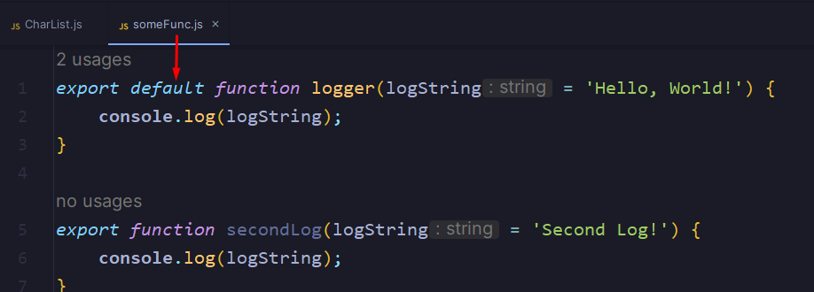
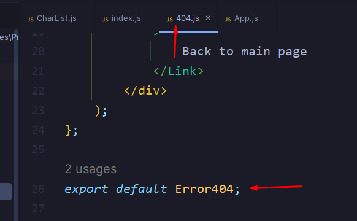
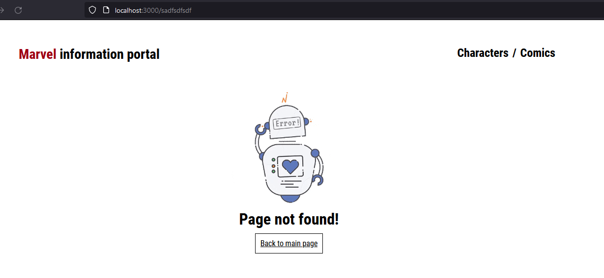
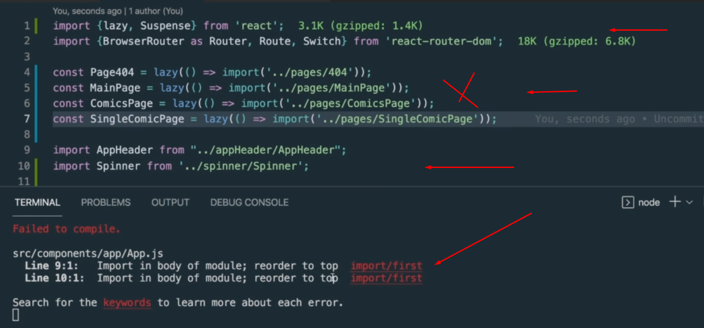

На определённом этапе разработки приложение станет настолько большим, что уже оно начнёт загружаться крайне длительное время. Но мы можем определить, какие участки приложения нам не нужны на этапе первичной загрузки и так же мы можем указать с помощью JS на эти блоки кода.

Для примера создадим функцию логгера:

`components > charList > someFunc.js`
```JS
export function logger(logString = 'Hello, World!') {  
   console.log(logString);  
}  
  
export function secondLog(logString = 'Second Log!') {  
   console.log(logString);  
}
```

Динамический импорт возвращает промис с объектом модуля

Тут нужно напомнить, что любой экспорт из файла в JS экспортирует единый объект (в данном случае - `obj`), который хранит данную функцию в качестве свойства (`obj.logger`). Если мы экспортируем по умолчанию через `export default`, то на выходе мы получаем объект с одним свойством - `obj.default`

Так же обязательно всегда нужно указывать `catch`, который будет срабатывать, когда не сработал импорт / неправильно был указан путь

`components > charList > CharList.js`


Но зачастую используется более простой синтаксис - получение нужной функции через деструктуризацию 

`components > charList > CharList.js`


И если нам нужно будет вытащить дефолтную функцию, то в импортах нужно будет обратиться не к функции по имени, а к свойству `default`, которое содержит функцию 



`components > charList > CharList.js`
```JS
if (loading) {  
   import('./someFunc').then((obj) => obj.default());  
}
```

Далее переходим к функционалу реакта - `React.lazy`

- Основным условием является то, что компонент должен экспортироваться дефолтно из файла
- Так же все динамические импорты нужно вставлять после статических, иначе может произойти ошибка




Далее нужно как и с промисами обработать возможную ошибку. Для этого предназначен дополнительный компонент `Suspense`. Он принимает в себя атрибут `fallback`, который будет показываться пока подгружается нужный нам компонент из динамического импорта

`components > app > App.js`
```JS
import { lazy, Suspense } from 'react';

// нужен дефолтный экспорт объекта
const Error404 = lazy(() => import('../pages/404'));

const App = () => {
	return (
		<Router>
			<div className='app'>
				<AppHeader />
				<main>
		// оборачиваем страницу в саспенс, который и будет подгружать нужный компонент
					<Suspense fallback={<Spinner />}>
						<Switch>
							<Route exact path='/'>
								<MainPage />
							</Route>
							<Route exact path='/comics'>
								<ComicsPage />
							</Route>
							<Route exact path='/comics/:comicId'>
								<SingleComicPage />
							</Route>
							<Route path='*'>
								<Error404 />
							</Route>
						</Switch>
					</Suspense>
				</main>
			</div>
		</Router>
	);
};

export default App;
```

И теперь во время загрузки этой страницы у нас будет показываться спиннер пока не загрузится ошибка



Так же можно сделать подобную подгрузку для всех страниц, чтобы они не грузились сразу все пользователю, а только по надобности

```JS
import { BrowserRouter as Router, Route, Switch } from 'react-router-dom';
import AppHeader from '../appHeader/AppHeader';

import { lazy, Suspense } from 'react';
import Spinner from '../Spinner/Spinner';

// нужен дефолтный экспорт объекта
const Error404 = lazy(() => import('../pages/404'));
const MainPage = lazy(() => import('../pages/MainPage'));
const ComicsPage = lazy(() => import('../pages/ComicsPage'));
const SingleComicPage = lazy(() => import('../pages/SingleComicPage'));

const App = () => {
	return (
		<Router>
			<div className='app'>
				<AppHeader />
				<main>
					<Suspense fallback={<Spinner />}>
						<Switch>
							<Route exact path='/'>
								<MainPage />
							</Route>
							<Route exact path='/comics'>
								<ComicsPage />
							</Route>
							<Route exact path='/comics/:comicId'>
								<SingleComicPage />
							</Route>
							<Route path='*'>
								<Error404 />
							</Route>
						</Switch>
					</Suspense>
				</main>
			</div>
		</Router>
	);
};

export default App;
```

И уже таким образом будет выглядеть ошибка, если ленивые импорты вставить внутрь статических



До ленивых импортов мы имели 3 файла JS и вся папка весила 751 килобайт. Тут нужно сказать, что все эти файлы пользователь подгружал сразу, даже если их функционал ему не нужен был


После lazy-импорта количество файлов возросло в несколько раз и вес папки со скриптами вырос до 880 килобайт. Хоть скрипты и весят больше в общем, но теперь пользователь не будет скачивать все страницы сразу - он будет получать только актуальные ему страницы и подгружать их в процессе использования приложения. 


>[!info] Использовать ленивую загрузку стоит уже в больших приложениях, где первая скорость загрузки уже будет переваливать за 3 секунды
>- Зачастую такую загрузку применяют уже к целым страницам приложения 
>- Но таким же образом можно выносить в ленивую загрузку и отдельные компоненты
