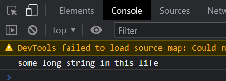

> [!Info] `localStorage`- это свойство объекта `Window`, которое хранит в себе данные и сохранено в браузере пользователя. Оно позволяет сохранить данные даже после перезагрузки страницы

>[!Note] Пример использования: 
> 1) Запомнить время, на котором пользователь остановился
> 2) Запомнить введённые данные в поля
> 3) Запомнить настройки сайта (тёмная/светлая тема)

> Однако нужно отметить, что нам доступно только 5 мб информации

И вот пример того, как мы можем закинуть данные в локальное хранилище данных через `localStorage.setItem('ключ', значение)`. В браузере мы можем просмотреть настройки во вкладке Application

```JS
localStorage.setItem('number', 5);
```


И так же через `getItem()` мы можем получить нужную нам строку

```JS
localStorage.setItem('string', 'some long string in this life');
console.log(localStorage.getItem('string'));
```


А уже таким образом мы можем удалить ненужное нам значение

```JS
localStorage.removeItem('string');
```

Уже эта команда полностью очищает локальное хранилище

```JS
localStorage.clear();
```

Через этот код мы реализовали сохранение галочки на странице. Теперь при перезагрузке она остаётся в позиции checked

```JS
'use strict';

const checkbox = document.querySelector('#checkbox'),
      form = document.querySelector('form'),
      change = document.querySelector('#color');
      
// Проверим, есть ли наша запись при пезагрузке страницы
if (localStorage.getItem('isChecked')) { // если будет отсутствовать, то = null, а null === false
    checkbox.checked = true;
}

// Создадим новую запись в localStorage на клике галочки
checkbox.addEventListener('change', () => {
    localStorage.setItem('isChecked', true);
});
```


А тут уже показана реализация изменения цвета формы по листенеру и сохранение этих настроек даже после перезагрузки. Цвет можно убрать только нажав ещё раз по кнопке

```JS
// Проверка на наличие цвета
if (localStorage.getItem('bg') === 'changed') {
    form.style.backgroundColor = 'violet';
}

// Листенер на изменение цвета
change.addEventListener('click', () => {
    if (localStorage.getItem('bg') === 'changed') {
        localStorage.removeItem('bg');
        form.style.backgroundColor = '#fff';
    } else {
        localStorage.setItem('bg', 'changed');
        form.style.backgroundColor = 'violet';
    }
});
```


Ну и так же в localStorage мы можем закинуть объект (но только уже стрингифайнутый в JSON)

```JS
const person = {
    name: 'Alex',
    age: 18
}

const serializedPerson = JSON.stringify(person);

localStorage.setItem('alex', serializedPerson);
```


Ну и так же спокойно мы можем получить это значение с сайта

