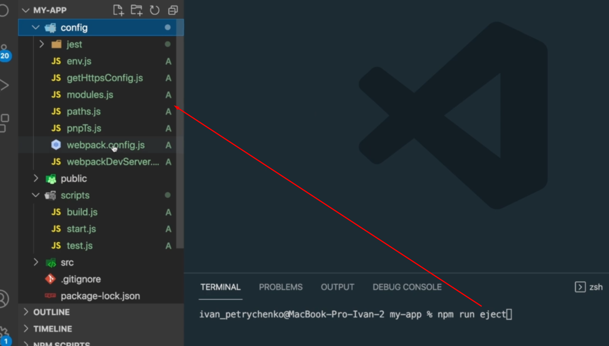
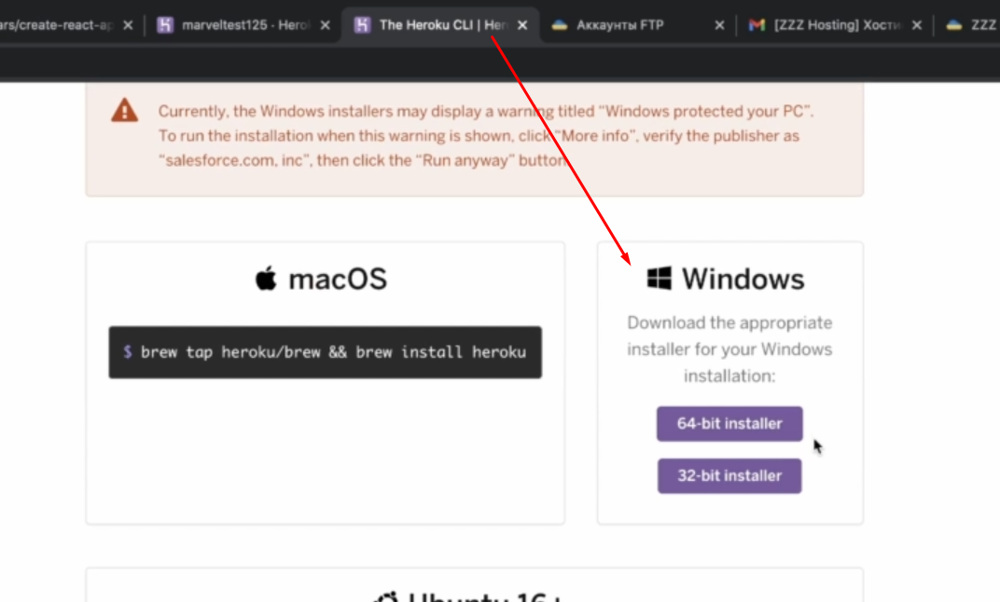

Для выгрузки сайта на сервер, нужно две вещи:
- Имя сайта - домен
- Место хранения сайта - хостинг

Хостинг для обычного сайта подойдёт любой. Однако, если мы собираемся заливать веб-приложения, то нам нужны WPS-сервера, которые выделяют нам отдельный виртуальный ПК.

Но чтобы что-то выгрузить на сервер, нужно сначала собрать проект.

`npm run eject` - позволит получить доступ к настройкам вебпака в `create-react-app`. Эта операция необратима, поэтому нужно использовать её только в крайних случаях.



`npm run build` - сбилдит проект, который можно будет выгрузить на сервер


И сейчас мы можем попробовать открыть сбилженный проект

```bash
npm i -g http-server
http-server build/
```


>[!info] Весь процесс [деплоя](https://create-react-app.dev/docs/deployment/) сайта на сервер можно просмотреть на сайте документации CRA

Чтобы залить приложение на сервер, перейдём в heroku


далее запишем домен


И далее мы можем залить на хироку сайт прямо с гитхаба или через утилиту

И тут нужно оставить примечание, что все зависимости в нашем проекте должны стоять в нужных местах, и если они нужны для работы сайта, то их нужно перенести в `dependencies`


Устанавливаем утилиту и со страницы деплоя берём команду



И тут мы можем увидеть статус деплоя нашего приложения


И сейчас мы имеем доступ к нашему сайту с хироку


