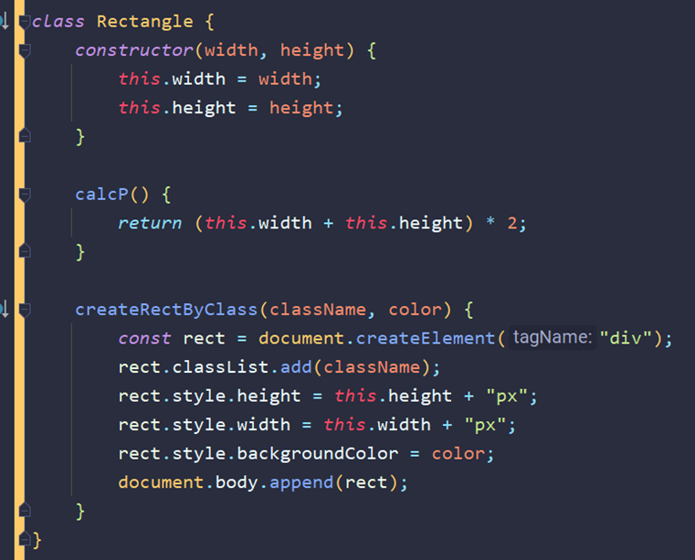

Классы появились в стандарте ECMA2015. Если нам нужно будет перевести код в старый стандарт, то для этого используются трансплиттеры (тот же babel)

Синтаксис классов немного отличается от синтаксиса функции. Внутри класса обязательно описывается конструктор. Конструктор представляет собой те начальные значения, которые мы задаём концепции экземпляра. Синтаксис достаточно схож по смыслу с функциональными конструкторами

Дальше мы пишем методы класса. Внутри них мы спокойно можем обращаться к тем начальным значениям, что мы задали для экземпляра

И далее у нас идёт синтаксис **наследования**. Он представляет из себя передачу кода дочерним элементам. Реализуется наследование через `extends`.

Метод `super` вызывает код родителя. Помещать его нужно всегда до написания остального кода

