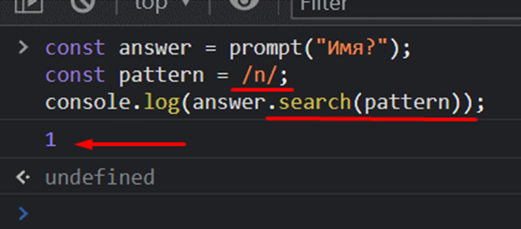
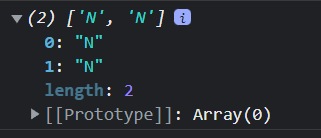
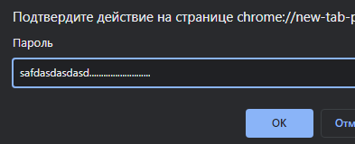

Где используются? Для работы со строками: удаление, замена части слов, ограничить ввод *определённых* знаков,  для поиска определённой буквы или сочетания букв в строке и так далее.

Регулярные выражения состоят из паттерна и флага. Записываются паттерны так: /паттерн/флаги.

Пример записи флагов выглядит так: всегда записываем сам паттерн и затем уже его флаги

```JS
new RegExp("pattern", "flags"); // редко используется
/pattern/flags; // используется часто
```

И тут мы в переменной *answer* через метод `search()` ищем *pattern* внутри ответа. Метод поиска вернёт нам индекс, где в слове находится паттерн. 
Тут 0 - A, 1 - n, ищем мы - n




При отсутствии нужного значения, получим "`-1`"


Флаги: 
- `i` – пытаемся найти что-то вне зависимости от регистра
- `g` – пытаемся найти сразу несколько вхождений
- `m` – многострочный режим

И теперь мы можем попробовать вывести сразу несколько значений вне зависимости от регистра. Для этого мы должны будем поменять метод (`search` находит всегда только первое вхождение) на `match()`, который возвращает массив значений. А так же прописать нужные флаги (в любом порядке)

```JS
const answer = prompt("Имя?");
const pattern = /n/igm;
console.log(answer.match(pattern));
```



Если внутрь регулярного выражения поместить точку, то это означает, что мы берём все значения из переменной. Конкретно сейчас мы воспользуемся методом `replace()`, который заменит все символы, которые мы в нём укажем

```JS
const pass = prompt("Пароль");
console.log(pass.replace(/./g, "*"));
```


Так же мы можем экранировать точку и выделять только её. Делаем это мы, потому что точка - это зарезервированный спецсимвол

```JS
const pass = prompt("Пароль");

console.log(pass.replace(/\./g, "*"));
```




Кроме точки у нас есть ещё много разных зарезервированных спецсимволов: `|`, `\`, `/`, `^`, `&`

И вот пример прямого использования строкового метода. Тут мы можем непосредственно и быстро изменять нужный нам текст. 


Дальше пойдут методы, которые непосредственно относятся к паттернам. Все прошлые относились к строкам. 
Метод `test()` вернёт `boolean` значение. Отвечает за поиск паттерна в слове


Так же перед нами может встать задача, которая будет заключаться в поиске значений определённого типа. Например, поиск чисел или слов. Для этого используются классы:

```JS
\d // - digits - числа
\w // - words - слова
\s // - spaces - пробелы
```

И вот пример поиска чисел:


Так же мы можем вписать заборчик из того паттерна, который нам нужно найти. 
Тут мы уже ищем слово, которое совпадает под наш паттерн


Так же у нас имеются обратные классы, которые ищут НЕ_тип

```JS
\D // Ищет НЕ цифры
\W // НЕ буквы
\S // НЕ пробелы
```

Пример поиска НЕ цифр:


==Дальше уже перейдём в наш проект==

Напомню, что мы получаем свойство ширины из компутированных стилей в браузере. Тут мы получаем строку '`560px`'

```JS
const sourceWidth = window.getComputedStyle(slidesWrapper).width;
```

Это первый вариант получения чисел из полученного массива. Тут мы складываем все полученные числа через `reduce`

```JS
const width = +sourceWidth.match(/\d/g).reduce((acc, val) => {  
    return acc += val;
});
```

А вот второй вариант. Тут мы все НЕ числа заменяем на пустую строку и переводим полученный результат в число

```JS
const width = +sourceWidth.replace(/\D/g, '');
```