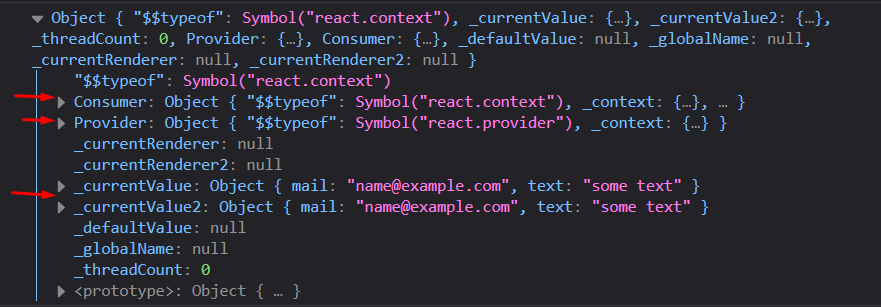
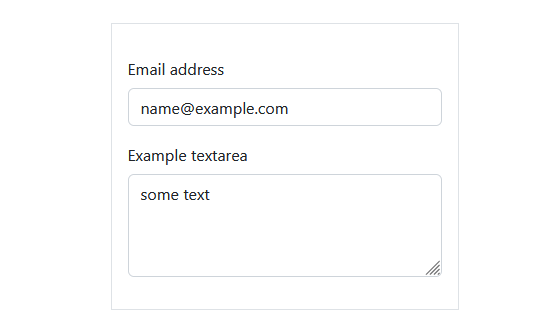
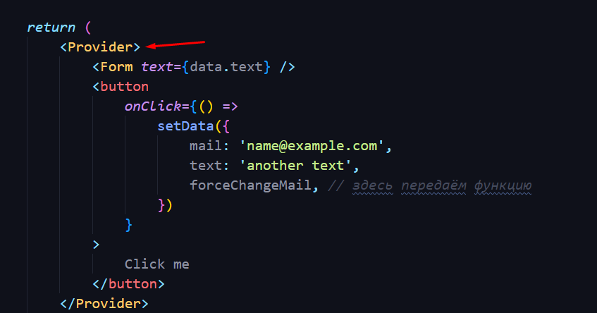
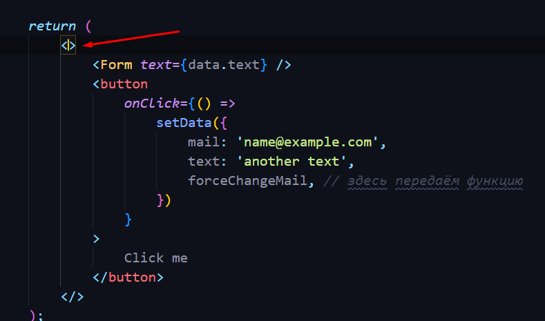
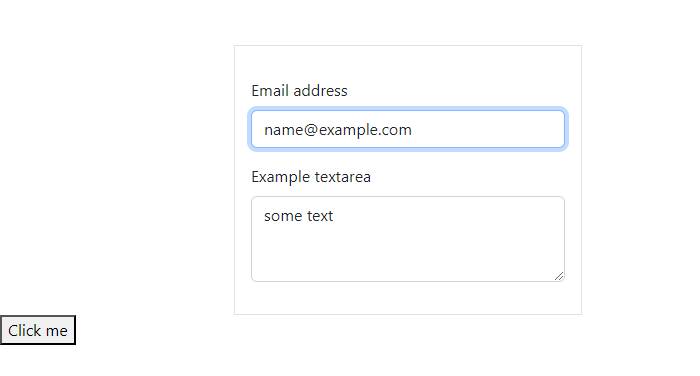
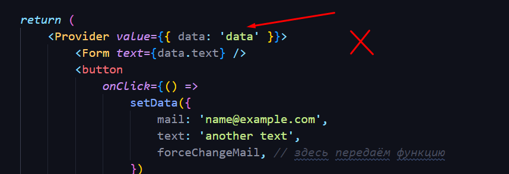

`React.createContext` и `useContext` - это функциональность, которая позволит создать один глобальный провайдер пропсов, чтобы пользоваться ими из любого участка приложения. То есть мы можем передавать данные по дереву компонентов не прибегая к *property drill* (сверлим компоненты пропсами, которые нужно передать ниже)

Вот пример антипаттерна передачи пропсов через несколько промежуточных компонентов:

```JSX
<Page user={user} avatarSize={avatarSize} />
// ... который рендерит ...
<PageLayout user={user} avatarSize={avatarSize} />
// ... который рендерит ...
<NavigationBar user={user} avatarSize={avatarSize} />
// ... который рендерит ...
<Link href={user.permalink}>
  <Avatar user={user} size={avatarSize} />
</Link>
```

- Функция `createContext` создаёт единый контекст в приложении
- В эту функцию можно передать дефолтное значение, которое будет передаваться во все провайдеры, если в них не было передано значение в атрибут `value`
- Сам `Provider` является компонентом и в себя он принимает любое значение своего компонента (компонент `App` раздаёт состояние `data`) 
- `Consumer` так же является компонентом, который получает все данные из провайдера. Данный компонент получает функцию с данными в виде одного аргумента и через неё и можно отрендерить внутренности (просто так вставить компонент не получится)
- Все компоненты, которые используют данные провайдера будут обновлены при изменении этих данных

```JS
import { Component, createContext, memo, PureComponent, useCallback, useState } from 'react';
import { Container } from 'react-bootstrap';
import './App.css';

// это создание самого контекста в приложении
const dataContent = createContext({
	// сюда мы можем передать дефолтные данные
	mail: 'name@example.com',
	text: 'some text',
});

// получаем провайдера и консьюмера
const { Provider, Consumer } = dataContent;

const Form = memo((props) => {
	console.log('render Form');

	return (
		<Container>
			<form className='w-50 border mt-5 p-3 m-auto'>
				<div className='mb-3'>
					<label htmlFor='exampleFormControlInput1' className='form-label mt-3'>
						Email address
					</label>
					<Input />
				</div>
				<div className='mb-3'>
					<label htmlFor='exampleFormControlTextarea1' className='form-label'>
						Example textarea
					</label>
					<textarea
						value={props.text}
						className='form-control'
						id='exampleFormControlTextarea1'
						rows='3'
					></textarea>
				</div>
			</form>
		</Container>
	);
});

// компонент инпута
class Input extends Component {
	render() {
		return (
			// объявляем получателя
			<Consumer>
			{/* получаем функцию, которая сгенерирует нужную нам вёрстку и отдаст нужное значение */}
				{(value) => (
					<input
						// используем значение value
						value={value.mail}
						type='email'
						className='form-control'
						id='exampleFormControlInput1'
						placeholder='name@example.com'
					/>
				)}
			</Consumer>
		);
	}
}

function App() {
	const [data, setData] = useState({
		mail: 'name@example.com',
		text: 'some text',
	});

	return (
		// оборачиваем нужный участок в провайдера и передаём нужное для распространения значение (data)
		<Provider value={data}>
			<Form text={data.text} />
			<button
				onClick={() =>
					setData({
						mail: 'name@example.com',
						text: 'another text',
					})
				}
			>
				Click me
			</button>
		</Provider>
	);
}

export default App;
```

Сам же объект, который располагается в контексте хранит в себе:
- Переданные данные
- `Provider` - раздаёт данные всем компонентом из единого места в приложении 
- `Consumer` - подписывается на провайдера и следит за изменением его данных



Так же есть более простой метод получать данные из состояний - это присвоение контекста компоненту

```JS
// компонент инпута
class Input extends Component {
	render() {
		return (
			<input
				// вытаскиваем данные из контекста
				value={this.context.mail}
				type='email'
				className='form-control'
				id='exampleFormControlInput1'
				placeholder='name@example.com'
			/>
		);
	}
}

// присваиваем контекст компоненту
Input.contextType = dataContent;
```

Так же можно использовать `static` присвоение контекста, но это экспериментальный способ

```JS
class Input extends Component {
	static contextType = dataContent;

	render() {
		return (
			<input
				// вытаскиваем данные из контекста
				value={this.context.mail}
				type='email'
				className='form-control'
				id='exampleFormControlInput1'
				placeholder='name@example.com'
			/>
		);
	}
}
```

Ну и работа заметно упрощается, когда мы работаем с функциональными компонентами и просто используем `useContext()`

```JS
const Input = (props) => {
	// подписываемся на определённый контекст 
	const context = useContext(dataContext);

	return (
		<input
			value={context.mail}
			type='email'
			className='form-control'
			id='exampleFormControlInput1'
			placeholder='name@example.com'
		/>
	);
};
```

- так же приложение можно разбить на модули с контекстом
- контекстов может быть несколько в приложении
- провайдеры можно вкладывать в провайдеры, чтобы добавлять дополнительно контекст

```JS
/// context.js - тут хранится сам контекст приложения
import { createContext } from 'react';

export const dataContext = createContext({
	mail: 'name@example.com',
	text: 'some text',
});


/// Input.js - тут хранится отдельный компонент инпута
import { useContext } from 'react';
import { dataContext } from './context';

export const Input = (props) => {
	const context = useContext(dataContext);

	return (
		<input
			value={context.mail}
			type='email'
			className='form-control'
			id='exampleFormControlInput1'
			placeholder='name@example.com'
		/>
	);
};


/// Form.js - компонент формы
import { memo } from 'react';
import { Container } from 'react-bootstrap';
import { Input } from './Input';

export const Form = memo((props) => {
	console.log('render Form');

	return (
		<Container>
			<form className='w-50 border mt-5 p-3 m-auto'>
				<div className='mb-3'>
					<label 
						htmlFor='exampleFormControlInput1' 
						className='form-label mt-3'
					>	
						Email address
					</label>
					<Input />
				</div>
				<div className='mb-3'>
					<label 
						htmlFor='exampleFormControlTextarea1' 
						className='form-label'
					>	
						Example textarea
					</label>
					<textarea
						value={props.text}
						className='form-control'
						id='exampleFormControlTextarea1'
						rows='3'
					></textarea>
				</div>
			</form>
		</Container>
	);
});


/// App.js - главный компонент приложения
import { useState } from 'react';
import './App.css';

import { dataContext } from './context';
import { Form } from './Form';

const { Provider } = dataContext;

function App() {
	const [data, setData] = useState({
		mail: 'name@example.com',
		text: 'some text',
	});

	return (
		<Provider value={data}>
			<Form text={data.text} />
			<button
				onClick={() =>
					setData({
						mail: 'name@example.com',
						text: 'another text',
					})
				}
			>
				Click me
			</button>
		</Provider>
	);
}

export default App;
```

- Таким образом можно изменить состояние через функцию, переданную внутри контекста
- Теперь нам везде так же нужно передавать функцию `forceChangeMail` (меняет стейт), чтобы не было ошибок

```JS
/// Input.js
export const Input = (props) => {
	// подписываемся на определённый контекст
	const context = useContext(dataContext);

	return (
		<input
			value={context.mail}
			type='email'
			className='form-control'
			id='exampleFormControlInput1'
			placeholder='name@example.com'
			// при фокусе будет меняться состояние
			onFocus={context.forceChangeMail}
		/>
	);
};


/// App.js
const { Provider } = dataContext;

function App() {
	const [data, setData] = useState({
		mail: 'name@example.com',
		text: 'some text',
		forceChangeMail, // здесь передаём функцию
	});

	// функция будет менять данные в стейте при фокусе
	function forceChangeMail() {
		setData({ ...data, mail: 'changed@mail.com' });
	}

	return (
		<Provider value={data}>
			<Form text={data.text} />
			<button
				onClick={() =>
					setData({
						mail: 'name@example.com',
						text: 'another text',
						forceChangeMail, // здесь передаём функцию
					})
				}
			>
				Click me
			</button>
		</Provider>
	);
}
```




Так же нужно сказать, что если мы в `Provider` не передаём атрибут `value`, то он будет равняться `undefind`, что вызовет ошибки




Однако, если убрать провайдера, то мы будем получать данные по умолчанию из контекста






И чтобы не получать ошибок, нужно добавлять все новые значения в значения по умолчанию контекста


Так же в провайдера не стоит передавать объекты напрямую, так как такая запись будет ухудшать оптимизацию проекта




