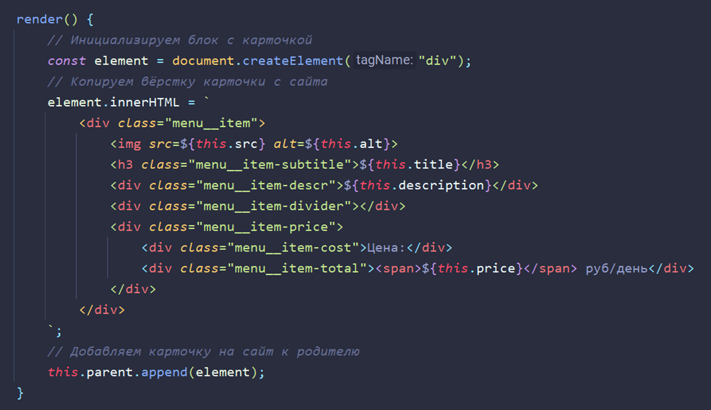

Сама вёрстка. Она содержит в себе блок «menu», внутри которого располагаются три `menu__item`, которые и являются нашими карточками

Первым делом мы создаём класс и конструктор, который будет в себя принимать уникальную для каждой карточки информацию. Так же чуть дальше пропишем метод, который будет переводить доллары (единица из БД) в рубли. Вызываем перевод прямо в конструкторе при создании

И дальше у нас идёт самый важный метод, который и выводит саму карточку на страницу. Первым делом мы инициализируем блок, в котором будет находиться карточка. Дальше мы в этот элемент помещаем саму карточку и забиваем её элементы нашими переменными.

В самом конце мы аппендим карточку на страницу через аппенд по родителю

Так же хочется упомянуть, что создать новый объект можно и без его объявления и присвоения в переменную. Конкретно тут, мы не собираемся над карточками проводить никаких операций, поэтому их можно просто создать через `new`. Ну и сразу вызвать метод `render`, который сконструирует блоки на сайте

Ну и дальше нам нужно создать три этих карты (вёрстку из html нужно будет удалить)

