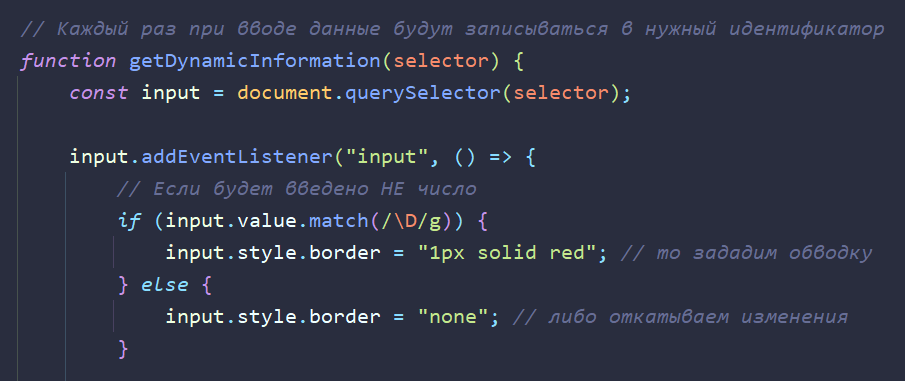
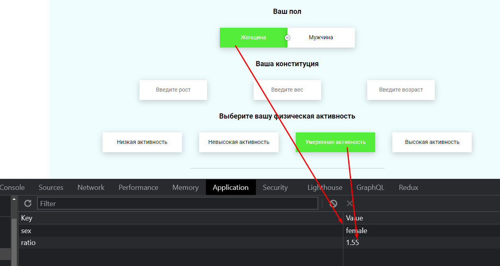
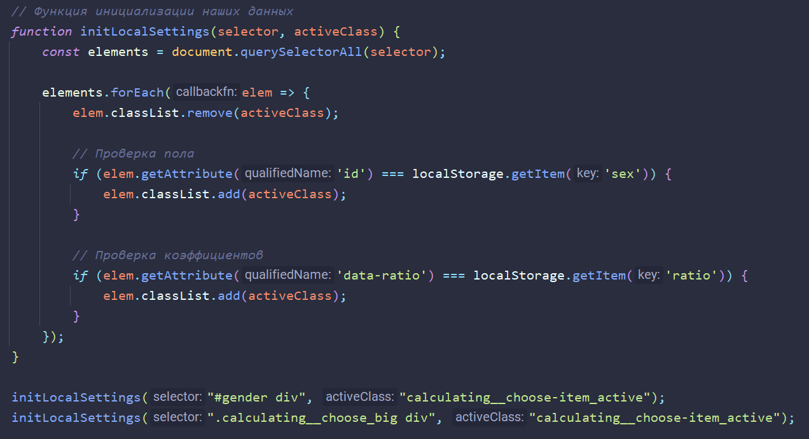
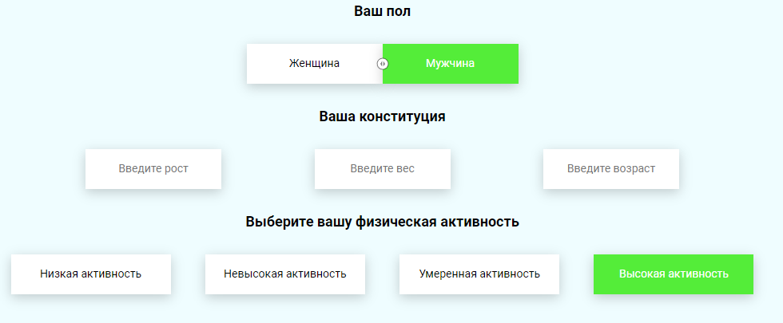

Сначала сделаем проверку на вводимые значения в наши поля

При обращении к `localStorage`, мы сохраняем выбор пользователя в локальное хранилище, чтобы при перезагрузке сохранить эти значения

И немного перепишем задание наших переменных по умолчанию. Конкретно тут мы будем хранить наши значения в локальном хранилище и каждый раз при стирании их из локального хранилища (очистка кэша сайтов), у нас будут загружаться эти значения

И вот сама функция, которая будет реализовывать у нас сохранение положения активных классов при перезагрузке страницы

