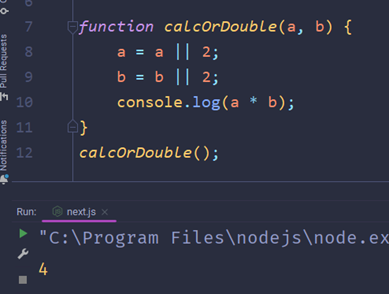
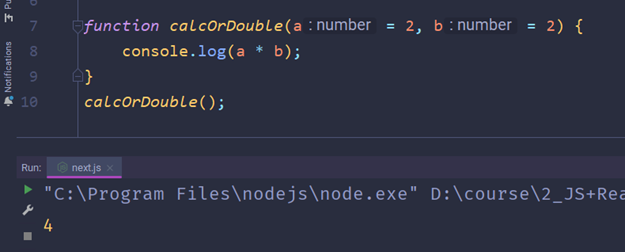
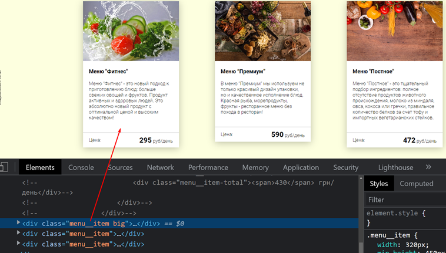

В JS есть оператор `spread` – "`…`", который деструктуризирует объект (массив). Однако так же есть и оператор `rest`, который собирает отдельные элементы в один массив – «`…название`»

И попытаемся вставить данный оператор в наш проект. Представим, что нужно дать возможность вставить сразу несколько классов на карточку и для этого можно воспользоваться рестом, который вернёт массив этих значений

Так же нам нужно внусти изменения в рендер наших карточек. В условии нужно проверить, переданы ли вообще классы и присвоить эти классы (если нет или если их передали). В первом случае, мы проверяем массив, который нам возвращает рест. Если ничего в качестве классов не будет передано, то сработает первое условие (так как рест всегда возвращает массив, даже если значений 0). Если что-то будет передано, то сработает второе условие, которое через `forEach` передаст все нужные значения в качестве класса в наш див-элемент.

И сейчас у нас есть возможность не писать классы или написать сразу несколько

И примерно так это выглядит на странце

