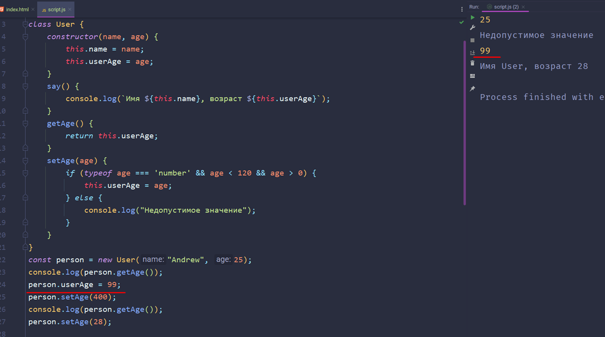
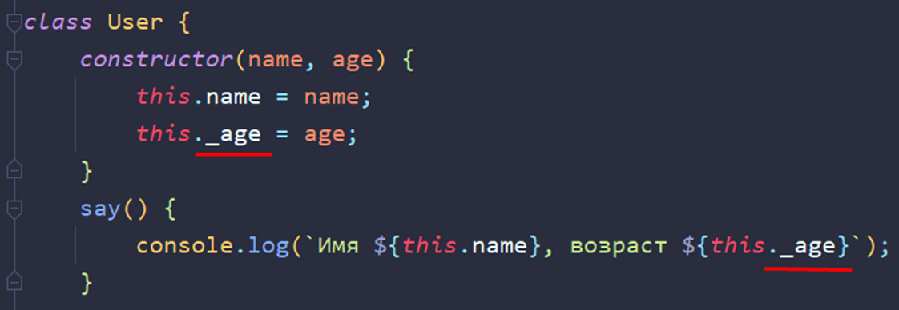
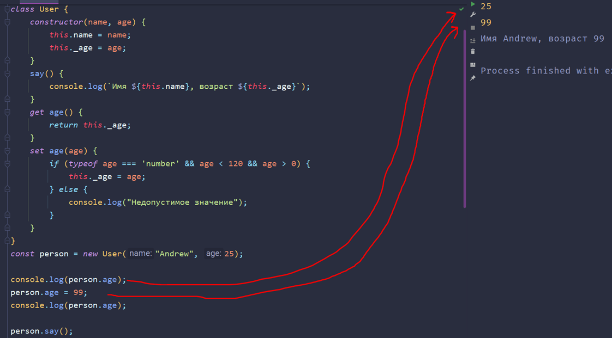
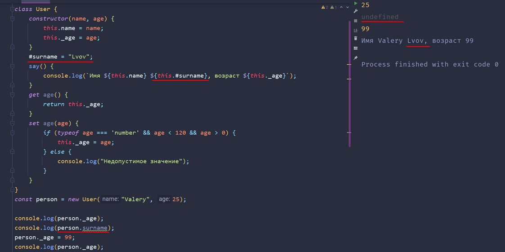
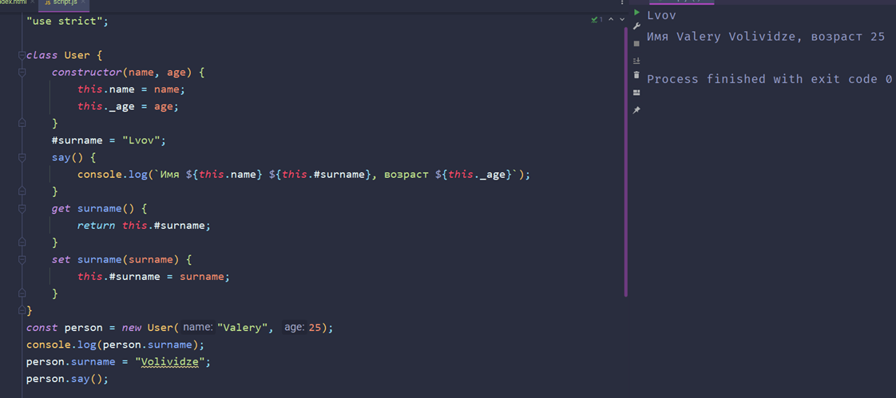

Вот пример функции-конструктора, который создаёт нам персонажа. Тут мы легко можем поменять переменные внутри пользователя

Однако если мы создадим переменную, то она станет недоступна для просмотра извне, но останется вполне себе изменяемой

Дальше у нас идут собственные геттеры и сеттеры. Это методы, которые реализуют наш вывод данной переменной во внешнюю среду

Так же мы можем переписать наш код на классы. Однако тут встаёт проблема, которая запрещает нам использовать простые переменные в конструкторе (`let`) и теперь опять наши переменные можно просто увидеть и изменить извне без геттеров и сеттеров

По соглашению о наименовании переменных, если переменная начинается с нижнего подчёркивания (например, `_age`), то эту переменную **нельзя** изменять

И вот через сеттер age мы можем добавить нужное нам значение возраста

Однако у нас до сих пор есть возможность менять переменную, которую мы можем получить через геттеры и сеттеры. Есть возможность инкапсулировать значения полностью, но это уже экспериментальная технология

Так же можно инкапсулировать нормально значения в TypeScript

Через решётку создаётся приватное поле класса. Оно создаётся вне конструктора, чтобы можно было обратиться к нему везде.

Так же он выполняет нужную нам функцию – не выходит за пределы класса. Его можно только просмотреть через метод (при обычном вызове будет `undefined`). Поменять извне – не получится

И вот реализация геттера и сеттера для приватного поля класса

