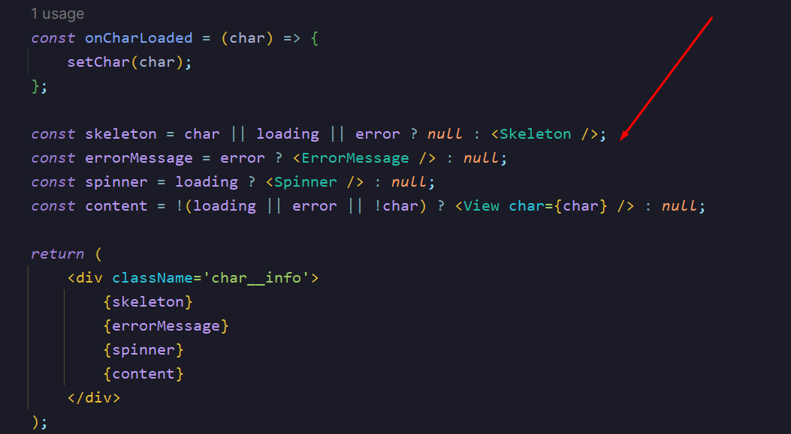
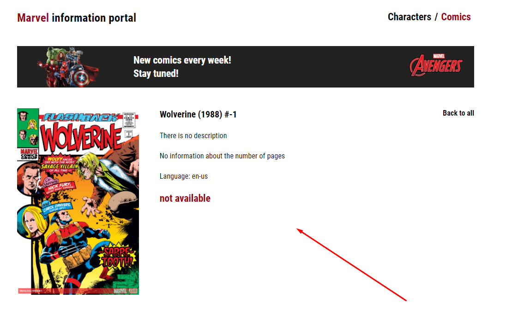

Начнём с того, что в приведённом примере ниже, отображение на странице зависит от данных четырёх состояний. Это очень громоздкая и зачастую непонятная конструкция, но ей пользуются для реализации вёрстки на страницах.



И тут к нам приходит **Концепция Конечного Автомата** (FSM - Finite-State Machine - State Machine - Машина состояний). Это такая сущность (математическая модель), которая имеет определённое количество состояний. То есть данная сущность может иметь ровно одно состояние в определённый момент времени.

Если кнопка скрыта, то она уже имеет определённое состояние. Она не может быть выключена, так как она скрыта и так далее.

На примере курьера можно привести его состояния:
- Ожидание (тут он может отдохнуть, выпить кофе)
- Получение заказа (тут он уже уточняет адрес, общается с заказчиком и так далее)
- Доставка заказа (уже тут он перемещается к заказчику)
- Получение оплаты (а тут получает оплату и дальше переходит в состояние ожидания)

Данная концепция не выделяется как отдельный приём. Оно отвечает лишь за то, что мы контролируем количество состояний, которое может быть в приложении.

Для работы со машиной состояний имеется несколько библиотек под JS (их стоит использовать уже вместе с `Redux`):
- [Xstate](https://xstate.js.org/docs/recipes/react.html)
- [Robot](https://thisrobot.life/)
- [Machina.js](http://machina-js.org/)

Модифицируем хук, который выполняет получение данных с сервера. В него на каждый из этапов будем устанавливать состояние процесса, который будет вызвать определённый рендер в компонентах

Первым делом, мы можем удалить состояния `loading` и `error` из хука и так же установку этих состояний внутри хука

`hooks > http.hook.js`
```JS
import { useState, useCallback } from 'react';

export const useHttp = () => {
	// Эти две строки больше НЕ НУЖНЫ, так как мы больше не используем данные состояния, а перекладываем всю ответственность на состояние process
	// const [loading, setLoading] = useState(false);
	// const [error, setError] = useState(null);
	
	// тут будет находиться состояние процесса
	// начальное - ожидание
	const [process, setProcess] = useState('waiting');

	const request = useCallback(
		async (
			url,
			method = 'GET',
			body = null,
			headers = { 'Content-Type': 'application/json' },
		) => {
			// тут происходит загрузка
			setProcess('loading');

			try {
				const response = await fetch(url, { method, body, headers });

				if (!response.ok) {
					throw new Error(`Could not fetch ${url}, status: ${response.status}`);
				}

				const data = await response.json();

				return data;
			} catch (e) {
				// так же состояние может принять в себя ошибку
				setProcess('error');
				throw e;
			}
		},
		[],
	);

	const clearError = useCallback(() => {
		// тут так же будет стоять ожидание
		setProcess('waiting');
	}, []);

	return { request, clearError, process, setProcess };
};
```

Возвращаем хук установки процесса и состояние самого процесса через хук сервиса общения с сервером

`service > MarvelService.js`
```JS
const useMarvelService = () => {
	const { request, clearError, process, setProcess } = useHttp();

	/// CODE ...

	return {
		clearError,
		getAllCharacters,
		getCharacterByName,
		getCharacter,
		getAllComics,
		getComic,
		process,
		setProcess,
	};
};
```

Эта уже сама машина состояний. Тут мы определяем, какие процессы будут выполняться на разных этапах процесса

`utils > setContent.js`
```JS
import Skeleton from '../components/skeleton/Skeleton';
import Spinner from '../components/spinner/Spinner';
import ErrorMessage from '../components/errorMessage/ErrorMessage';

// по состоянию процесса компонент будет рендерить разные части интерфейса
export const setContent = (process, Component, data) => {
	switch (process) {
		case 'waiting':
			return <Skeleton />;
		case 'loading':
			return <Spinner />;
		case 'confirmed':
			return <Component data={data} />;
		case 'error':
			return <ErrorMessage />;
		default:
			throw new Error('Unexpected process state in this case');
	}
};
```

И далее тут в рендере используем `setContent()`. Эта функция будет каждый раз перевызываться при изменении состояния `process`. Так же в этом же компоненте нужно вызывать `setProcess` после того, как мы получили данные внутри `updateChar`

`component > charInfo > CharInfo.js`
```JS
const CharInfo = (props) => {
	const [char, setChar] = useState(null);

	const { getCharacter, clearError, process, setProcess } = useMarvelService();

	useEffect(() => {
		updateChar();
	}, [props.charId]);

	const updateChar = () => {
		const { charId } = props;
		if (!charId) {
			return;
		}

		clearError();
		getCharacter(charId)
			.then(onCharLoaded)
			// тут мы подтверждаем загрузку данных, чтобы рендер персонажа был с данными
			.then(() => setProcess('confirmed'));
	};

	const onCharLoaded = (char) => {
		setChar(char);
	};

	return <div className='char__info'>{setContent(process, View, char)}</div>;
};
```

Так же стоит переименовать пропс, получаемый в компоненте на тот, что передаётся внутри свича


Тут так же пришлось решать проблему с тем, что в списке во время загрузки отображалось `null` (это приводит к тому, что мы поднимаемся вверх страницы и заново приходится скроллить вниз по списку). Эту проблему можно было решить только переписав функцию установки контента, где мы в загрузке показываем старый список или спиннер (если старых элементов списка нет)

`component > charList > CharList.js`
```JS
// !!!
export const setContent = (process, Component, newItemLoading) => {
	switch (process) {
		case 'waiting':
			return <Spinner />;
		case 'loading':
			// если у нас грузятся новые элементы, то оставляем список, если нет, то показываем спиннер
			return newItemLoading ? <Component /> : <Spinner />;
		case 'confirmed':
			return <Component />;
		case 'error':
			return <ErrorMessage />;
		default:
			throw new Error('Unexpected process state in this case');
	}
};

const CharList = (props) => {
	const [charList, setCharList] = useState([]);
	const [newItemLoading, setnewItemLoading] = useState(false);
	const [offset, setOffset] = useState(210);
	const [charEnded, setCharEnded] = useState(false);

	const { loading, error, getAllCharacters, process, setProcess } = useMarvelService();

	useEffect(() => {
		onRequest(offset, true);
	}, []);

	const onRequest = (offset, initial) => {
		initial ? setnewItemLoading(false) : setnewItemLoading(true);
		getAllCharacters(offset)
			.then(onCharListLoaded)
			// !!
			.then(() => setProcess('confirmed'));
	};

	/// CODE ...

	return (
		<div className='char__list'>
			{/* !!! */}
			{setContent(process, () => renderItems(charList), newItemLoading)}
			<button
				disabled={newItemLoading}
				style={{ display: charEnded ? 'none' : 'block' }}
				className='button button__main button__long'
				onClick={() => onRequest(offset)}
			>
				<div className='inner'>load more</div>
			</button>
		</div>
	);
};
```

Код мы оптимизировали и компонент информации о персонаже так же работает и список персонажей тоже


Список комиксов так же переводим в стейт-машину

`component > comicsList > ComicsList.js`
```JS
// !!
export const setContent = (process, Component, newItemLoading) => {
	switch (process) {
		case 'waiting':
			return <Spinner />;
		case 'loading':
			return newItemLoading ? <Component /> : <Spinner />;
		case 'confirmed':
			return <Component />;
		case 'error':
			return <ErrorMessage />;
		default:
			throw new Error('Unexpected process state in this case');
	}
};

const ComicsList = () => {
	const [comicsList, setComicsList] = useState([]);
	const [newItemLoading, setnewItemLoading] = useState(false);
	const [offset, setOffset] = useState(0);
	const [comicsEnded, setComicsEnded] = useState(false);

	const { getAllComics, process, setProcess } = useMarvelService();

	useEffect(() => {
		onRequest(offset, true);
	}, []);

	const onRequest = (offset, initial) => {
		initial ? setnewItemLoading(false) : setnewItemLoading(true);
		getAllComics(offset)
			.then(onComicsListLoaded)
			// !!!
			.then(() => setProcess('confirmed'));
	};

	/// CODE ...

	return (
		<div className='comics__list'>
			{setContent(process, () => renderItems(comicsList), newItemLoading)}
			<button
				disabled={newItemLoading}
				style={{ display: comicsEnded ? 'none' : 'block' }}
				className='button button__main button__long'
				onClick={() => onRequest(offset)}
			>
				<div className='inner'>load more</div>
			</button>
		</div>
	);
};
```


Далее модифицируем компонент рандомного персонажа

`component > randomChar > RandomChar.js`
```JS
const RandomChar = () => {
	const [char, setChar] = useState(null);
	const { getCharacter, clearError, process, setProcess } = useMarvelService();

	useEffect(() => {
		updateChar();
		const timerId = setInterval(updateChar, 60000);

		return () => {
			clearInterval(timerId);
		};
	}, []);

	const onCharLoaded = (char) => {
		setChar(char);
	};

	const updateChar = () => {
		clearError();
		const id = Math.floor(Math.random() * (1011400 - 1011000)) + 1011000;
		getCharacter(id)
			.then(onCharLoaded)
			// !!!
			.then(() => setProcess('confirmed'));
	};

	return (
		<div className='randomchar'>
			{setContent(process, View, char)}
			<div className='randomchar__static'>
				<p className='randomchar__title'>
					Random character for today!
					<br />
					Do you want to get to know him better?
				</p>
				<p className='randomchar__title'>Or choose another one</p>
				<button onClick={updateChar} className='button button__main'>
					<div className='inner'>try it</div>
				</button>
				
			</div>
		</div>
	);
};

const View = ({ data }) => {
	const { name, description, thumbnail, homepage, wiki } = data;
	
	/// CODE ...
};

export default RandomChar;
```


И так же можно установить машину состояний для отдельных страниц комиксов и персонажей

`components > pages > SinglePage.js`
```JS
const SinglePage = ({ Component, dataType }) => {
	const { id } = useParams();
	const [data, setData] = useState(null);
	const { getComic, getCharacter, clearError, process, setProcess } = useMarvelService();

	useEffect(() => {
		updateData();
	}, [id]);

	const updateData = () => {
		clearError();

		switch (dataType) {
			case 'comic':
				getComic(id)
					.then(onDataLoaded)
					// !!
					.then(() => setProcess('confirmed'));
				break;
			case 'character':
				getCharacter(id)
					.then(onDataLoaded)
					// !!
					.then(() => setProcess('confirmed'));
		}
	};

	// устанавливаем в состояние
	const onDataLoaded = (data) => {
		setData(data);
	};

	return (
		<>
			<AppBanner />
			{setContent(process, Component, data)}
		</>
	);
};
```




Ну и так же стоит переписать на стейт-машину компонент поиска персонажа

`components > charSearchForm > CharSearchForm.js`
```JS
// !!
export const setContent = (process, Component, updateChar) => {
	switch (process) {
		case 'waiting':
			return <Spinner />;
		case 'loading':
			return <Spinner />;
		case 'confirmed':
			return <Component updateChar={updateChar} />;
		case 'error':
			return (
				<div className='char__search-critical-error'>
					<ErrorMessage />
				</div>
			);
		default:
			throw new Error('Unexpected process state in this case');
	}
};

const CharSearchForm = () => {
	const [char, setChar] = useState(null);
	const { getCharacterByName, clearError, process, setProcess } = useMarvelService();

	// !!
	useEffect(() => setProcess('confirmed'), []);

	const onCharLoaded = (char) => {
		setChar(char);
	};

	const updateChar = (name) => {
		clearError();

		getCharacterByName(name)
			.then(onCharLoaded)
			// !!
			.then(() => setProcess('confirmed'));
	};

	const results = !char ? null : char.length > 0 ? (
		<div className='char__search-wrapper'>
			<div className='char__search-success'>There is! Visit {char[0].name} page?</div>
			<Link to={`/characters/${char[0].id}``} className='button button__secondary'>
				<div className='inner'>To page</div>
			</Link>
		</div>
	) : (
		<div className='char__search-error'>
			The character was not found. Check the name and try again
		</div>
	);

	return (
		<div className='char__search-form'>
			{/* !! */}
			{setContent(process, View, updateChar)}
			{results}
		</div>
	);
};

// !!
const View = ({ updateChar }) => {
	return (
		<Formik
			initialValues={{
				charName: '',
			}}
			validationSchema={Yup.object({
				charName: Yup.string().required('This field is required'),
			})}
			onSubmit={({ charName }) => {
				updateChar(charName);
			}}
		>
			<Form>
				<label className='char__search-label' htmlFor='charName'>
					Or find a character by name:
				</label>
				<div className='char__search-wrapper'>
					<Field id='charName' name='charName' type='text' placeholder='Enter name' />
					<button type='submit' className='button button__main'>
						<div className='inner'>find</div>
					</button>
				</div>
				<FormikErrorMessage
					component='div'
					className='char__search-error'
					name='charName'
				/>
			</Form>
		</Formik>
	);
};

export default CharSearchForm;
```


