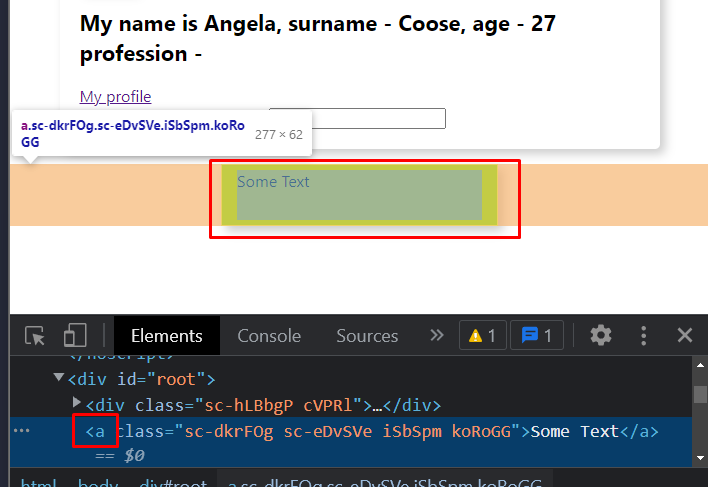

[Styled Components](https://styled-components.com/) в ==React== позволяют писать CSS код ==прямо== внутри реакт-компонентов

Устанавливаются через:

```bash
npm install --save styled-components
```

Дальше для реализации компонента с логикой и его стилями используются ==[тэгированные шаблонные строки](https://developer.mozilla.org/en-US/docs/Web/JavaScript/Reference/Template_literals)==
Конкретно тут мы сделаем компонент `Button`, который будет представлять из себя ссылку `a` с определёнными стилями внутри кавычек

```JSX
const Button = styled.a`
  /* This renders the buttons above... Edit me! */
  display: inline-block;
  border-radius: 3px;
  padding: 0.5rem 0;
  margin: 0.5rem 1rem;
  width: 11rem;
  background: transparent;
  color: white;
  border: 2px solid white;

  /* The GitHub button is a primary button
   * edit this to target it specifically! */
  ${props => props.primary && css`
    background: white;
    color: black;
  `}
`
```

И вот пример использования стилевых компонентов в ==React==:
Так же эти компоненты можно экспортировать в другие компоненты

```JSX
// импорт стилевых компонентов
import styled from 'styled-components';

// Создание стилевых компонентов
export const Wrapper = styled.div`  
    width: 600px;    
    margin: 80px auto 0 auto;
`;  

function App() {  
    return (  
	    // Использование стилевых компонентов
        <Wrapper>  
            <WhoAmI name='John' surname="Smith" link="google.com" />  
            <WhoAmI name='Angela' surname="Coose" link="facebook.com" />  
        </Wrapper>  
    );  
}
```

Так же компоненты стилей можно наследовать и переопределять для других элементов:

`App.js`
```JSX
export const Button = styled.button`  
  display: block;  
  padding: 5px 15px;  
  background-color: gold;  
  border: 1px solid rgba(0, 0, 0, 0.2);  
  box-shadow: 5px 5px 10px rgba(0, 0, 0, 0.2);  
`;
```

`index.js`
```JSX
import App, {Btn, Field, Header, Button} from './App';  
import styled from 'styled-components';  

// В () указываем элемент, который мы переписываем
const BigButton = styled(Button)`  
  margin: 0 auto;  
  width: 245px;  
  height: 50px;
`;  
  
const root = ReactDOM.createRoot(document.getElementById('root'));  
root.render(  
    <StrictMode>  
        <App/>  
        {/* Непосредственное использование переопределённой кнопки */}
        <BigButton>Some Text</BigButton>  
    </StrictMode>  
);
```


Так же мы можем заменить выводимый тег. То есть если мы создавали компонент стилей `div`, то мы можем его поменять на `a` или на любой другой тег через `as="тег"`

`index.js`
```JSX
const root = ReactDOM.createRoot(document.getElementById('root'));  
root.render(  
    <StrictMode>  
        <App/>  
        {/* меняем тег 'div' на 'a' */}
        <BigButton as="a">Some Text</BigButton>  
    </StrictMode>  
);
```



Так же синтаксис поддерживает вкладывание обращений к элементам

`App.js`
```JSX
const EmpItem = styled.div`  
    padding: 20px;    
    margin-bottom: 15px;    
    border-radius: 5px;    
    box-shadow: 5px 5px 10px rgba(0, 0, 0, 0.2);  
    a {  
        display: block;        
        margin: 10px 0px 10px 0px;        
        color: black;  
    }    
    input {  
        display: block;        
        margin-top: 10px;    
    }
`;
```


Так же мы можем использовать выражения внутри наших CSS-свойств (те же тернарные операторы, которые будут подставлять нужное значение свойства в зависимости от значения атрибута, которое передаётся через `props`)

`App.js`
```JSX
//...
const EmpItem = styled.div`  
    padding: 20px;    
    margin-bottom: 15px;    
    border-radius: 5px;    
    box-shadow: 5px 5px 10px rgba(0, 0, 0, 0.2);  
    a {  
        display: block;        
        margin: 10px 0px 10px 0px;  
        
        /*тут мы использем условие, опираясь на значение пропса*/      
        color: ${props => props.active ? 'orange' : 'black'};  
    }    
    input {  
        display: block;        
        margin-top: 10px;    
    }
`;

//...
render() {  
    const {name, surname, link} = this.props;  
    const {text, years, position} = this.state;  
    return (  
    
	    // В качестве пропса передаём атрибут активности (по умолчанию true)
        <EmpItem active>  
            <Button onClick={() => this.nextYear()}>{text}</Button>  
            <Header>My name is {name}, surname - {surname}, age - {years} <br/> profession - {position}</Header>  
            <a href={link}>My profile</a>  
            <form>  
                <label htmlFor={`profession${name}`}>Введите вашу профессию</label>  
                <input type="text" id={`profession${name}`} onChange={(e) => this.commitInputChanges(e, 'red')}/>  
            </form>  
        </EmpItem>  
    );  
};
```


>[!summary] Несколько важных фактов:
> - Вендорные префиксы ставятся автоматически - их не требуется писать
> - Отношения пишутся и работают как в обычном CSS
> - Псевдоселекторы и псевдоэлементы работают точно так же
> - Так же можно создавать тут же CSS-анимации

>[!success] Преймущества:
> - Инкапсулирование стилей - они нигде друг с другом не пересекаются и нет необходимости писать лишние классы
> - Так же отпадает необходимость пользоваться БЭМом
> - Возможность использования пропсов и условий
> - Вендорные префиксы ставятся автоматически

>[!warning] Минусы:
> - К такому синтаксису нужно привыкнуть
> - Очень легко запутаться в тегах, если написано очень много стилизованных компонентов
> - Названия стилей внутри devtools превращены в кашу (так как идёт динамическая генерация имён классов)
> - CSS и JS вместе до конца - их не получится отдельно закэшировать