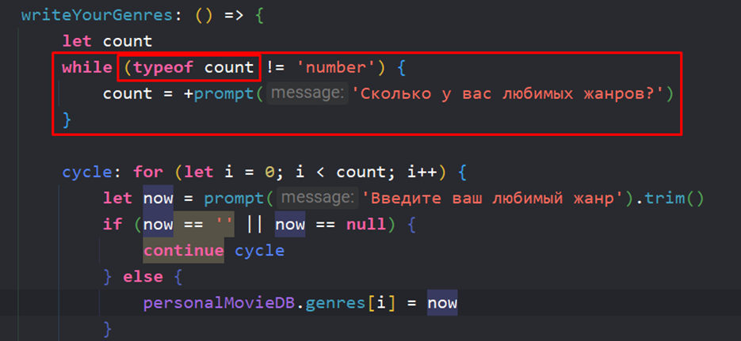

Очень важный мем! Чтобы проверить, что наш пользователь ввёл число, нужно проверять не само равенство введённого значения к типу (`count === Number`), а тип введённого числа к типам, которые выдаёт typeof (пример на рисунке)

Выводим любимый жанр и его номер

Так же есть ещё один интересный способ, как можно принять значения от пользователя в виде массива. Метод `split(‘, ’)` позволяет указать разделитель для строчки и по этому разделителю разложить значения в массив.

Тут впринципе показана реализация, когда мы приводим сначала строку к нижнему регистру (потому что сортировка, которая идёт дальше, будет производиться по юникоду, а в юнкоде сначала идут заглавные буквы)

