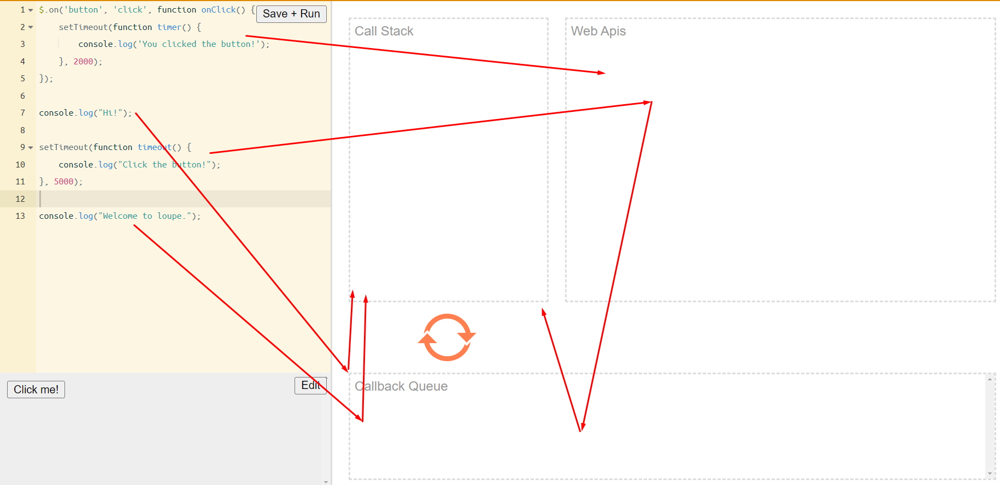
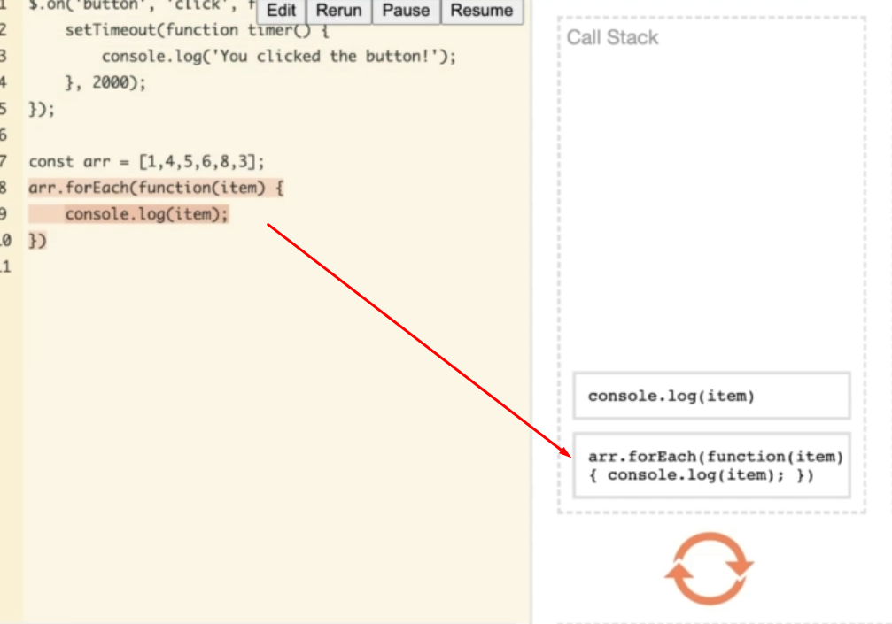
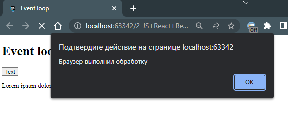

Ниже представлено сочетание синхронных и асинхронных функций:

```JS
console.log(1);  
  
setTimeout(() => {  
    console.log('timeout_1');  
}, 2000)  
  
setTimeout(() => {  
    console.log('timeout_2');  
}, 4000)  
  
console.log(2);

// 1
// 2
// timeout_1
// timeout_2
```

Во втором случае команды оставим всё те же, но сеттаймауты сделаем по одинаковому времени. Вывод будет идентичен первому варианту, так как первый сеттаймаут в коде запустился чуть раньше второго 

```JS
console.log(1);  
  
setTimeout(() => {  
    console.log('timeout_1');  
}, 4000)  
  
setTimeout(() => {  
    console.log('timeout_2');  
}, 4000)  
  
console.log(2);

// 1
// 2
// timeout_1
// timeout_2
```

==Call Stack== - это операции, которые выполняются прямо сейчас на данный момент
==Web Apis== - это хранилище в браузере для хранения промежуточных данных
==Callback Queue== - это очередь задач. Все операции не могут выполняться параллельно, они встают в очередь друг за другом, чтобы нормально выполниться.

> **Что тут происходит?** Все наши таймауты, ивенты на кнопках попадают в ==Web Apis== и ждут своего выполнения (таймауты - конца таймера, кнопки - срабатывания). Дальше абсолютно все задачи попадают в порядке очереди в ==Callback Queue== (очередь из синхронных задач по порядку и попадающие в них асинхронные функции). После того, как задача подошла к выходу из очереди, она попадает в ==Call Stack==, где и выполняется. После выполнения новая задача попадает в стек из очереди. 



Все события (клики, коллбэки, таймауты, промисы), которые мы вызовем, становятся в очередь и не могут выполниться одновременно, так как ==JS== - ==это однопоточный язык==.

Но если мы запустим функцию и внутри неё уже будут производиться итерации по циклу, то они будут выполняться сразу в ==Call Stack==. Самый важный из этого вывод: **если внутри цикла выполняется какая-то тяжёлая задача, то она будет тормозить всю очередь на странице - то есть кроме этого цикла ничего выполняться на странице не будет**
*Например, бесконечный цикл может полностью убить сайт от чего придётся перезапускать вкладку с этим сайтом*



###### Пример
Такой цикл с перебором и записью стопорит сайт полностью на 10+ секунд и не даёт тыкать кнопки или выполнять какую-либо анимацию 

```JS
let k;  
  
function count() {  
    for (let i = 0; i < 1e9; i++) { // 1 000 000 000  
        k++;  
    }  
    alert('Браузер выполнил обработку');  
}  
  
count();
```



1) `setTimeout` проходит всегда полный цикл асинхронных операций, поэтому он обязательно попадает сначала в ==Web Apis==, что замедлит его выполнение. В таком примере всегда сначала выполняется синхронная операция, если таковая имеется сразу после асинхронной операцией.
2) Минимальная длительность задержки *= 4 мс* (даже если мы напишем *0*). Сделано это для совместимости с разными браузерами.

```JS
setTimeout(() => {  
    console.log(1);  
}, 0) // 4мс  
  
console.log(2);

// 2
// 1
```

>[!info] Очень важно понимать работу Event Loop для правильной работы с промисами, сервером и правильного построения архитектуры приложения, так как из-за непонимания этого подхода у нас может очень легко крашнуться сайт.